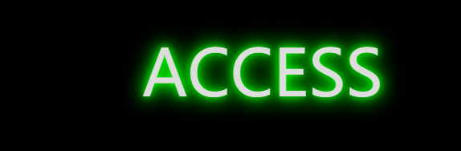
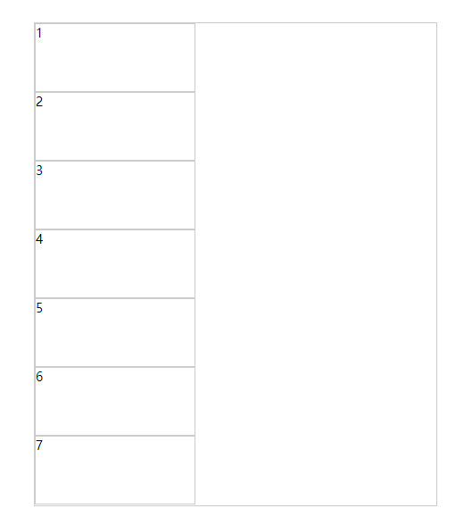

# CSS3 {ignore} 
[toc]

# brief introduction of CSS3

  - upgrade version  
  
    - **CSS2的升级版本**

    ``css2`` ————> ``css3``

  - CSS3's compatible history  

**查询网站：**

  参考手册：http://css.doyoe.com/

  权威网站：https://www.caniuse.com/

- 预处理器``pre-processor``:简易化书写

    less/sass cssNext插件  cssNext（用来实现一些未来的标准（未完全在各大主流浏览器实现的效果））

- 后处理器``post-processor``:补齐代码

    autoprefixer

- postCss + 插件：用JS实现的css的抽象的语法树

  AST(Abstract Syntax Tree)

# selector

## 关系型选择器模式
  
    - ``E > F`` **直接子元素选择器**

      ```css
        div>span {
            color: red;
        }
      ```

    - ``E + F`` **E下一个满足条件的兄弟元素节点E**
    - 
      ```css
        div+span {
            color: red;
        }
      ```

    - ``E ~ F`` **E后面所有满足条件的兄弟元素节点F**

      ```css
        div~span {
            color: red;
        }
      ```
 
## 属性选择器 

    - ``E[attr~='val']`` 选择属性名为``attr``，该属性值有一个为``val``的元素

      ```css
        div[class~='demo'] {
            color: red;
        }
      ```

    - ``E[attr|='val']`` 选择以``val``开头或以``val``-开头的元素

      ```css
        div[class|='demo'] {
            color: red;
        }
      ```

    - ``E[attr^='val']`` 选择以``val``字符串开头的元素

      ```css
        div[class^='demo'] {
            color: red;
        }
      ```

    - ``E[attr$='val']`` 选择以``val``字符串结尾的元素

      ```css
        div[class$='demo'] {
            color: red;
        }
      ```

    - ``E[attr^='val']`` 选择存在``val``字符串的元素

      ```css
        div[class*='demo'] {
            color: red;
        }
      ```

## 伪元素选择器

  - ``E::placeholder`` inpu元素的提示文本，只能改color，存在兼容性问题
  
      ```css
        input::placeholder {
            color: red;
        }
      ```

  - ``E::selection`` 字体选中后的样式

      ```css
        div::selection {
            color: red;
        }
      ```

## 伪类选择器（被选中元素的一种状态）

  - ``E:not(sel)`` 或 ``E:nots(sel)`` 除了sel元素以外的其他E元素，sel可以是属性选择器、class选择器、ID选择器等 

      ```css
        div:not([class='demo']) {
            color: red;
        }
        div:not(.demo) {
            color: red;
        }

      ```

-  ``E:root`` 根标签选择器

```css
        html:root {
            background-color: green;
        }
```

- ``E:target`` 锚点选择元素

```css
        :root,body{
            margin: 0;
            height: 100%;
        }
        #red,#green,#blue{
            width: 100%;
            height: 100%;
        }
        div[id]:not(:target){
            display: none;
        }
        #red{
            background-color: red;
        }
        #green{
            background-color: green;
        }
        #blue{
            background-color: blue;
        }
        div.wrapper {
            position: absolute;
            width: 600px;
            top: 300px;
        }
        div a{
            text-decoration: none;
            color: #fff;
            background-color: rgb(30, 11, 139);
            font-size: 30px;
            border-radius: 10px;
            margin: 0 10px;
        }
```

```html
    <div class="wrapper">
        <a href="#red">red</a>
        <a href="#green">green</a>
        <a href="#blue">blue</a>
    </div>
    <div id="red"></div>
    <div id="green"></div>
    <div id="blue"></div>
```
 
 - ``E:first-child`` 选中子元素中的第一个元素且是E

```css
        span:first-child{
            color:red ;
        }
```
```html
        <span>0</span><!--无法选中-->
        <p>1</p>
        <p>2</p>
        <p>3</p>
        <p>4</p>
        <p>5</p>
```
```html
        <p>1</p><!--选中-->
        <p>2</p>
        <p>3</p>
        <p>4</p>
        <p>5</p>
```


 - ``E:last-child`` 选中子元素中的最后一个元素且是E

```css
        p:last-child{
            color:red ;
        }
```
```html
        <span>0</span>
        <p>1</p>
        <p>2</p>
        <p>3</p>
        <p>4</p>
        <p>5</p><!--无法选中-->
        <span>6</span>
```
```html
        <span>0</span>
        <p>1</p>
        <p>2</p>
        <p>3</p>
        <p>4</p>
        <p>5</p><!--选中-->
```


- ``E:only-child`` 选中独生子元素且是E

```css
        span:only-child{
            color:red ;
        }
```
```html
        <span>0</span><!--选中-->
```


- ``E:nth-child(n)`` 选中相应数字的子元素E，从1开始查数，与JS从0开始不一样

```css
        p:nth-child(3n) {
            color: red;
        }
```
```html
        <span>0</span>
        <p>1</p>
        <p>2</p><!--选中-->
        <p>3</p>
        <p>4</p>
        <p>5</p><!--选中-->
        <span>6</span>
```


- ``E:nth-last-child(n)`` 选中相应数字导数的子元素E，从1开始查数，与JS从0开始不一样

```css
        p:nth-last-child(3n) {
            color: red;
        }
```
```html
        <span>0</span>
        <p>1</p><!--选中-->
        <p>2</p>
        <p>3</p>
        <p>4</p><!--选中-->
        <p>5</p>
        <span>6</span>
```


- ``E:first-of-type`` E类型子元素中的第一个

```css
        p:first-of-type {
            color: red;
        }
```
```html
        <span>0</span>
        <p>1</p><!--选中-->
        <p>2</p>
        <p>3</p>
        <p>4</p>
        <p>5</p>
        <span>6</span>
```


- ``E:last-of-type`` E类型子元素中的最后一个

```css
        p:last-of-type {
            color: red;
        }
```
```html
        <p>1</p>
        <p>2</p>
        <p>3</p>
        <p>4</p>
        <p>5</p> <!--选中-->
        <span>6</span>
        <span>7</span>
```

- ``E:only-of-type`` 只有一个E类型子元素（可以有其他类型的子元素）

```css
        p:only-of-type {
            color: red;
        }
```
```html
    <p>1</p><!--选中-->
    <span>2</span>
    <span>3</span>
```

- ``E:nth-of-type(n)`` 选中第n个子元素且是E

```css
        p:only-of-type(2) {
            color: red;
        }
```
```html
    <span>1</span>
    <p>2</p><!--选中-->
    <p>3</p>
    <span>4</span>
    <span>5</span>
```

- ``E:empty``选中没有子节点的元素（里面什么都没（注释除外））

```css
        p:empty {
            background-color: red;
        }
```
```html
    <span>1</span>
    <p></p><!--选中-->
    <p>3</p>
    <span>4</span>
    <span>5</span>
```

- ``E:checked``被选中的元素

```css
        input:checked {
            display: none;
        }
```
```html
    <label for="">
        购买<input type="checkbox" name="" id="">
    </label>
```

- ``E:disabled`` ``E:enabled`` 不能使用的和能使用的input元素

```css
        input:disabled {
            background-color: red;
        }
        input:enabled {
            background-color: blue;
        }
       
```
```html
    <label for="">
        <input type="text">
        <input type="text" disabled>
    </label>
```

- ``E:read-only`` ``E:read-write`` 只能读的和能读能写的input元素

```css
        input:read-only {
            background-color: red;
        }
        input:read-write {
            background-color: blue;
        }
       
```
```html
    <label for="">
        <input type="text">
        <input type="text" readonly>
    </label>
```

# border & background

## ``border-radius`` 圆角效果

```css
    div{
        width: 100px;
        height: 100px;
        border: 2px solid blue;
        position: absolute;
        left: calc(50% - 50px);
        top: calc(50% - 50px);
        /* border-radius: 20px 30px 40px 50px; */

        /* border-top-left-radius: 20px;
        border-top-right-radius: 30px;
        border-bottom-right-radius: 40px;
        border-bottom-left-radius: 50px; */

        border-top-left-radius: 20px 20px;
        border-top-right-radius: 30px 30px;
        border-bottom-right-radius: 40px 40px;
        border-bottom-left-radius:  50px 50px;

        border-radius: 20px 30px 40px 50px / 20px 30px 40px 50px;
    }
```

## ``box-shadow`` 阴影 
  
    - 参数1：填inset，内阴影；不填，外阴影   

    - 参数2：X方向上的偏移量

    - 参数3：Y方向上的偏移量

    - 参数4：模糊值，阴影衍射范围，基线两边各一半衍射

    - 参数5：水平垂直方向上同时扩大数值

```css
        div{
            width: 100px;
            height: 100px;
            border: 1px solid #0ff;
            position: absolute;
            left: calc(50% - 50px);
            top: calc(50% - 50px);
            border-radius: 50%;

            box-shadow: inset 0px 0px 30px 2px #0ff,
            0px 0px 30px 2px #0ff;
        }
```

实现移上突出显示效果

```css
        div{
            width: 100px;
            height: 100px;
            position: absolute;
            left: calc(50% - 50px);
            top: calc(50% - 50px);
            border-radius: 5px;
            background-color: #fff;
            box-shadow: inset 0px 0px 3px  rgba(0, 0, 0, .1);
            transition: all .7s;
        }
        div::after{
            content: "";
            position: absolute;
            left: 0;
            top: 0;
            width: 100%;
            height: 100%;
            border-radius: 5px;
            box-shadow: 0px 5px 15px rgba(0, 0, 0, .3);
            opacity: 0;
            transition: all .7s;
        }
        div:hover{
            transform: scale(1.25,1.25);
        }
        div:hover::after{
            opacity: 1;
        }
```

## ``border-image`` 边框图片

  - ``border-image-source`` 边框填充内容，可为颜色或图片（url）
    
  - ``border-image-slice`` 边框背景图片切割方式 填数值（不加px）或百分数,默认为100%
    
  - ``border-image-repeat``  设置边框图片的平铺效果

    - ``stretch`` 将被分割的图像使用拉伸的方式来填充满边框图像区域。
        
    - ``repeat`` 将被分割的图像使用重复平铺的方式来填充满边框图像区域。当图像碰到边界时，如果超过则被截断。
        
    - ``round`` 与 ``repeat`` 关键字类似。不同在于，当背景图像不能以整数次平铺时，会根据情况缩放图像。
        
    - ``space`` 与 ``repeat`` 关键字类似。不同在于，当背景图像不能以整数次平铺时，会用空白间隙填充在图像周围。
    
- ``border-image-outset`` 设置边框背景图片向外延伸，不可天负值

- ``border-image-width`` 设置边框显示的宽度，最后一个参数可填fill，表示填充内容区

## ``background``背景图片

- ``background-image`` 添加背景图片，CSS3支持添加多个背景图片

    - ``linear-gradient()`` 渐变色

```css
div{
        background-image: linear-gradient(red,blue);
        /* 第一个参数填to XX ，表示方向 */
        background-image: linear-gradient(to top,red,blue);
        background-image: linear-gradient(to bottom,red,blue);
        /* 第一个参数 XXdeg，表示角度方向 */
        background-image: linear-gradient(90deg,red,blue);
        background-image: linear-gradient(180deg,red,blue);
        /* 第二个开始的参数颜色后面填的是到该值后都是该颜色 */
        background-image: linear-gradient(to top ,red 50px,blue 180px);
}
```
  - ``radial-gradient`` 辐射渐变色 

```css
div{
    /* 第一个参数：ellipse椭圆形、circle圆形表示形状，farthest-corner辐射到最远的角，farthest-side辐射到最远的边，closest-corner最近的角，closest-side最近的边 */
    background-image: radial-gradient(ellipse  farthest-corner , red,yellow);
    /* at XXpx XXpx:圆心位置 */
    background-image: radial-gradient(ellipse at 50px 50px , red,yellow);

}
```


- ``background-size`` 背景图片大小

- ``background-repeat`` 背景图片平铺方式

- ``background-position`` 背景图片位置

```css
div {
    position: absolute;
    left: 0;
    right: 0;
    top: 0;
    bottom: 0;
    margin: auto;
    width: 100px;
    height: 100px;
    background-image: url(./image/1.png),url(./image/2.png);
    background-size: 50px 100px , 50px 100px;
    background-repeat: no-repeat;
    background-position: 0 0 , 50px 0;
}
```


- ``background-origin`` 更改背景图片的起始点，默认值为padding-box,其他值：border-box、content-box  
   
  - ``background-position``会相对于``background-origin``所涉的值进行原点定位

- ``background-clip``  更改背景图片的截至点，默认值为border-box,padding-box、content-box ，列如：border-box，背景图片在border以外不显示（截断）

    - ``text`` 从前景内容的形状（比如文字）作为裁剪区域向外裁剪，如此即**可实现使用背景作为文字的填充色之类的遮罩效果**。

```html
<style>
div{
    position: absolute;
    left: calc(50% - 50px);
    top: calc(50% - 50px);
    height: 100px;
    line-height: 100px;
    font-size: 80px;
    width: 400px;
    font-weight: 700;

    background-image: url(./image/2.png);
    -webkit-background-clip: text;
    background-clip: text;
    /* 将自体填充色设为透明，即可展示background-clip设置的背景色 */
    -webkit-text-fill-color: transparent;
}
div:hover{
    background-position: center center;
    transition: all 1s;
}
</style>
<div>莫斯利安</div>
```


- ``background-repeat`` 背景图片的平铺方式，可填两个值，表示X方向和Y方向，两个值不能填repeat-x和repeat-y,

  - ``round`` 当背景图像不能以整数次平铺时，会根据情况缩放图像。（CSS3）
  
  - ``space`` 当背景图像不能以整数次平铺时，会用空白间隙填充在图像周围。（CSS3）

- ``background-attachment`` 背景在有滚动条的容器里的定位

    - ``scroll`` 默认值，背景图像相对于元素固定，也就是说当元素内容滚动时背景图像不会跟着滚动，因为背景图像总是要跟着元素本身。但会随元素的祖先元素或窗体一起滚动。
    
    - ``local``  背景图像相对于元素内容固定，也就是说当元素随元素滚动时背景图像也会跟着滚动，因为背景图像总是要跟着内容。（CSS3）

    - ``fixed`` 背景图像相对于视口（viewport）固定。


- ``background-size``

    - ``cover`` 将背景图像等比缩放到完全覆盖容器，背景图像有可能超出容器。**可能会溢出（保持原有比例）**

    - ``contain`` 将背景图像等比缩放到宽度或高度与容器的宽度或高度相等，背景图像始终被包含在容器内。**可能会留白（保持原有比例）**

# text

## ``text`` 文字样式及排列

- ``text-shadow`` 文字阴影

    - 参数1：水平偏移量；参数2：垂直偏移量；参数3：模糊值；参数4：颜色。

```css
div{
    text-shadow: 5px 10px 2px #ccc;
}
```

火焰效果实现

```html
    <style>
        body{
            background-color:#000;
        }
        div {
            width: 500px;
            height: 100px;
            position: absolute;
            top: 100px;
            left: calc(50% - 300px);
            font-size: 80px;
            color: #ddd;
            text-shadow: 0px 0px 10px #0f0,
            0px 0px 20px #0f0,
            0px 0px 30px #0f0;
            transition: 1.5s;
        }
        div::before{
            content: 'NO ';
            opacity: 0;
            text-shadow: 0 0 10px red,
            0 0 20px red,
            0 0 30px red,
            0px -10px 20px red,
            0px -15px 30px red,
            0px -20px 40px red;
            transition: 1.5s;
        }
        div:hover{
            text-shadow: 0 0 10px red,
            0 0 20px red,
            0 0 30px red;
        }
        div:hover::before{
            opacity: 1;
        }
    </style>
    <div>ACCESS</div>
```



背景图片shadow效果

```html
    <style>
        div{
            position: absolute;
            width: 400px;
            height: 120px;
            top: 100px;
            left: calc(50% - 200px);
            font-size: 100px;
            font-weight: bold;
            background-repeat: no-repeat;
            background-image: url(./image/1.png);
            background-size: 400px 200px;
            background-position: 0 -80px;
            -webkit-background-clip: text;
            background-clip: text;
            -webkit-text-fill-color: transparent;
            transition: all 1.5s;
            text-shadow:-3px -5px 5px rgba(255, 0, 0, 0.3),
           3px 5px 5px rgba(0, 255, 255, .3);
        }
        div:hover{
            background-position: 0 0 ;
        }
    </style>
    <div>朝花夕拾</div>
```


- ``@font-face`` 添加字体包

```css
        @font-face{
            font-family: '鸿蒙';
            src: url(./HarmonyOS_Sans_Thin.ttf);
        }
        div{
            font-family:'鸿蒙';
        }
```

- ``white-space`` 指定元素是否保留文本间的空格、换行；指定文本超过边界时是否换行。

  - ``normal`` 默认处理方式。会将序列的空格合并为一个，内部是否换行由换行规则决定。

  - ``pre`` 原封不动的保留你输入时的状态，空格、换行都会保留，并且当文字超出边界时不换行。等同 pre 元素效果

  - ``nowrap`` 与normal值一致，不同的是会强制所有文本在同一行内显示。

  - ``pre-wrap`` 与pre值一致，不同的是文字超出边界时将自动换行。

  - ``pre-line`` 与normal值一致，但是会保留文本输入时的换行。

- ``word-break``定义元素内容文本的字间与字符间的换行行为

  - ``normal``  默认的换行规则。依据各自语言的规则，允许在字间发生换行。

  - ``keep-all``  对于 CJK（中文，韩文，日文）文本不允许在字符内发生换行。Non-CJK 文本表现同normal

  - ``break-all``  对于 Non-CJK 文本允许在任意字符内发生换行。该值适合包含一些非亚洲文本的亚洲文本，比如使连续的英文字符断行。

  - ``break-word``  与break-all相同，不同的地方在于它要求一个没有断行破发点的词必须保持为一个整体单位。这与word-wrap的break-word值效果相同

**``text``相关API详见**：http://css.doyoe.com/

## ``column`` column布局

    - ``columns``  设置或检索对象的列数和每列的宽度。复合属性
    
    - ``column-width`` 设置或检索对象每列的宽度
    
    - ``column-count`` 设置或检索对象的列数
    
    - ``column-gap`` 设置或检索对象的列与列之间的间隙
    
    - ``column-rule`` 设置或检索对象的列与列之间的边框。复合属性
    
      -``column-rule`` = ``column-rule-width`` + ``column-rule-style`` + ``column-rule-color``

```css
        div {
            column-count: 3;
            column-width: 200px;
            column-gap: 30px;
            column-rule: 2px solid #0f0;
            /* column-rule-width:2px;
            column-rule-style: solid;
            column-rule-color: #0f0; */
        }
```
colum布局实现翻页效果
```css
        .wrapper{
            background-color: rgba(0, 0, 250, .4);
        }
        div{
            width: 300px;
            height: 500px;
            border: 1px solid #000;
        }
        .content{
            column-width: 300px;
            column-gap: 20px;
            border: none;
            transition: all 1s;
        }
        div:hover .content{
            transform: translateX(-320px);
        }
```
```html
    <div class="wrapper">
        <div class="content">Lorem1000 </div>
    </div>
```

**``column``相关API详见**：http://css.doyoe.com/

# box

## ``box-sizing`` 盒模型模式

- 盒模型模式，默认值为content-box

    1) W3C标准盒模型：boxWidth = width + padding*2 + border*2

     - ``content-box``
  
    2) IE6混杂盒模型：boxWidth = width
     
     - ``border-box``

## ``overflow`` 内容溢出

- 元素处理溢出内容的方式

    - ``visible`` 对溢出内容不做处理，内容可能会超出容器。

    - ``hidden`` 隐藏溢出容器的内容且不出现滚动条。

    - ``scroll`` 隐藏溢出容器的内容，溢出的内容可以通过滚动呈现。

    - ``auto`` 当内容没有溢出容器时不出现滚动条，当内容溢出容器时出现滚动条，按需出现滚动条。textarea元素的overflow默认值就是auto。

    - ``clip`` 与hidden一样，clip也被用来隐藏溢出容器的内容且不出现滚动条。不同的地方在于，clip是一个完全禁止滚动的容器，而hidden仍然可以通过编程机制让内容可以滚动

## ``resize`` 改变元素大小

- 拖拽边角改变元素大小，必须与overflow配合使用

    - ``none`` 不允许用户调整元素大小。默认值

    - ``both`` 用户可以调节元素的宽度和高度。

    - ``horizontal`` 用户可以调节元素的宽度

    - ``vertical`` 用户可以调节元素的高度。


# flex弹性盒子

## flex父元素设置

- ``display:flex;`` 设置盒子类型为弹性盒子，其内部内容弹性排列

- ``flex-direction`` 定义flex容器的主轴方向

    - ``row`` 主轴与行内轴方向作为默认的书写模式。即横向从左到右排列（左对齐）。

    - ``row``-reverse 对齐方式与row相反。

    - ``column`` 主轴与块轴方向作为默认的书写模式。即纵向从上往下排列（顶对齐）。

    - ``column-reverse`` 对齐方式与column相反。

    

- ``flex-wrap`` 控制flex容器是单行或者多行,是否换行

    - ``nowrap`` flex容器为单行。该情况下flex子项可能会溢出容器

    - ``wrap`` flex容器为多行。该情况下flex子项溢出的部分会被放置到新行，子项内部会发生断行

    - ``wrap-reverse`` 反转 wrap 排列。

- ``justify-content`` **单行**盒子元素在主轴（横轴）方向上的对齐方式

    - ``flex-start`` 弹性盒子元素将向行起始位置对齐。该行的第一个子元素的主起始位置的边界将与该行的主起始位置的边界对齐，同时所有后续的伸缩盒项目与其前一个项目对齐。

    
  
    - ``flex-end`` 弹性盒子元素将向行结束位置对齐。该行的第一个子元素的主结束位置的边界将与该行的主结束位置的边界对齐，同时所有后续的伸缩盒项目与其前一个项目对齐。

    
  
    - ``center`` 弹性盒子元素将向行中间位置对齐。该行的子元素将相互对齐并在行中居中对齐，同时第一个元素与行的主起始位置的边距等同与最后一个元素与行的主结束位置的边距（如果剩余空间是负数，则保持两端相等长度的溢出）。

    
  
    - ``space-between`` 弹性盒子元素会平均地分布在行里。如果最左边的剩余空间是负数，或该行只有一个子元素，则该值等效于'flex-start'。在其它情况下，第一个元素的边界与行的主起始位置的边界对齐，同时最后一个元素的边界与行的主结束位置的边距对齐，而剩余的伸缩盒项目则平均分布，并确保两两之间的空白空间相等。
  
    

    - ``space-around`` 弹性盒子元素会平均地分布在行里，两端保留子元素与子元素之间间距大小的一半。如果最左边的剩余空间是负数，或该行只有一个伸缩盒项目，则该值等效于'center'。在其它情况下，伸缩盒项目则平均分布，并确保两两之间的空白空间相等，同时第一个元素前的空间以及最后一个元素后的空间为其他空白空间的一半。

    
  
- ``align-items`` **多行**flex子项在flex容器的当前行的侧轴（纵轴）方向上的对齐方式

    - ``flex-start`` 弹性盒子元素的侧轴（纵轴）起始位置的边界紧靠住该行的侧轴起始边界。

    

    - ``flex-end`` 弹性盒子元素的侧轴（纵轴）结束位置的边界紧靠住该行的侧轴结束边界。

    

    - ``center`` 弹性盒子元素在该行的侧轴（纵轴）上居中放置。（如果该行的尺寸小于弹性盒子元素的尺寸，则会向两个方向溢出相同的长度）。

    

    - ``baseline`` 如弹性盒子元素的行内轴与侧轴为同一条，则该值与'flex-start'等效。其它情况下，该值将参与基线对齐。
    
    **第一个盒子设置了marginTop，其他盒子与第一个盒子的基线对齐**
    

    - ``stretch`` 如果指定侧轴大小的属性值为'auto'，则其值会使项目的边距盒的尺寸

    **当子盒未设置高度时，默认撑开为母盒的高度**
    

- ``align-content`` **多行元素**flex子项在flex容器的当前行的侧轴（纵轴）方向上的对齐方式

    - ``flex-start`` 各行向弹性盒容器的起始位置堆叠。弹性盒容器中第一行的侧轴起始边界紧靠住该弹性盒容器的侧轴起始边界，之后的每一行都紧靠住前面一行。

    

    - ``flex-end`` 各行向弹性盒容器的结束位置堆叠。弹性盒容器中最后一行的侧轴起结束界紧靠住该弹性盒容器的侧轴结束边界，之后的每一行都紧靠住前面一行。

    

    - ``center`` 各行向弹性盒容器的中间位置堆叠。各行两两紧靠住同时在弹性盒容器中居中对齐，保持弹性盒容器的侧轴起始内容边界和第一行之间的距离与该容器的侧轴结束内容边界与第最后一行之间的距离相等。（如果剩下的空间是负数，则各行会向两个方向溢出的相等距离。）

    

    - ``space-between`` 各行在弹性盒容器中平均分布。如果剩余的空间是负数或弹性盒容器中只有一行，该值等效于'flex-start'。在其它情况下，第一行的侧轴起始边界紧靠住弹性盒容器的侧轴起始内容边界，最后一行的侧轴结束边界紧靠住弹性盒容器的侧轴结束内容边界，剩余的行则按一定方式在弹性盒窗口中排列，以保持两两之间的空间相等。

    

    - ``space-around`` 各行在弹性盒容器中平均分布，两端保留子元素与子元素之间间距大小的一半。如果剩余的空间是负数或弹性盒容器中只有一行，该值等效于'center'。在其它情况下，各行会按一定方式在弹性盒容器中排列，以保持两两之间的空间相等，同时第一行前面及最后一行后面的空间是其他空间的一半。

    

    - ``stretch`` 各行将会伸展以占用剩余的空间。如果剩余的空间是负数，该值等效于'flex-start'。在其它情况下，剩余空间被所有行平分，以扩大它们的侧轴尺寸。

    

## flex子元素设置

- ``order`` 弹性盒模型对象的子元素出現的順序,越小越靠前，默认值为0，相当于索引

- ``align-self`` 单独设置子项的排列位置

    - 取值同``align-content``

- ``flex-grow`` 若没有排满，所有盒子按比率来分配剩余空间

- ``flex-basis`` 相当于width，权重高于width
  
  - 未填width时，内容超出部分不会换行，会将元素撑开，相当于最小宽度；加了width时，width值相当于最大值
  
  - 无论什么情况，被不换行元素撑开盒子都不参与缩放

- ``flex-shrink`` 若排列超过母盒宽度，按比率来收缩空间

**注意**：``flex-grow``按比例分配剩余空间，但是``flex-shrink``只有在所有盒子宽度相同时按比例缩放，否则会按每个盒子的加权值分配缩放量，参与计算的是content宽度

  - shrink1 * width1 + shrink2 * width2 + ..... = 总权重值

  - 缩放大小 = 超出宽度 / 总权重值 * shrink1 = 超出宽度 / 总权重值 * shrink2 = ......

- ``flex``复合属性，``flex-grow`` + ``flex-shrink`` + ``flex-basis``，默认值为``flex:0 0 auto;``

- ``flex-flow`` 复合属性，``flex-direction`` + ``flex-wrap``,默认值为``flex-flow:row nowrap;``

flex布局实现排列伸缩

```html
    <style>
        * {
            margin: 0;
            padding: 0;
        }

        .wrapper {
            margin: 100px;
            width: 400px;
            height: 200px;
            border: 1px solid #ccc;
            display: flex;
            resize: both;
            overflow: hidden;
            resize: both;
        }
        .content{
            flex: 1 1 auto;
            border: 1px solid #0f0;
            height: 100px;
            box-sizing: border-box;
        }
        .content:nth-of-type(3){
            flex: 2 2 auto;
        }
        .content:nth-of-type(2){
            flex: 0 0 50%;
        }
    </style>
    <div class="wrapper">
        <div class="content">1</div>
        <div class="content">2</div>
        <div class="content">3</div>
    </div>
```


实现圣杯布局

```html
    <style>
        * {
            margin: 0;
            padding: 0;
        }

        .wrapper {
            text-align: center;
            margin: 70px;
            width: 400px;
            height: 500px;
            border: 1px solid #ccc;
            display: flex;
            flex-direction: column;
            overflow: hidden;
            resize: both;
        }
        .content{
            flex: 1 1 auto;
            display: flex;
            box-sizing: border-box;
        }
        .header,.footer{
            flex:  0 0 20%;
            border: 1px solid #0f0;
            box-sizing: border-box;
        }
        .left,.right{
            flex: 0 0 20%;
            border: 1px solid #0ff;
            box-sizing: border-box;
        }
        .center{
            flex:  1 1 auto;
        }
    </style>
    <div class="wrapper">
        <div class="header">header</div>
        <div class="content">
            <div class="left">left</div>
            <div class="center">center</div>
            <div class="right">right</div>
        </div>
        <div class="footer">footer</div>
    </div>
```


简单练习

```html
    <style>
        * {
            margin: 0;
            padding: 0;
        }

        div{
            margin: 1px;
        }
        .wrapper {
            font-size: 20px;
            font-weight: 600;
            text-align: center;
            margin: 70px;
            width: 400px;
            height: 500px;
            border: 2px solid #000;
            display: flex;
            flex-direction: column;
            overflow: hidden;
            resize: both;
        }
        .header{
            flex:  0 0 20%;
            border: 2px solid #000;
        }
        .content{
            flex: 1 1 auto;
            display: flex;
            border: 2px solid #000;
        }
        .left{
            flex:  0 0 12%;
            border: 2px solid #000;
        }
        .center{
            flex: 1 1 auto;
            display: flex;
            border: 2px solid #000;
            flex-direction: column;
        }
        .c-top{
            flex: 0 0 40%;
            border: 2px solid #000;
        }
        .c-bottom{
            flex: 1 1 auto;
            border: 2px solid #000;
            display: flex;
        }
        .c-b-left{
            flex: 0 0 30%;
            border: 2px solid #000;
        }
        .c-b-right{
            flex: 1 1 auto;
            border: 2px solid #000;
        }
        .right{
            display: flex;
            flex: 0 0 20%;
            border: 2px solid #000;
            flex-direction: column;
        }
        .r-box{
            flex: 0 0 20%;
            border: 2px solid #000;
        }
        .r-bottom{
            flex: 1 1 auto;
            border: 2px solid #000;
        }
        .footer{
            flex:  0 0 20%;
            border: 2px solid #000;
            display: flex;
        }
        .f-left{
            border: 2px solid #000;
            flex: 0 0 40%;
        }
        .f-right{
            border: 2px solid #000;
            flex: 1 1 60%;  
        }


    </style>
    <div class="wrapper">
        <div class="header">header</div>
        <div class="content">
            <div class="left">left</div>
            <div class="center">
                <div class="c-top">c-top</div>
                <div class="c-bottom">
                    <div class="c-b-left">c-b-left</div>
                    <div class="c-b-right">c-b-right</div>
                </div>
            </div>
            <div class="right">
                <div class="r-box">r-box1</div>
                <div class="r-box">r-box2</div>
                <div class="r-box">r-box3</div>
                <div class="r-bottom">r-bottom</div>
            </div>
        </div>
        <div class="footer">
            <div class="f-left">f-left</div>
            <div class="f-right">f-right</div>
        </div>
    </div>
```


# transition

- ``transition-property`` 检索或设置对象中的参与过渡的属性

- ``transition-duration`` 检索或设置对象过渡的持续时间

- ``transition-timing-function`` 检索或设置对象中过渡的动画类型

- ``transition-delay`` 检索或设置对象延迟过渡的时间

```html
    <style>
        div{
            width: 100px;
            height: 100px;
            background-color: turquoise;
            position: absolute;
            left: calc(50% - 50px);
            top: calc(50% - 50px);
            transition: width 2s, height 2s linear 2s;
        }
        div:hover{
            width: 200px;
            height: 200px;
        }
    </style>
    <div></div>
```

# animation

   -  ``animation-name``  检索或设置对象所应用的动画名称

   -  ``animation-duration``  检索或设置对象动画的持续时间

   -  ``animation-timing-function``  设置对象动画的过渡类型（列如：由快到慢

   -  ``animation-delay``  设置对象动画延迟的时间

   -  ``animation-iteration-count``  检索或设置对象动画的循环次数，可取无限次

   -  ``animation-direction``  设置动画运动方向是否反向运动

   -  ``animation-fill-mode``  保留开始帧或结束帧的状态

   -  ``animation-play-state``  可设置动画的暂停或开始


```html
    <style>
        *{
            margin: 0;
            padding: 0;
        }
        @keyframes run{
            0%{
                left:0;
                top:0;
            }
            25%{
                left:200px;
                top:0;
            }
            50%{
                left:200px;
                top:200px;
            }
            75%{
                left:0;
                top:200px;
            }
            100%{
                left:0;
                top:0;
            }
        }
        div{
            width: 100px;
            height: 100px;
            background-color: turquoise;
            position: absolute;
            animation: run 4s;
        }
    </style>
    <div></div>
```


**css3实现日出日落效果**

```html
    <style>
        * {
            margin: 0;
            padding: 0;
        }

        body {
            background-color: #000;
        }

        @keyframes space-change {
            0% {
                opacity: .3;
            }

            20% {
                opacity: 1;
            }
            40% {
                opacity: .9;
            }
            45% {
                opacity: .6;
            }

            50% {
                opacity: .1;
            }

            75% {
                opacity: .1;
            }

            100% {
                opacity: .3;
            }
        }

        @keyframes sunrise {
            0% {
                opacity: .2;
            }
            4% {
                opacity: .4;
            }

            10% {
                opacity: 1;
            }

            20% {
                opacity: 1;
                transform: scale(.7, .7) translateX(0) translateY(-400px);
            }

            45% {
                opacity: .5;
                transform: scale(.7, .7) translateX(500px) translateY(0);
            }
            48% {
                opacity: 0;
                transform: scale(.7, .7) translateX(500px) translateY(0);
            }


            100% {
                opacity: 0;
                transform: scale(.7, .7) translateX(500px) translateY(0);

            }

        }

        @keyframes moonrise {
            0% {
                opacity: 0;
                transform: translateY(0);
            }
            30% {
                opacity: 0;
                transform: translateY(0);
            }

            50% {
                opacity: 0;
                transform: translateY(-200px);
            }

            70% {
                opacity: 1;
                transform: translateY(-300px);
            }

            80% {
                transform: translateY(-300px);
                opacity: 1;
            }
            100% {
                transform: translateY(0);
                opacity: 0;
            }
        }

        .space {
            height: 500px;
            background-image: linear-gradient(to bottom, rgba(0, 130, 255, 1), rgba(255, 255, 255, 1));
            animation: space-change 30s cubic-bezier(.5, 0, .5, 1) infinite;
        }

        .sun {
            position: absolute;
            left: calc(50% - 50px);
            top: 400px;
            width: 100px;
            height: 100px;
            background-color: #fff;
            border-radius: 50%;
            transform: scale(.5, .5);
            box-shadow: 0 0 100px 50px #fff,
                0 0 250px 125px #ff0,
                0 0 300px 150px #ff0;
            animation: sunrise 30s cubic-bezier(.5, 0, .5, 1) infinite;
            /* animation-fill-mode: both; */
        }

        .moon {
            position: absolute;
            left: calc(50% + 400px);
            top: 400px;
            width: 100px;
            height: 100px;
            background-color: #fff;
            border-radius: 50%;
            box-shadow: 0 0 8px #fff,
                inset 0 0 8px #000;
            animation: moonrise 30s cubic-bezier(.5, 0, .5, 1) infinite;
        }
    </style>
    <div class="space"></div>
    <div class="sun"></div>
    <div class="moon"></div>
```


**steps实现打字光标效果**

```html
    <style>
        *{
            margin: 0;
            padding: 0;
        }
        @keyframes cursor {
            0% {
                border-left-color: #fff;
            }

            50% {
                border-left-color: #000;

            }

            100% {
                border-left-color: #fff;

            }
        }

        @keyframes cover {
            0% {
                left: 0;
            }

            100% {
                left: 100%;
            }
        }

        div {
            font-family: monospace;
            display: inline-block;
            position: relative;
            height: 100px;
            /* background-color: red; */
            font-size: 80px;
            line-height: 100px;
        }

        div::after {
            content: '';
            position: absolute;
            left: 0;
            top: 10px;
            height: 90px;
            width: 100%;
            background-color: #fff;
            border-left: 2px solid #000;
            box-sizing: border-box;
            animation: cursor .8s step-end infinite,cover 12s steps(12,end) infinite;
        }
    </style>
    <div>saajqiwojnfa</div>
```


**实现时钟转动效果**

```html
    <style>
        * {
            margin: 0;
            padding: 0;
        }
        @keyframes  secondrun {
            0%{
                transform: rotate(180deg);
            }
            100%{
                transform: rotate(540deg);
            }
        }
        @keyframes  minuterun {
            0%{
                transform: rotate(180deg);
            }
            100%{
                transform: rotate(540deg);
            }
        }
        @keyframes hourrun {
            0%{
                transform: rotate(180deg);
            }
            100%{
                transform: rotate(540deg);
            }
        }
        .clock{
            width: 512px;
            height: 512px;
            background-color: aqua;
            border-radius: 50%;
            position: absolute;
            left: calc(50% - 256px);
            top: calc(50% - 256px);
        }
        div.second{
            width: 18px;
            height: 300px;
            background-color: blue;
            border-radius: 10px;
            border-radius: 10px;
            position: absolute;
            left: 247px;
            top: 180px;
            transform-origin: center 76px;
            transform:rotate(180deg);
            z-index: 3;
            animation: secondrun 60s steps(60,end) infinite;
        }
        div.minute{
            width: 26px;
            height: 218px;
            background-color: #0f0;
            border-radius: 10px;
            position: absolute;
            left: 242px;
            top: 240px;
            transform-origin: center 16px;
            transform: rotate(180deg);
            z-index: 2;
            animation: minuterun 3600s steps(60,end) infinite;
        }
        div.hour{
            width: 30px;
            height: 148px;
            background-color: #ccc;
            border-radius: 10px;
            position: absolute;
            left: 240px;
            top: 240px;
            transform-origin: center 16px;
            transform: rotate(180deg);
            z-index: 1;
            animation: hourrun 39600s steps(60,end);
        }

    </style>
    <div class="clock">
        <div class="second"></div>
        <div class="minute"></div>
        <div class="hour"></div>
    </div>
```


# transform

- ``transform``变换

    - ``rotate(角度)`` 2D旋转

    - ``rotateX(角度)``3D旋转，X轴旋转

    - ``rotateY(角度)``3D旋转，Y轴旋转

    - ``rotateZ(角度)``3D旋转，Z轴旋转

    - ``rotate3d(x,y,z)``3D旋转，以该向量为旋转轴进行旋转
    
    - ``scale(b,a)`` 元素的伸缩变换，伸缩的不是元素的width和height，而是坐标轴的刻度；其它坐标轴的影响会一直保留

    - ``scaleX(a)`` 在3D视角下，在X轴方向上伸缩

    - ``scaleY(a)`` 在3D视角下，在Y轴方向上伸缩

    - ``scaleZ(a)`` 在3D视角下，在Z轴方向上伸缩
    
    - ``skew(x角度,y角度)`` 倾斜坐标轴，填X轴上，会作用在Y轴;填Y轴上，会作用在X轴

    - ``skewx(角度)`` X轴的（水平方向）倾斜
  
    - ``skewy(角度)`` Y轴的（垂直方向）倾斜

    - ``translate(x,y)`` 平移

    - ``translatex()`` X轴（水平方向）的平移

    - ``translatey()`` Y轴（垂直方向）的平移
  
    - ``translatez()`` Z轴的平移

    - ``translate3d()`` 指定对象的3D位移。第1个参数对应X轴，第2个参数对应Y轴，第3个参数对应Z轴，**参数不允许省略**
    
    - ``perspective()`` 景深：眼睛离视口的距离,子级添加，``perspective-origin``无法设置，默认为``center``
    
    - ``matrix()`` 以一个4x4矩阵的形式指定一个3D变换

        - ``matrix(1,0,0,1,e,f)`` === ``translate(e,f)``
        
        - ``matrix(a,0,0,b,0,0)`` === ``scale(a,b)``
        
        - ``matrix(cos(A),sin(A),-sin(A),cos(A),0,0)`` === ```rotate(A)```

        - 镜像效果``matrix(-1,0,0,1,0,0)``

- ```transform-origin``旋转中心

- ``transform-style`` 使某元素的子元素是（看起来）位于三维空间内，或在该元素所在的平面内被扁平化


```css
body{
    /* 景深：眼睛离视口的距离,父级添加*/
    perspective:800px;
    /* 使视口具有3D视觉 */
    transform-style:preserve-3D;
    /* 眼睛的位置 */
    perspective-origin:300px 300px;
}
```

**实现鼠标位置观看屏幕3D效果**

```html
    <style>
        *{
            margin: 0;
            padding: 0;
        }
        :root{
            height: 100%;
        }
        body{
            perspective: 800px;
            background-color: black;
            height: 100%;
        }
        div{
            width: 200px;
            height: 280px;
            background-image: url(./image/1.jpg);
            position: absolute;
            background-size: cover;
            top: calc(50% - 150px);
            transform:  perspective(800px) rotatey(45deg);
        }
        .content1{
            left: 200px;
        }
        .content2{
            left: 400px;
        }
        .content3{
            left: 600px;
        }
        .content4{
            left: 800px;
        }
        .content5{
            left: 1000px;
        }

    </style>
    <div class="content1"></div>
    <div class="content2"></div>
    <div class="content3"></div>
    <div class="content4"></div>
    <div class="content5"></div>
    <script>
        document.body.onmousemove =function(e){
            this.style.perspectiveOrigin = ''+e.pageX +'px '+e.pageY+'px';
        }
    </script>
```


**实现旋转照片墙**

```html
    <style>
        * {
            margin: 0;
            padding: 0;
        }
        @keyframes round {
            0%{
                transform: translate(-50%,-50%) rotateY(0deg);
            }
            100%{
                transform: translate(-50%,-50%) rotateY(360deg);
            }

        }

        :root,body {
            height: 100%;
        }

        body {
            perspective: 4000px;
            background-color: black;
            transform-style: preserve-3d;
        }

        .wrapper {
            position: absolute;
            width: 300px;
            height: 300px;
            left: calc(50%);
            top: calc(50%);
            transform: translate(-50%, -50%);
            transform-style: preserve-3d;
            animation: round 30s linear infinite;
        }

        img {
            width: 300px;
            position: absolute;
            /* backface-visibility: hidden; */
        }

        img:nth-of-type(1) {
            transform: rotateY(45deg) translatez(500px);
        }

        img:nth-of-type(2) {
            transform: rotateY(90deg) translatez(500px);
        }

        img:nth-of-type(3) {
            transform: rotateY(135deg) translatez(500px);
        }

        img:nth-of-type(4) {
            transform: rotateY(180deg) translatez(500px);
        }

        img:nth-of-type(5) {
            transform: rotateY(225deg) translatez(500px);
        }

        img:nth-of-type(6) {
            transform: rotateY(270deg) translatez(500px);
        }

        img:nth-of-type(7) {
            transform: rotateY(315deg) translatez(500px);
        }

        img:nth-of-type(8) {
            transform: rotateY(360deg) translatez(500px);
        }
    </style>
    <div class="wrapper">
        
        
        
        
        
        
        
        
    </div>
    <script>
        document.body.onmousemove =function(e){
            this.style.perspectiveOrigin = ''+e.pageX +'px '+e.pageY+'px';
        }
    </script>
```


# 性能优化

**reflow：**

- 改变窗口大小 

- 改变文字大小 

- 内容的改变（包括输入框输入文字），激活伪类（列如hover） 

- 操作class元素 

- 脚本操作DOM 

- 计算offsetWidth和offsetHeight 

- 设置style属性


**repaint：**

- 改变元素背景色、文字颜色、边框颜色


调用GPU加速 降低渲染消耗性能

opacity、translate3d、translateZ会调用GPU

标准调用GPU

``will-change``属性

```css
div{
    width:200px;
    height:200px;
}
div:hover{
    will-change:transform;
}
div:active{
    transform:scale(2,1);
}
```

# CSS3响应式布局

响应式网页开发主要是在CSS样式上操作

```html
<!DOCTYPE html>
<html lang="en">

<head>
    <meta charset="UTF-8">
    <meta http-equiv="X-UA-Compatible" content="IE=edge">
    <!-- 
    将页面大小 根据分辨率不同进行相应的调节，以展示给用户的大小感觉差不多 
    width=device-width : iphone或ipad上 横竖屏的宽度 = 竖屏的宽度 不能自适应的问题  
        device-width  ： 设备宽度
    initial-scale=1.0  ： windows系统手机上的IE浏览器 横竖屏的宽度 = 竖屏的宽度 不能自适应的问题
    initial-scale=1.0  : 默认缩放比
    uswer-scalable=no  ： 是否允许用户放大缩小
    minimum-scale=1.0  :  最小缩放比
    maximum-scale=1.0  ： 最大缩放比
    -->
    <meta name="viewport" content="width=device-width, initial-scale=1.0 ,uswer-scalable=no,minimum-scale=1.0,maximum-scale=1.0">
    <title>Document</title>
    <link rel="stylesheet" media='(max-width:400px)' href="./index.css">
</head>

<body>
</body>

</html>
```

## 响应式网页开发方法

1. 流体网格：可伸缩的网格，大小宽高都是可伸缩的，可用**flex布局**或者**百分比**来控制大小，布局上面，元素大小不固定可伸缩

2. 弹性图片：图片宽高不固定（可设置min-width:100%;）

3. 媒体查询：让网页在不同的终端上展示相同的效果，均展示合适的页面

    媒体查询是向不同设备提供不同样式的一种方式，它为每种类型的用户提供了最佳的体验

    媒体功能详见：https://www.runoob.com/cssref/css3-pr-mediaquery.html

    三种媒体查询引入方式

    header用link引入
    ```  html  
        <link rel="stylesheet" media="(max-width:375px)" href="./index.css">
    ```

    css文件中用css关键字``@import``引入
    ```css
            @import './index.css' screen and (max-width:375px);
    ```

    css行间用关键字``@media``引入
    ```css
            @media (max-width:375px){
            :root,body{
                width: 100%;
                height: 100%;
                background-color: red;
            }
        }
    ```

    ``and`` 表示并且；

    ``,``  表示或者，以外的情况

    ```css
            @media screen and (max-width:375px) and (min-width:300px),(min-width:600px) and (max-width:700px){
                :root,body{
                    width: 100%;
                    height: 100%;
                    background-color: red;
                }
            }
    ```

    ``not`` 表示除这种情况以外都适用
    ```css
            @media not screen and (max-width:375px) and (min-width:300px){
                :root,body{
                    width: 100%;
                    height: 100%;
                    background-color: red;
                }
            }
    ```

4. 主要断点：设备宽度的临界点


