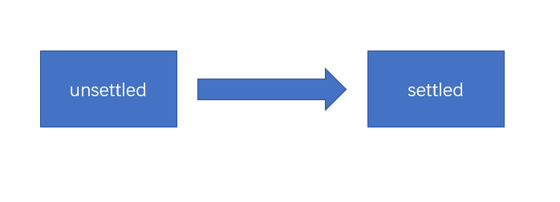

# ES6 {ignore} 
[toc]

# ES6课程概述

1. **ECMAScript**、**Javascript**、**NodeJs**，它们的区别是什么？

    - **ECMAScript**：简称ES，是一个语言标准（循环、判断、变量、数组等数据类型）

    - **JavaScript**：运行在浏览器端的语言，该语言使用ES标准，ES + web API = JavaScript

    - **NodeJs**：运行在服务器端的语言，该语言使用的是ES标准，ES + Node API = NodeJs
  
无论是JavaScript，还是NodeJs，它们都是ES的超集（super set）

2. ECMAScript有哪些关键的版本？

    - ES3.0：  1999年
    
    - ES5.0：  2009年

    - ES6.0：  2015年，从该版本开始不再使用数字作为编号，而使用年份
    
    - ES7.0：  2016年

3. 为什么ES6如此重要？

    ES6解决了JS无法开发大型应用的语言层面的问题

4. 如何应对兼容性问题？

    相应的技术解决

# 声明变量的问题

使用var声明变量

1. 允许重复的变量声明，导致数据被覆盖

```js
        var a = 123;
        console.log(a);//abc
        var a = 'abc';
```

2. 变量提升：怪异的数据访问

```js
        if(Math.random() < 0.5){
            var a = 'abc';
            console.log(a);
        }else{
            console.log(a);
        }
        console.log(a);
```

3. 全局变量挂载到全局对象：全局对象成员污染问题 

```js
var a = 'abc';
console.log(window.a)//abc
```

## 使用let声明变量 

ES6不仅引入let关键字用于解决变量声明的问题，同时引入了块级作用域的概念

块级作用域：代码执行时遇到花括号，会创建一个块级作用域，花括号结束，销毁块级作用域

    在块级作用域中用let定义的变量，在作用域外不能访问

```js
//全局作用域
let a = 123;
{//创建块级作用域
    let a = 345;
    console.log(a);//345
}//销毁块级作用域
console.log(a)//123
```

- let声明的变量不会挂载到全局对象

- let声明的变量，不允许当前作用域范围内重复声明

- 使用let不会有变量提升，因此，不能在定义let变量之前使用他

    - 底层实现上，let声明的变量实际上也会有提升，但是提升后会将其放入到“暂时性死区”，如果访问的变量位于“暂时性死区”，则会报错,当代吗运行到该变量的声明语句时，会将其从“暂时性死区”中移除
    
    - 在循环中，用let声明的循环变量，会特殊处理，每次进入循环体，都会开启一个新的作用域，并且将循环变量绑定到该作用域，循环变量在循环结束后会销毁

    ```js
        console.log(a)//Cannot access 'a' before initialization
        let a = 123;
    ```

## 使用const声明变量

const和let完全相同，仅在于用const声明的变量，必须在声明时赋值，而且不可以重新赋值

实际上，在开发中，应该尽量使用const来声明变量，以保证变量的值不会随意篡改，原因是：

  1. 开发中很多变量，都不会改变，也不应该更改

  2. 很多框架或者是第三方JS库，都要求数据不可变，使用常量可以一定程度上保证这一点

注意的细节：

1. 常量不可变，是指声明的常量的内存空间不可变，并不保证内存空间中的地址指向其他空间不可变

2. 常量的命名
   
   1. 特殊的常量：该常量从字面意义上，一定是不可变的，比如圆周率、地月距离或者其它一些不可能改变的配置，通常，**这种常量的名称全部使用大写，多个单词用下划线‘_’连接**
   
   2. 普通的变量：使用和之前一样的命名即可

3. 在for循环中，不可以使用常量表示

# 字符串和正则表达式

## 更好的Unicode支持

    早期，由于储存空间宝贵，Unicode使用16位二进制来储存文字，我们将一个16位的二进制编码叫做一个码元（Code Unit）

    后来，由于技术的发展，Unicode对文字编码进行了扩展，将某些文字扩展到了32位（占用两个码元），并且，将某个文字对应的二进制数字叫做码点（Code Point）

    ES6为了解决某些文字的码元是两个的特殊，为字符串提供了方法：codePointAt，根据字符串码元的位置得到其码点

    同时ES6为正则表达式添加了一个flag：u，如果添加了该配置，则使用码点匹配

    ```js
        const text= '周';
        console.log(text.length);//1
        console.log(/^.$/u.test(text),text.codePointAt());//true 21608
    ```

## 更多的字符串API

**以下均为字符串的实例（原型）方法**

- ``includes`` 判断字符串中是否包含指定的子字符串,第二个参数为开始查找的索引

```js
    const text= '朝花夕拾';
    const result = text.includes('花');
    console.log(result);//true
    const demo = text.includes('花',2);
    console.log(demo);//false
```

- ``startWith`` 判断字符串中是否以指定的字符串开始

- ``endWith`` 判断字符串中是否以指定的字符串结尾

```js
    const text= '朝花夕拾';
    const result = text.startsWith('朝花');
    console.log(result);//true
    const demo = text.endsWith('夕');
    console.log(demo);//false
```

- ``repeat`` 将字符串重复指定的次数，然后返回一个新字符串

```js
    const text= '朝花夕拾';
    const result = text.repeat(4);
    console.log(result);//朝花夕拾朝花夕拾朝花夕拾朝花夕拾
```

## [扩展]正则中的粘连标记

标记名：y

含义：匹配时，完全按照正则对象中的lastIndex位置开始匹配，并且匹配的位置必须在lastIndex位置

将标记改为y，会从lastIndex处查看，若lastIndex处的符合正表达式则返回true

```js
const text = 'Hello World';
const reg = /W\w+/y;
reg.lastIndex = 6;
console.log(reg.test(text));//true
```

## 模板字符串

ES6之前处理字符串繁琐的连个方面：

1. 多行字符串

2. 字符串拼接

在ES6中，提供了模板字符串的书写，可以非常方便的换行和拼接，要做的仅仅是将字符串的开始和结尾改为 ` 符号

如果要在字符串中拼接JS表达式，只需要在模板字符串中使用``${表达式}``，表达式可以使任何有意义的代码

```js
const a = 'new';
const text = `Hello
${a}
World`;
console.log(text);
```

## [扩展]模板字符串标记

```js
const a = 'new';
const b = '!';
const text = myTag`Hello${a}World${b}`;
// 相当于const text = myTag(['Hello','world',''],'new','!');
function myTag (parts,arg1,arg2){
    console.log(parts,arg1,arg2)
}
 console.log(text);
```

# 函数

## 参数默认值

### 使用

在书写形参时，直接给形参赋值，赋的值即为默认值

这样一来，当调用函数时，如果没有给对应的参数赋值时（给它的值时undefined），则使用默认值

```js
function add (a,b=1,c=2){
    return a+b+c;
}
console.log(add(10,1,3));
console.log(add(10));
console.log(add(10,undefined,4));
```

### [扩展]对arguments的影响

只要给函数加了参数默认值，该函数会自动变为严格模式下的规则：arguments和形参脱离

```js
function A (a,b){
    console.log(arguments);//1,2
    console.log(a,b);//1,2
    b = 3;
    console.log(arguments);//1,3
    console.log(a,b);//1,3
}
console.log(A(1,2));

function B(a=1,b=2){
    console.log(arguments);//1,2
    console.log(a,b);//1,2
    b = 3;
    console.log(arguments);//1,2
    console.log(a,b);//1,3  
}
console.log(B(1,2));
```

### [扩展]留意暂时性死区

形参和ES6中的let或const声明一样，具有作用域，并且根据参数的声明顺序，存在暂时性死区

```js
// 定义参数时，a定义后没传参数，a要赋默认为b，但b的定义在a后面，所以报错
function A(a = b, b) {
    console.log(a, b);
}
A(undefined, 2);//报错 Cannot access 'b' before initialization
```

## 剩余参数

```js
function sum() {
    let sum = 0;
    for (let i = 0; i < arguments.length; i++) {
        sum += arguments[i];
    }
    return sum;
}
console.log(sum(1,2,3));
```

arguments的缺陷：

1. 如果和形参配合使用，容易发生混乱（严格模式下不会）

2. 从语义上来说，使用arguments获取参数，由于形参缺失，无法从函数定义上理解函数的真实意图

**ES6的剩余参数专门用于收集末尾的所有参数：将其放置到一个形参数组中**

```js
function sum(...args) {
    //将剩余所有的参数收集到args数组中
    let sum = 0;
    for (let i = 0; i < args.length; i++) {
        sum += args[i];
    }
    return sum;
}
console.log(sum(1,2,3));
```

**注意**：

1. 一个函数仅能出现一个剩余参数

2. 一个函数，如果有剩余参数，剩余参数必须是最后一个参数

## 展开运算符

```js
function sum(...args) {
    //将所有的参数收集到args数组中
    let sum = 0;
    for (let i = 0; i < args.length; i++) {
        sum += args[i];
    }
    return sum;
}
console.log(sum(1,2,3));

/**
 * 生成一个长度为length的数组，数组每一项随机
 * @param {*} length 
 * @returns 
 */
function getRandomNumber(length){
    const arr = [];
    for(let i = 0;i<length;i++){
        arr.push(Math.random());
    }
    return arr;
}
const number = getRandomNumber(10);

console.log(number);
// 将数组展开，每一项作为参数依次传递，而不是把整个数组作为一个参数传递
console.log(sum(...number));
console.log(sum(...number,1,2,3));
console.log(sum(1,2,...number,1,2,3));
```

## 对数组展开 ES7

```js
const arr1 = [1,2,3,4,5,6];
// 克隆 arr1 数组到 arr2 
const arr2 = [...arr1];
console.log(arr2,arr1 === arr2);
```

## 对对象展开 ES7

```js
const obj1 = {
    name:'a',
    age:18,
    love:'b'
};
// 克隆 obj1 对象到 obj2 
const obj2 = {...obj1}
console.log(obj2,obj1 === obj2);

//覆盖obj1中的一个属性
const obj3 = {
    ...obj1,
    name:'c'
};
console.log(obj3);
```

**注意：数组和对象的展开克隆是浅度克隆**

```js
//柯里化ES6实现
function curry(func, ...args) {
    return function (...subArgs) {
        // 将所有的参数拼接到一个数组里
        let allArgs = [...args, ...subArgs];
        // 判断这些参数的数量是否等于该函数需要的的形参数量
        if (allArgs.length === func.length) {
            // 等于的话，传入所有的参数，执行该函数
            return func(...allArgs)
        } else {
            // 不等于的话，返回当前的函数，形参为该函数和该函数缺少的形参
            return curry(func, ...allArgs);
        }
    }
}
function sum(a, b, c, d) {
    return a + b * c - d;
}
let curry1 = curry(sum, 1, 2);
console.log(curry1(2, 4));
let curry2 = curry1(3);
console.log(curry2(5));
```

## 明确函数的双重作用

ES6之前的构造函数调用

```js
    function Person(firstName, lastName) {
        // console.log(this)
        // ES6之前：判断this指向是否指向Person，若没指向Person则说明调用时未使用new关键字调用
        if (!(this instanceof Person)) {
            throw new Error('该函数需要使用new关键字调用')
        }
        this.firstName = firstName;
        this.lastName = lastName;
        this.fullName = `${firstName}${lastName}`;
    }
    let p1 = new Person('zhou', 'tao');
    console.log(p1);
    // let p2 = Person('zhou', 'tao');
    // console.log(p2);
    let p3 = Person.call(new Person(),'zhou', 'tao');
    console.log(p3);//undefined

```

**ES6提供了一个特殊的API，可以使用API在函数内部，判断该函数是否使用了new来调用**

```js
new.target//该表达式，得到的是：如果没有使用new来调用函数，则返回undefined；若使用了，则得到的是new关键字后面的函数本身
```

```js
function Person(firstName, lastName) {
    // 用new.target来判断是否是用new来调用的
    if (!new.target) {
        throw new Error('该函数需要使用new关键字调用')
    }
    this.firstName = firstName;
    this.lastName = lastName;
    this.fullName = `${firstName}${lastName}`;
}
let p1 = new Person('zhou', 'tao');
console.log(p1);
```

## 箭头函数

回顾this指向：

   1. 通过对象调用函数，this指向对象

   2. 直接调用函数，this指向全局对象

   3. 如果通过new调用函数，this指向所创建的对象

   4. 如果通过apply、call调用函数，this指向指定的数据

   5. 如果是DOM事件函数，this指向事件源

**this指向取决于怎么调用函数，与定义无关**

### 适用语法

箭头函数是一个函数表达式，理论上，任何使用函数表达式的场景都可以使用箭头函数

**完整语法：**

- **多个参数：**

    ```js
    (参数1,参数2,...)=>{
        //函数体
    }
    ```

    ```js
    let obj = (a,b,c)=>{
        console.log(a,b,c);
    }
    obj(1,2,3);//1 2 3
    ```

- **单个参数：**

    ```js
    参数=>{
        //函数体
    }
    ```

    ```js
    let obj = num=>{
        console.log(num);
    }
    obj(3);//3
    ```

- **函数体只有一条返回语句，可省略花括号和return关键字**

    ```js
    (参数1,参数2,...)=> 函数体

    ```

    ```js
    let isOdd = num => num % 2 !== 0;
    console.log(isOdd(5));//1
    let sum = (a, b, c) => ({
        a: a,
        b: b,
        c: a + b
    });
    console.log(sum(1,2,3));

    ```

### 注意细节

- 箭头函数的函数体中的this，**取决于箭头函数定义的位置的this指向**，与如何调用无关

    **原因**：箭头函数中不存在this、arguments、new target，如果使用了，则使用的是外层的this、arguments、new target

- 箭头函数没有原型

- 箭头函数不能当做构造函数使用

```js
    const obj = {
        count: 0,
        start: function () {
            setInterval(() => {
                this.count++;
                console.log(this.count)
            }, 1000);
        },

        regEvent: function () {
            window.onclick = () => {
                console.log(this.count)
            }
        },
        print:()=>{
            console.log(this.count)//window
        }
    }

    obj.start();
    obj.regEvent();
```

### 应用场景
    
1. 临时性使用的函数，并不会刻意调用它，列如：

   1. 事件处理函数
   
   2. 异步处理函数，列如：计时器  
   
   3. 其他临时性函数

2. 为了绑定外层this的函数

3. 在不影响其他代码的情况下，保持代码的简洁，最常见的是，数组方法中的回调函数

    ```js
    let number = [1, 2, 4, 5, 6];
    let result = number.filter(num => num % 2 != 0).map(num => num * 2).reduce((a,b)=>a+b)
    console.log(result)
    ```

# 对象

## 新增的对象字面量语法

1. 成员速写

如果对象字面量初始化时，成员的名称来自于一个变量，并且和变量的名称相同，便可以进行简写

```js
function createUser(loginId, loginPwd, nickName) {
    let sayHello = function(){
        console.log(this.loginId,this.loginPwd,this.nickName)
    }
    return {
        loginId,
        loginPwd,
        nickName,
        sayHello,
        id: Math.random()
    }
}
let user = createUser('abc', 12345, 'zt');
user.sayHello();
```

2. 方法速写

对象字面量初始化时，方法可以省略冒号和function关键字

```js
    function createUser(loginId, loginPwd, nickName) {
        return {
            loginId,
            loginPwd,
            nickName,
            sayHello() {
                console.log(this.loginId, this.loginPwd, this.nickName)
            },
            id: Math.random()
        }
    }
    let user = createUser('abc', 12345, 'zt');
    user.sayHello();
```

3. 计算属性名

有的时候，初始化属性名，某些属性名可能来自于某个表达式得到的值，在ES6中，可以使用
中括号来表示该属性名是通过计算得到的。

```js
        let prop1 = 'name';
        let prop2 = 'age';
        let user ={
            [prop1]:'abc',
            [prop2]:18,
        }
        console.log(user)
```

## Object新增的API

1. ``Object.is``
    
    用于判断两个数据是否相等，基本上跟严格相等（===）是一致的，除了以下两点：

     - NaN 和 NaN 相等

     - +0 和 -0 相等
    
    ```js
        console.log(NaN === NaN);//false
        console.log(+0 === -0)//true
        console.log(Object.is(NaN, NaN));//true
        console.log(Object.is(+0, -0));//false
    ```

2. ``Object.assign``

    用于混合对象，可传多个参数，后面的对象覆盖前面的对象，改变第一个对象并返回

    ```js
            let obj1 = {
            a: 123,
            b: 234,
            c: 'abc'
        }
        let obj2 = {
            a: 567,
            d: 'efg'
        }
        // 将obj2的数据覆盖obj1的数据，改变并返回obj1
        // 为防止第一个对象被更改，可在第一个参数传空对象
        console.log(Object.assign(obj1, obj2));
        console.log(Object.assign(obj1, obj2) === obj1);
    ```

3. ``Object.getOwnPropertyNames`` 

    非ES6方法，枚举对象自己拥有的属性（不是原型上的），返回一个数组，无规定排序；ES6明确该方法的排序方法：

    - 先排数字 按照升序排序
    
    - 再排其他 按照书写顺序排序

    ```js
            let obj1 = {
            0: 123,
            b: 'abc',
            1: 245,
            d: 678
        }
        console.log(Object.getOwnPropertyNames(obj1));
    ```

4. ``Object.setPrototypeOf``

    该函数用于设置某个对象的隐式原型,将第一个参数的隐式原型设置成第二个参数

    ```js
    let obj1 ={
        a:1
    }
    let obj2 ={
        b:2
    }
    // 将obj1的隐式原型设置成obj2
    Object.setPrototypeOf(obj1,obj2);
    console.log(obj1.__proto__ === obj2);//true
    ```

## 面向对象简介

面向对象：一种编程思想，更具体的语言无关

对比面向过程：

- 面向过程：思考的切入点是功能的步骤

- 面向对象：思考的切入点是对象的划分

## 类：构造函数的语法糖

### 传统的构造函数问题

1. 属性和原型方法分离，降低了可读性

2. 原型成员可以被枚举

```js
        // 面向对象中,将下面对一个对象的所有成员的定义,叫做类

        // 构造函数  构造器
        function Animal(type, name, age, sex) {
            this.type = type;
            this.name = name;
            this.age = age;
            this.sex = sex;
        }
        // 定义实例方法（原型方法）
        Animal.prototype.print = function () {
            console.log(`【种类】${this.type}\n【名字】${this.name}\n【年龄】${this.age}\n【性别】${this.sex}`)
        }
        let dog = new Animal('dog', 'A', 3, 'boy');
        dog.print();

        //枚举属性时会枚举原型上的属性print
        for(let prop in dog){
            console.log(prop);
        }
```

3. 默认情况下，构造函数仍然可以被当做普通函数使用

类的书写和优点

```js
// 类的书写方式 
// 整体化
class Animal {
    constructor(type, name, age, sex) {
        this.type = type;
        this.name = name;
        this.age = age;
        this.sex = sex;
    }
    print() {
        console.log(`【种类】${this.type}\n【名字】${this.name}\n【年龄】${this.age}\n【性别】${this.sex}`)
    }
}

let dog = new Animal('dog', 'A', 3, 'boy');
dog.print();

//枚举属性时，不会枚举原型上的属性print
for (let prop in dog) {
    console.log(prop);
}

// 无法被当作普通函数被调用
let text = Animal('dog', 'A', 3, 'boy') // Class constructor Animal cannot be invoked without 'new'
```

### 类的特点

1. 类声明不会被提升，与 let 和 const 一样，存在暂时性死区

2. 类中的所有代码**均在严格模式下执行**

3. 类的所有方法都是不可枚举的

4. 类的所有方法都无法被当作构造函数使用

5. 类的构造器**必须使用 new 来调用**

## 类的其他书写方式

1. 可计算的成员名

    ```js
    // 表达式保存成员名
    let printName ='print';
    class Animal {
        constructor(type, name, age, sex) {
            this.type = type;
            this.name = name;
            this.age = age;
            this.sex = sex;
        }
        // 中括号[] 加上 成员名变量
        [printName]() {
            console.log(`【种类】${this.type}\n【名字】${this.name}\n【年龄】${this.age}\n【性别】${this.sex}`)
        }
    }
    let dog = new Animal('dog', 'A', 3, 'boy');
    dog.print();
    ```

2. getter 和 stter

    Object.defineProperty可定义某个对象成员属性的读取与设置

    Object.defineProperty的配置参考：https://developer.mozilla.org/zh-CN/docs/Web/JavaScript/Reference/Global_Objects/Object/defineProperty 和 **JS基础笔记** **属性描述符章节**


    ```js
    class Animal {
        constructor(type, name, age, sex) {
            this.type = type;
            this.name = name;
            this.age = age;
            this.sex = sex;
        }
        // 创建一个age属性，并给它加上getter，读取该属性时，会运行该函数
        get age() {
            return this._age + '岁';
        }
        // 创建一个age属性，并给它加上setter，给该属性复制时，会运行该函数
        set age(age) {
            if (typeof age !== 'number') {
                throw new Error('age property must be a number');
            }
            if (age < 0) {
                age = 0;
            } else if (age > 1000) {
                age = 1000;
            }
            this._age = age;
        }
        print() {
            console.log(`【种类】${this.type}\n【名字】${this.name}\n【年龄】${this.age}\n【性别】${this.sex}`);
        }
    }
    let dog = new Animal('dog', 'A', -3, 'boy');
    dog.age = -10;
    console.log(dog.age);
    ```
    


3. 静态成员

    - 只能通过构造函数访问的成员

    **在类中，使用static关键字创建的成员即静态成员**

    ```js
    class Animal {
        constructor(type, name, age, sex) {
            this.type = type;
            this.name = name;
            this.age = age;
            this.sex = sex;
        }
        print() {
            console.log(`【种类】${this.type}\n【名字】${this.name}\n【年龄】${this.age}\n【性别】${this.sex}`)
        }
        // 添加静态方法
        static from = function (){
            return 'China';
        };
        // 添加静态属性
        static isAnimal = true;
    }
    let dog = new Animal('dog', 'A', 3, 'boy');
    console.log(dog.age);//通过构造函数new出来的对象来获取的成员叫做实例成员
    console.log(Animal.from());//只能通过构造函数来获取的成员叫做静态成员
    ```


4. 字段初始化器（ES7）

```js
class Text {
    a = 1;
    b = 2;
    constructor(){
    //     a=1;
    //     b=2
    this.d = this.a + this.b;
    }
    static c = 'abc';
}
let text = new Text();
console.log(text);// {a: 1, b: 2, d: 3}
```

  注意：

   - 使用static添加的是静态成员
 
   - 没有使用static的字段初始化器，添加的成员位于对象上面，即实例成员 
 
   - 箭头函数在字段初始化器位置上，this指向当前对象 即相当于在前面加了```constructor(){  }```

```js
class Text {
    constructor() {
        this.a = 1;
        this.b = 2
    }
    // 字段初始化器添加print方法
    print = () => {
        console.log(this.a);
    }
}
let text = new Text()
let p = text.print;
p();
```

5. 类表达式

```js
let A = class {//匿名类，类表达式
    one = 1;
    two = 2;
}
let a = new A();
console.log(a);
```

6. [扩展]装饰器（ES7） Decorator

## 类的继承

如果两个类A和B可以描述为：B是A，则，A和B形成继承关系

如果B是A，则：

1. B继承A

2. A派生B

3. B是A的子类

4. A是B的父类

如果A是B的父级，则B会自动拥有A中的所有实例成员

**ES6之前的构造函数继承：**

```js
 function Animal (type, name, age, sex) {
        this.type = type;
        this.name = name;
        this.age = age;
        this.sex = sex;
    }
    Animal.prototype.print= function() {
        console.log(`【种类】${this.type}\n【名字】${this.name}\n【年龄】${this.age}\n【性别】${this.sex}`);
    }
function Dog(name,age,sex){
    Animal.call(this,'dog',name,age,sex);
}
// 继承父类的原型
Object.setPrototypeOf(Dog.prototype,Animal.prototype);
let dog =new Dog('旺财',3,'boy');
console.log(dog);
```

**ES6提供的方法：**


新的关键字：

 - extends：继承，用于类的定义

 - super：

    - 直接当做函数调用

    - 如果当做对象使用，则表示父类的原型

注意：

   - ES6要求，如果定义了constructor，并且该类是子类，则必须在constructor的第一行手动调用父类的构造函数

   - 如果子类不写constructor，则会有默认的构造器，该构造器需要的参数与父类一致，并且自动调用父类构造器

```js
class Animal {
    constructor(type, name, age, sex) {
        this.type = type;
        this.name = name;
        this.age = age;
        this.sex = sex;
    }
    print() {
        console.log(`【种类】${this.type}\n【名字】${this.name}\n【年龄】${this.age}\n【性别】${this.sex}`);
    }
    jiao(){
        throw new Error('"动物"不会叫');
    }
}


// extends： Dog 继承自 Animal
class Dog extends Animal{
    constructor(name,age,sex){
        // 注意: 在派生的类中, 在使用'this'之前, 必须先调用super()。
        // 忽略这, 将导致引用错误。

        // super：调用 父对象/父类 的构造函数
        super ('dog',name,age,sex);
        
        this.loves = '吃骨头';
    }
    jiao(){
        console.log('旺旺');
    }
    print(){
        // super：调用 父对象/父类 上的方法
        // 先调用父级的print，避免代码重复
        super.print();
        console.log(`【种类】${this.loves}`);
    }
}


let dog = new Dog('ww',4,'boy');
dog.print();
console.log(dog);
// 如果Dog的原型上有该方法，则只会调用Dog上的方法，不会向上找了
dog.jiao();
```

## 解构

### 什么是解构

    使用ES6的一种语法规则，将一个对象或数组的某个属性提取到某个变量中

    解构不会影响原对象或原数组

    ```js
    let user = {
        name:'zt',
        age:'18',
        sex:'男',
        address:{
            province:'安徽',
            city:'合肥'
        }
    }

    // //写法一
    // let name,age,sex,address;
    // ({name,age,sex,address} = user);

    // 写法二
    let {name,age,sex,address} = user;

    console.log(name,age,sex,address)//zt 18 男 {province: "安徽", city: "合肥"}
    ```

### 在解构中使用默认值

```js
{变量名 = 默认值}
```

```js
let user = {
    name:'zt',
    age:'18',
    sex:'男',
    address:{
        province:'安徽',
        city:'合肥'
    }
}
let {name,age,sex,isWorking= 'no',address} = user;
console.log(name,age,sex,isWorking ,address)//zt 18 男 no {province: "安徽", city: "合肥"}
```
### 非同名属性解构

```js
{属性名:变量名}
```

```js
let user = {
    name:'zt',
    age:'18',
    sex:'男',
    address:{
        province:'安徽',
        city:'合肥'
    }
}

// 定义2个变量：age,sex
// 再从对象user中读取同名属性赋值（其中gender读取的是sex属性）
let {age,sex:gender} = user;
console.log(age,gender)//18 男


// 解构出user中的name、address中的province
// 定义两个变量name、province
// 再解构
let {name,address:{province}} = user;
console.log(name,province);// zt 安徽
```

**解构与展开运算符配合使用**

```js
let user = {
    name:'zt',
    age:18,
    sex:'男',
    address:{
        province:'安徽',
        city:'合肥'
    }
}
// 解构出name，然后，剩余的所有属性放到一个新对象中，对象名为obj
// name:zt
// obj:{age:18,sex:'男',address:{province:'安徽',city:'合肥'}}
let {name,...obj} = user;
console.log(name,obj)//zt {age: 18, sex: "男", address: {…}}
```

## 数组解构

```js
let arr = ['zt', 18, '男', ['安徽', '合肥'],{a:1,b:2}];

// 写法一
// let {
//     0:name,
//     1:age,
//     2:sex,
//     3:address
// } = arr;

// 写法二
let [name, , ,address]= arr;

console.log(name,address)

// 深层解构数组
let [, , , [province, city]] = arr;
console.log(province, city)

// 深层解构对象
let [, , , ,{a,b}] = arr;
console.log(a, b)
```

**数组结构与展开运算符配合使用**

```js
let arr = [1,2,3,4,5];

// 得到数组前两项，分别放到变量a和b中，然后剩余的所有数据放到数组num中

let [a,b,...num] = arr;
console.log(a,b,num)//1 2  [3, 4, 5]
```

**结构实现变量交换**

```js
let a = 1,
    b = 2;
[a, b] = [b, a];
console.log(a, b);
```

## 参数解构

```js
let user = {
    name: 'zt',
    age: 18,
    sex: '男',
    address: {
        province: '安徽',
        city: '合肥'
    }
}

function print({
        name,
        age,
        sex,
        address: {
            province,
            city
        }}) {
        console.log('名字', name);
        console.log('年龄', age);
        console.log('性别', sex);
        console.log('省份', province);
        console.log('城市', city);
    }
print(user);
```

## 符号

### 普通符号

符号是ES6新增的一个数据类型，它通过使用函数``Symbol(符号描述)``来创建

```js
let syb1 = Symbol();
let syb2 = Symbol('abc');
console.log(syb1,syb2);//Symbol() Symbol(abc)
```

符号设计的初衷是为了给对象设置私有属性

符号有以下特点：

  - 没有字面量
  
  - 使用typeOf得到的类型是 symbol
  
  - **每次调用 symbol 函数得到的符号永远不相等，无论符号名是否相等**

  - 符号可以作为对象的属性名存在，这种属性称之为符号属性

        - 开发者可以通过精心的设计，让这些属性无法通过常规方式被外界访问
        
        - 符号属性是不能枚举的，因此在for-in循环中无法读取到符号属性，``Object.key`` 方法也无法读取到符号属性

        - ``Object.getOwnPropertyNames`` 尽管可以到得到所有无法枚举的属性，但是仍然无法读取到符号属性
        
        - ES6 新增 ``Object.getOwnPropertySymbols()`` 方法，可以读取符号属性
        
        - 符号无法被隐式转换，因此不能被用于数学运算、字符串拼接或其他隐式转换的场景，但符号可以显示的转换为字符串，通过String构造函数进行转换即可，``console.log``之所以可以输出符号，是它在内部进行了显式转换


```js
let Hero = (() => {
    let getRandom = Symbol();
    return class {
        constructor() {
            this.attac = 30;
            this.hp = 300;
            this.defence = 10;
        }
        gongji() {
            let dmg = this.attac * this[getRandom](0.8, 1.1);
            console.log(dmg);
        }
        [getRandom](min, max) {
            return Math.random() * (max - min) + min;
        }
    }
})()
let hero = new Hero();
console.log(hero);
hero.gongji()
```

### 共享符号

根据某个符号描述能够得到同一个符号

```js
Symbol.for('符号描述');//获取共享符号
```

```js
let syb1 = Symbol.for('abc');
let syb2 = Symbol.for('abc');
let obj1 = {
    a:1,
    b:2,
    [syb1]:3
}
let obj2 = {
    a:'a',
    b:'b',
    [syb2]:'c'
}
console.log(Object.getOwnPropertySymbols(obj1));
console.log(Object.getOwnPropertySymbols(obj2));
console.log(obj1,obj2,syb1 === syb2);
```

实现Symbol.for()功能

```js
let SymbolFor = (() => {
    let global = {}; //创建一个对象接受该符号属性
    return function (name) {
        if (!global[name]) { //判断该对象里是否有相同符号描述的符号属性
            global[name] = Symbol(name); //没有的话，就赋值一个符号属性
        }
        return global[name]; //返回该符号属性
    }
})()
let syb1 = SymbolFor('abc');
let syb2 = SymbolFor('abc');
let obj1 = {
    a: 1,
    b: 2,
    [syb1]: 3
}
let obj2 = {
    a: 'a',
    b: 'b',
    [syb2]: 'c'
}
console.log(Object.getOwnPropertySymbols(obj1));
console.log(Object.getOwnPropertySymbols(obj2));
console.log(obj1, obj2, syb1 === syb2);
```

## 知名（公共、具名）符号

知名符号是一些具有特殊含义的共享符号，通过 Symbol 的静态属性得到

ES6 延续了 ES5 的思想：减少魔法，暴露内部实现

因此， ES6 用知名符号暴露了某些场景的内部实现

1. ``Symbol.hasInstance``

该符号用于定义构造函数的静态成员，它将影响 instanceof 的判定

```js
obj instanceof A

// 等效于

A[Symbol.hasInstance](obj);//Function.prototype[Symbol.hasInstance]
```

更改instanceof的内部实现

```js
function A() {

}
Object.defineProperty(A, Symbol.hasInstance, {
    value: function () {
        return false;
    }
})
let a = new A();
console.log(a instanceof A);
```

2. [扩展]``Symbol.isConcatSpreadable``

    该知名符号会影响concat拼接时是否分割

    ```js
    let arr = [3];
    let result = arr.concat(56, [1, 2])
    console.log(result)//[3,56,1,2] concat方法在默认情况下拼接数组和对象会对传入的数组或对象进行分割
    let arr1 = [3, 4, 5, 6]
    arr1[Symbol.isConcatSpreadable] = false;//取消concat的默认分割
    arr2 = arr.concat(3, arr1);
    console.log(arr2); //[3,3,[3,4,5,6]] concat拼接时不分割
    ```

3. [扩展]``Symbol.toPrimitive``

    该知名符号会影响类型转换的结果

    ```js
    let obj = {
        a: 1,
        b: 2,
        [Symbol.toPrimitive]: function () {
            return 2;
        }
    }
    console.log(obj + 123); //125
    ```

4. [扩展]``Symbol.toStringTag``

    影响``Object.prototype.tsString``的返回值

    ```js
    let arr = [1,2,3]
    arr[Symbol.toStringTag] = 'person';
    console.log(Object.prototype.toString.apply(arr)); //[object person]
    ```

# 异步

## 事件循环

浏览器宿主环境中包含的5个线程：

 1. JS引擎：负责执行执行栈的最顶端的代码
 
 2. GUI线程：负责渲染页面 
 
 3. 事件监听线程：负责监听各种事件
 
 4. 计时线程：负责计时
 
 5. 网络线程：负责网络通信

- 宏任务（队列）：macroTask，计时器结束的回调、事件回调、http回调等等绝大部分异步函数进入宏队列

- 微任务（队列）：``MutationObserver``，Promise产生的回调进入微队列，优先于宏队列进行执行

``MutationObserver``：监听某个DOM元素的变化

```html
    <ul class="ul"></ul>
    <button class="btn">添加</button>
    <script src="./index.js"></script>

    <script>
        let i = 1;
        let ul = document.getElementsByClassName('ul')[0];
        let btn = document.getElementsByClassName('btn')[0];
        btn.onclick = function () {
            setTimeout(() => {
                console.log('添加了一个li')
            }, 0);
            let li = document.createElement('li');
            li.innerHTML = i++;
            ul.appendChild(li);
        }
        // 监听ul
        let observer = new MutationObserver(() => {
            // 当监听的DOM元素发生变化时运行的回调函数
            console.log('ul发生了变化');
        })
        // 监听ul
        observer.observe(ul, {
            attributes: true,//监听属性变化
            childList: true,//监听子元素变化
            subtree: true//监听子树的变化
        })
        // observer.disconnect()//取消监听

    </script>
```

## 事件和回调函数的缺陷

我们习惯于使用传统的回调或事件处理来处理异步问题

- 事件：某个对象的属性是一个函数，当发生某一件事时，运行该函数

```js
dom.onclick = function () {

}
```
 
- 回调：运行某个函数以实现某个功能的时候，传入一个函数作为参数，当某事发生时，会运行该函数

```js
dom.addEventListener('click',function(){

})
```

本质上，事件和回调并没有本质的区别，只是把函数放置的位置不同而已

目前，该模式主要面临以下两个问题：

1. 回调地狱：某个异步操作需要等待之前的异步操作完成，无论用事件还是回调，都会陷入不断地嵌套

```html
    <button>按钮1：注册按钮2的事件</button>
    <button>按钮2：注册按钮3的事件</button>
    <button>按钮3：触发按钮3的事件</button>
    <script>
        let btn1 = document.getElementsByTagName('button')[0],
        btn2 = document.getElementsByTagName('button')[1],
        btn3 = document.getElementsByTagName('button')[2];
        //回调地狱
        btn1.addEventListener('click',function(){
            btn2.addEventListener('click',function(){
                btn3.addEventListener('click',function(){
                    console.log('hello');
                })
            })
        })
    </script>
```

回调地狱
```js
function biaobai(god, callback) {
    console.log(`小明向女神【${god}】表白`);
    setTimeout(() => {
        if (Math.random() > 0.8) {
            // success
            callback(true);
        } else {
            // fali
            callback(false);
        }
    }, 1000);
}
biaobai('小周', function (result) {
    if (result) {
        console.log('小明向小周表白成功了，很开心')
    } else {
        console.log('小周拒绝了小明，小明表示无压力，然后向小王表白');
        biaobai('小王', function (result) {
            if (result) {
                console.log('小明向小王表白成功了，很开心')
            } else {
                console.log('小王婉拒了小明，然后小明向小刘表白');
                biaobai('小刘', function (result) {
                    if (result) {
                        console.log('小明向小刘表白成功了，很开心')
                    } else {
                        console.log('小刘婉拒了小明，小明很伤心');
                    }
                })
            }
        })
    }
})
```

回调地狱
```js
        //获取李华所在班级的老师的信息
        ajax({
            url: "./data/students.json?name=马冬梅",
            success: function (data) {
                for (let i = 0; i < data.length; i++) {
                    if (data[i].name === "马冬梅") {
                        const cid = data[i].classId;
                        ajax({
                            url: "./data/classes.json?id=" + cid,
                            success: function (data) {
                                for (let i = 0; i < data.length; i++) {
                                    if (data[i].id === cid) {
                                        const tid = data[i].teacherId;
                                        ajax({
                                            url: "./data/teachers.json?id=" + tid,
                                            success: function (data) {
                                                for (let i = 0; i < data.length; i++) {
                                                    if (data[i].id === tid) {
                                                        console.log(data[i]);
                                                    }
                                                }
                                            }
                                        })
                                        return;
                                    }
                                }
                            }
                        })
                        return;
                    }
                }
            }
        })
```

2. 异步之间的联系：某个异步操作要等待多个异步操作的结果，对这种联系的结果，会让代码的复杂度剧增

模拟等待异步操作的场景
```js
        function biaobai(god, callback) {
            console.log(`小明向女神【${god}】表白`);
            setTimeout(() => {
                if (Math.random() > 0.9) {
                    // success
                    callback(true);
                } else {
                    // fali
                    callback(false);
                }
            }, Math.floor(Math.random()*2000+1000));
        }
        let agreeGod =null;//用于保存第一个答应的女神
        let results =[];//用于记录回复结果的数组
        for (let i = 0; i < 20; i++) {
            biaobai(`女神${i}`,(result)=>{
                results.push(result)


                if(result){
                    console.log(`女神${i}同意了`);
                    if(agreeGod){
                        console.log(`小明回复女神${i}：不好意思，发错了`);
                    }else{
                        agreeGod = `女神${i}`
                        console.log('小明找到了真爱')
                    }
                }else{
                    console.log(`女神${i}婉拒了小明`);
                }
                if(results.length === 20){
                    console.log('记录日志',results)
                }
            })
        }
```

## 异步处理的通用模型

为了兼容旧系统，ES6 并不打算抛弃掉过去的做法，只是基于该模型推出一个全新的 API，使用该 API ，会让异步处理更加的简洁优雅。

理解该 API，最重要的，是理解它的**异步模型**

1. ES6 将某一件可能发生异步操作的事情，分为两个阶段：``unsettled`` 和 ``settled``



 - ``unsettled``： 未决阶段，表示事情还在进行前期的处理，并没有发生通向结果的那件事

 - ``settled``：已决阶段，事情已经有了一个结果，不管这个结果是好是坏，整件事情无法逆转

事情总是从 未决阶段 逐步发展到 已决阶段的。并且，未决阶段拥有控制何时通向已决阶段的能力。

2. ES6将事情划分为三种状态： ``pending``、``resolved``、``rejected``

   - ``pending``: **挂起**，处于未决阶段，则表示这件事情还在挂起（最终的结果还没出来）
 
   - ``resolved``：**已处理**，已决阶段的一种状态，表示整件事情已经出现结果，并是一个可以按照正常逻辑进行下去的结果
  
   - ``rejected``：**已拒绝**，已决阶段的一种状态，表示整件事情已经出现结果，并是一个无法按照正常逻辑进行下去的结果，通常用于表示有一个错误
  
    既然未决阶段有权力决定事情的走向，因此，未决阶段可以决定事情最终的状态！

    1. 我们将 把事情变为``resolved``状态的过程叫做：``resolve``，推向该状态时，可能会传递一些数据

    2. 我们将 把事情变为``rejected``状态的过程叫做：``reject``，推向该状态时，同样可能会传递一些数据，通常为错误信息

**无论是阶段，还是状态，是不可逆的**！


3. 当事情达到已决阶段后，通常需要进行后续处理，不同的已决状态，决定了不同的后续处理。

   - ``resolved``状态：这是一个正常的已决状态，后续处理表示为 ``thenable``

   - ``rejected``状态：这是一个非正常的已决状态，后续处理表示为 ``catchable``


后续处理可能有多个，因此会形成作业队列，这些后续处理会按照顺序，当状态到达后依次执行

4. 整件事称之为Promise


理解上面的概念，对学习Promise至关重要！

## Promise 的基本使用

```js
const pro = new Promise((resolve, reject)=>{
    // 未决阶段的处理
    // 通过调用resolve函数将Promise推向已决阶段的resolved状态
    // 通过调用reject函数将Promise推向已决阶段的rejected状态
    // resolve和reject均可以传递最多一个参数，表示推向状态的数据
})

pro.then(data=>{
    //这是thenable函数，如果当前的Promise已经是resolved状态，该函数会立即执行
    //如果当前是未决阶段，则会加入到作业队列，等待到达resolved状态后执行
    //data为状态数据
}, err=>{
    //这是catchable函数，如果当前的Promise已经是rejected状态，该函数会立即执行
    //如果当前是未决阶段，则会加入到作业队列，等待到达rejected状态后执行
    //err为状态数据
})

// 多个队列
pro.then(data=>{}, err=>{})
```

**细节**:

1. 未决阶段的处理函数是同步的，会立即执行

2. ``thenable``和``catchable``函数是异步的，就算是立即执行，也会加入到事件队列中等待执行，并且，加入的队列是微队列

```js
        let pro = new Promise((resolve, reject) => {
            console.log(1);

            //异步函数，必须等待同步函数执行完才能执行
            // 宏队列
            setTimeout(() => {
                console.log(2)
            }, 0)

            //异步函数，必须等待同步函数执行完才能执行
            // 微队列
            resolve(3);
            console.log(4);
        }).then(data => {
            console.log(data);
        })
        console.log(5)//输出顺序 1,4,5,3,2
```

3. ``pro.then``可以只添加``thenable``函数，``pro.catch``可以单独添加``catchable``函数

```js
        let pro = new Promise((resolve, reject) => {
            resolve(1);
        });
        pro.then(data => {
            console.log(data)
        })
```

4. 在未决阶段的处理函数中，如果发生未捕获的错误，会将状态推向``rejected``，并会被``catchable``捕获

```js
        let pro = new Promise((resolve, reject) => {
            throw new Error('error');//抛出错误，直接使pro被推向为rejected状态
        });
        pro.then(data => {
            console.log(data)
        })
        pro.catch(err=>{
            console.log(err)
        })
```

5. 一旦状态推向了已决阶段，无法再对状态做任何更改

```js        
        let pro = new Promise((resolve, reject) => {
            resolve(1);//只只执行到此，后面无法改变状态，相当于直接忽略
            reject(2);//无效代码
            resolve(3)//无效代码
        });
        pro.then(data => {
            console.log(data)
        })
        pro.catch(err=>{
            console.log(err)
        })

```

6. **``Promise``并没有消除回调，只是让回调变得可控**

## Promise的串联

    当后续的Promise需要用到之前的Promise的处理结果时，需要Promise的串联

    Promise对象中，无论是then方法还是catch方法，它们都具有返回值，返回的是一个全新的Promise对象，它的状态满足下面的规则：

1. 如果当前的Promise是未决的，得到的新的Promise是挂起状态
   
2. 如果当前的Promise是已决的，会运行响应的后续处理函数，并将后续处理函数的结果（返回值）作为resolved状态数据，应用到新的Promise中；如果后续处理函数发生错误，则把返回值作为rejected状态数据，应用到新的Promise中。
   
3. 后续的Promise一定会等到前面的Promise有了后续处理结果后，才会变成已决状态

如果前面的Promise的后续处理，返回的是一个Promise，则返回的新的Promise状态和后续处理返回的Promise状态保持一致。

```js
        let p1 = new Promise((resolve,reject)=>{
            resolve(1)
        });
        let p2 = new Promise((resolve,reject)=>{
            resolve(2)
        });

        let p3 = p1.then(data=>{
            return p2;//p2的状态和p3的状态保持一致，即p2、p3同挂起同已决
        })
        p3.then(data=>{
            console.log(data === p2,data)
        })
        setTimeout(function(){
            console.log(p2)
        },100)
```

解决回调地狱
```js
        ajax({
            url: './data/students.json'
        }).then(sts => {//得到学生列表
            for (i = 0; i < sts.length; i++) {
                if (sts[i].name === '李华') {
                    return sts[i].classId;//得到班级ID
                }
            }
        }).then(cid => {//班级ID
            return ajax({
                url: './data/classes.json?' 
            }).then(cls => {//得到班级列表
                for (i = 0; i < cls.length; i++) {
                    if (cls[i].id === cid) {
                        return cls[i].teacherId//得到老师id
                    }
                }
            })
        }).then(tid => {//老师id
            return ajax({
                url: './data/teachers.json'
            }).then(ts => {
                for (i = 0; i < ts.length; i++) {
                    if (ts[i].id === tid) {
                        return ts[i]//得到老师信息
                    }
                }
            })
        }).then(teacher=>{
            console.log(teacher)
        })

```

循环解决回调地狱
```js
        function biaobai(god) {
            return new Promise((resolve, reject) => {
                console.log(`小明向女神【${god}】表白`);
                setTimeout(() => {
                    if (Math.random() > 0.9) {
                        // success
                        resolve(true);
                    } else {
                        // fali
                        resolve(false);
                    }
                }, 2000);
            })
        }

        let gods = ['a', 'b', 'c'];
        let pro;
        for (let i = 0; i < gods.length; i++) {
            if (i === 0) {
                pro = biaobai(gods[i])
            }
            pro = pro.then(resp => {
                if (resp === undefined) {
                    return;
                }
                if (resp) {
                    console.log(`女神【${gods[i]}】同意了`)
                    return;
                }
                if (i !== gods.length - 1) {
                    console.log(`女神【${gods[i]}】拒绝了`)
                    return biaobai(gods[i + 1]);
                }else{
                    console.log('555')
                }
            })

        }
```

## Promise的其他API

### 原型成员（实例成员）

- then：注册一个后续处理函数，当Promise为resolved状态时运行该函数

- catch：注册一个后续处理函数，当Promise为rejected状态时运行该函数

- finally：[ES2018]注册一个后续处理函数（无参），当Promise为已决时运行该函数

```js
        let pro = new Promise((resolve, reject) => {
            resolve(1)
        })
        pro.then(resp => console.log(resp * 2));
        pro.then(resp => console.log(resp * 3));
        pro.catch(resp => console.log(-resp * 2));
        pro.catch(resp => console.log(-resp * 3));
        pro.finally(() => console.log('finally1'));
        pro.finally(() => console.log('finally2'));
```

### 构造函数成员 （静态成员）

- ``resolve(数据)``：该方法返回一个resolved状态的Promise，传递的数据作为状态数据

    特殊情况：如果传递的数据是Promise，则直接返回传递的Promise对象,而不是该Promise对象的返回值

    ```js
        let pro =  Promise.resolve();
        // 等效于
        pro = new Promise((resolve,reject)=>{
            resolve()
        })
    ```

- ``reject(数据)``：该方法返回一个rejected状态的Promise，传递的数据作为状态数据

    ```js
        let pro =  Promise.reject();
        // 等效于
        pro = new Promise((resolve,reject)=>{
            reject()
        })
    ```


- ``all(promise对象的数组))``：这个方法返回一个新的promise对象，该promise对象在iterable参数对象里**所有的promise对象都成功的时候才会触发成功**，**一旦有任何一个iterable里面的promise对象失败则立即触发该promise对象的失败**。

    这个新的promise对象在触发成功状态以后，会把一个包含promise对象的数组里所有promise返回值的数组作为成功回调的返回值，顺序跟promise对象的数组的顺序保持一致；如果这个新的promise对象触发了失败状态，它会把promise对象的数组里第一个触发失败的promise对象的错误信息作为它的失败错误信息。Promise.all方法常被用于处理多个promise对象的状态集合。

```js
        let proms = [];
        for (let i = 0; i < 10; i++) {
            proms.push(new Promise((resolve, reject) => {
                setTimeout(() => {
                    console.log(i, '完成');
                    resolve(i);
                }, Math.random() * 3000 + 2000);
            }))
        }
        // 等到数组里所有的promise都变为resolved状态后执行输出：全部完成
        let pro = Promise.all(proms);
        pro.then(datas => {
            console.log(datas,'全部完成');
        })
```

```js
        function biaobai(god) {
            return new Promise((resolve, reject) => {
                console.log(`小明向女神【${god}】表白`);
                setTimeout(() => {
                    if (Math.random() > 0.9) {
                        // success
                        resolve(true);
                    } else {
                        // fali
                        resolve(false);
                    }
                }, 2000);
            })
        }

        let pros = []
        for(let i = 0;i<10;i++){
            pros.push(biaobai(`女神${i}`));
        }
        Promise.all(pros).then(result=>{
            console.log(result)
        })
```

- ``race(promise对象的数组)``：当promise对象的数组参数里的任意一个子promise被成功或失败后，父promise马上也会用子promise的成功返回值或失败详情作为参数调用父promise绑定的相应句柄，并返回该promise对象


    pending -> resolve方法 -> fulfilled
    
    pending -> reject方法 -> rejected


## async 和 await

``async`` 和 ``await`` 是 ES2016 新增两个关键字，它们借鉴了 ES2015 中生成器在实际开发中的应用，目的是简化 Promise api 的使用，并非是替代 Promise。

#### async

目的是**简化在函数的返回值中对Promise的创建**

``async`` 用于修饰函数（无论是函数字面量还是函数表达式），放置在函数最开始的位置，被修饰函数的返回结果一定是 Promise 对象。


```js
        async function A() {
            console.log(1);
            throw 3;//相当于reject(3);
            return 2;//相当于resolve(2);
        }

        // 相当于

        // function A() {
        //     return new Promise((resolve, reject) => {
        //         console.log(1);
        //         resolve(2);
        //     })
        // }
        let a = A();
        console.log(a);
```

以下场景不适合async
```js
        function biaobai(god) {
            return new Promise((resolve, reject) => {
                console.log(`小明向女神【${god}】表白`);
                setTimeout(() => {
                    if (Math.random() > 0.9) {
                        resolve(true);//若用async，在此处无法返回（此处是setTimeout创建的匿名函数，所以返回的是该匿名函数的返回值），只能使用该模式返回Promise对象
                    } else {
                        resolve(false);//同上
                    }
                }, 2000);
            })
        }
```

### await

await关键字必须出现在async函数中！！！！

await用在某个表达式之前，如果表达式是一个Promise，则得到的是thenable中的状态数据。

```js
        async function text1() {
            console.log(1);//与console.log(t)都是同步代码，所以在console.log(t)之前执行
            return 2;
        }
        async function text2() {
            let result = await text1();
            console.log(result)

            // 相当于

            // return new Promise((resolve, reject) => {
            //     text1().then(data => {
            //         let result = data;
            //         console.log(result);
            //         resolve();// 相当于函数返回了undefined
            //     })
            // })
        }
        let t = text2()
        console.log(t)
```


**await & async 实现网络请求调用**
```js
        async function getTeacher() {
            let sts = await ajax({//利用await的等待执行后，将Promise数据保存
                url: './data/students.json'
            })
            let cid;
            for (let i = 0; i < sts.length; i++) {
                if (sts[i].name === '李华') {
                    cid = sts[i].classId;
                }
            }
            let cls = await ajax({
                url: './data/classes.json'
            })
            let tid;
            for (let i = 0; i < cls.length; i++) {
                if (cls[i].id === cid) {
                    tid = cls[i].teacherId;
                }
            }
            let teas = await ajax({
                url: './data/teachers.json'
            })
            for (let i = 0; i < teas.length; i++) {
                if (teas[i].id === tid) {
                    console.log(teas[i])
                }
            }


            // ajax({
            //     url: './data/students.json'
            // }).then(sts => {
            //     console.log(sts)
            // })

        }
        getTeacher()
```

**其他场景**
```js
        function biaobai(god) {
            return new Promise((resolve, reject) => {
                console.log(`小明向女神【${god}】表白`);
                setTimeout(() => {
                    if (Math.random() > 0.8) {
                        // success
                        resolve(true);
                    } else {
                        // fali
                        resolve(false);
                    }
                }, 2000);
            })
        }
        let gods = ['god1', 'god2', 'god3', 'god4', 'god5', 'god6', 'god7']
        async function biaobaiAll() {
            for (let i = 0; i < gods.length; i++) {
                let god = gods[i]
                // 当前循环等待的Promise没有resolve的话，不进行下一次循环
                let result = await biaobai(god)
                console.log(i, result)
                if (result) {
                    console.log(`${god}同意了，不用再表白了`);
                    break;
                } else {
                    if (i === gods.length - 1) {
                        console.log('555,全都拒绝了我')
                    } else {
                        console.log(`${god}没有同意，向下一个表白`);
                    }
                }
            }
        }
        biaobaiAll()
```

若await后面的对象不是Promise对象

如果await的表达式不是Promise，则会将其**使用Promise.resolve包装后按照规则运行**

```js         async function A() {
            let result = await 1;
            console.log(result)

            // 上面的写法相当于

            // return new Promise((reslove, reject) => {
            //     Promise.resolve(1).then(data => {
            //         let result = data;
            //         console.log(result);
            //     })
            // })

        }
        A();
        console.log('abc');//先输出ABC 在输出1 

```

异步出现rejected状态

```js
        async function text1() {
            if (Math.random() > 0.5) {
                return 1;
            } else {
                throw 2;
            }
        }
        async function text2() {
            try {
                // 正常状态下的处理
                let result = await text1();
                console.log('正常状态', result)
            } catch (err) {
                // 非正常状态下的处理
                console.log('错误状态', err)
            }
        }
        text2()
```

# Fetch API

## 简述 Fatch API

**XMLHttpRequest的问题**

- 所有的功能全部集中在同一个对象上，容易书写出混乱不易维护的代码

- 采用传统的事件驱动模式，无法适配新的 Promise Api

**Fetch Api 的特点**

1. 并非取代 AJAX，而是对 **AJAX 传统 API 的改进**

2. **精细的功能分割**：头部信息、请求信息、响应信息等均分布到不同的对象，更利于处理各种复杂的 AJAX 场景

3. **使用 Promise Api**，更利于异步代码的书写

4. Fetch Api 并非 ES6 的内容，属于 HTML5 新增的 Web Api

5. **需要掌握网络通信的知识**

## Fetch 的基本使用

使用 ``fetch`` 函数即可立即向服务器发送网络请求

**请求配置对象**

- ``method``：字符串，请求方法，默认值GET

- ``headers``：对象，请求头信息

- ``body``: 请求体的内容，必须匹配请求头中的 Content-Type

- ``mode``：字符串，请求模式

  - ``cors``：默认值，配置为该值，会在请求头中加入 origin 和 referer

  - ``no-cors``：配置为该值，不会在请求头中加入 origin 和 referer，跨域的时候可能会出现问题

  - ``same-origin``：指示请求必须在同一个域中发生，如果请求其他域，则会报错

- ``credentials``: 如何携带凭据（cookie）

  - ``omit``：默认值，不携带cookie

  - ``same-origin``：请求同源地址时携带cookie

  - ``include``：请求任何地址都携带cookie

- ``cache``：配置缓存模式

  - ``default``: 表示fetch请求之前将检查下http的缓存.

  - ``no-store``: 表示fetch请求将完全忽略http缓存的存在. 这意味着请求之前将不再检查下http的缓存, 拿到响应后, 它也不会更新http缓存.

  - ``no-cache``: 如果存在缓存, 那么fetch将发送一个条件查询request和一个正常的request, 拿到响应后, 它会更新http缓存.

  - ``reload``: 表示fetch请求之前将忽略http缓存的存在, 但是请求拿到响应后, 它将主动更新http缓存.

  - ``force-cache``: 表示fetch请求不顾一切的依赖缓存, 即使缓存过期了, 它依然从缓存中读取. 除非没有任何缓存, 那么它将发送一个正常的request.

  - ``only-if-cached``: 表示fetch请求不顾一切的依赖缓存, 即使缓存过期了, 它依然从缓存中读取. 如果没有缓存, 它将抛出网络错误(该设置只在mode为”same-origin”时有效).

**返回值**

    fetch 函数返回一个 Promise 对象

  - 当收到服务器的返回结果后，Promise 进入resolved状态，状态数据为 Response 对象

  - 当网络发生错误（或其他导致无法完成交互的错误）时，Promise 进入 rejected 状态，状态数据为错误信息

**Response对象**

手动创建
```js
let resp = new Response('[{a:1,b:2}]',{ok:true,status:200});
```

  - ``ok``：boolean，当响应消息码在200~299之间时为true，其他为false

  - ``status``：number，响应的状态码

  - ``text()``：用于处理文本格式的 Ajax 响应。它从响应中获取文本流，将其读完，然后返回一个被解决为 string 对象的 Promise。

  - ``blob()``：用于处理二进制文件格式（比如图片或者电子表格）的 Ajax 响应。它读取文件的原始数据，一旦读取完整个文件，就返回一个被解决为 blob 对象的 Promise。

  - ``json()``：用于处理 JSON 格式的 Ajax 的响应。它将 JSON 数据流转换为一个被解决为 JavaScript 对象的promise。

  - ``redirect()``：可以用于重定向到另一个 URL。它会创建一个新的 Promise，以解决来自重定向的 URL 的响应。

```html
    <button>点击</button>
    <script>
        let pro
        async function getProvinces() {
            let url = './data/students.json?name=李华';
            pro = await fetch(url);
            if (Math.random() > 0.5) {
                //text():在ajax中，将Promise对象解析为字符串格式，再返回
                let resp = await pro.text()//text()为异步模式，所以需要调用await等待解析完成后执行
                console.log(resp)
            } else {
                // json():在ajax中，将Promise对象解析为JSON格式，再返回
                let resp = await pro.json()//json()为异步模式，所以需要调用await等待解析完成后执行
                console.log(resp)

            }

        }
        document.querySelector('button').onclick = function () {
            getProvinces()
        }
```

## Request 对象

除了使用基本的fetch方法，还可以通过创建一个Request对象来完成请求（实际上，fetch的内部会帮你创建一个Request对象）

```js
new Request(url地址, 配置对象)
```

**注意点**：

尽量保证每次请求都是一个新的Request对象，如下处理即可

```js
        let req
        function getRequestInfo() {
            if (!req) {
                let url = './data/students.json?name=李华'
                req = new Request(url, {});
                console.log(req)
            }
            return req.clone() // 克隆一个全新的request对象，配置一致
        }
        async function getProvinces() {
            let pro = await fetch(getRequestInfo());
            let resp = await pro.json();
            console.log(resp)
        }
        document.querySelector('button').onclick = function () {
            getProvinces()
        }
```

## Headers 对象

手动创建
```js
let headers = new Headers({
    a:1,
    b:2
});
```

在Request对象和Response对象内部，会将传递的``headers``请求头对象，转换为Headers

Headers对象中的方法：

  - has(key)：检查请求头中是否存在指定的key值

  - get(key): 得到请求头中对应的key值

  - set(key, value)：修改对应的键值对

  - append(key, value)：添加对应的键值对

  - keys(): 得到所有的请求头键的集合

  - values(): 得到所有的请求头中的值的集合

  - entries(): 得到所有请求头中的键值对的集合

```js
        let req
        function getRequestInfo() {
            if (!req) {
                let url = './data/students.json?name=李华'
                let headers = new Headers({
                    a:1,
                    b:2
                })
                req = new Request(url, {//创建请求头
                    headers
                });
                console.log(req,headers)
            }
            return req.clone();
        }
        async function getProvinces() {
            let pro = await fetch(getRequestInfo());
            let resp = await pro.json();
            // console.log(resp.headers)
        }
        document.querySelector('button').onclick = function () {
            getProvinces()
        }
```


```js
        let req
        function getRequestInfo() {
            if (!req) {
                let url = './data/students.json?name=李华'
                let headers = new Headers({
                    a:1,
                    b:2
                })
                req = new Request(url, {
                    headers
                });
                console.log(req);
                console.log(headers.has('a'));//has:判断是否存在
                console.log(headers.get('a'));//get:得到属性值
                console.log(headers.set('a',3),headers.get('a'));//set:修改属性值
                console.log(headers.append('c',1),headers.get('c'));//append:添加属性值
                let data= headers.keys()//keys:得到一个Iterator对象,请求头键的集合
                console.log(data);
                for(let prop of data){//遍历获得该集合的每项请求头键
                    console.log(prop);
                }
                let values = headers.values();//values:得到一个Iterator对象,请求头中的值的集合
                console.log(values);
                for(let prop of values){//遍历获得该集合的每项请求头键
                    console.log(prop);
                }
                let entries = headers.entries();//entries:得到一个Iterator对象,请求头中的键值对的集合
                console.log(entries);
                for(let prop of entries){//遍历获得该集合的每项请求头中的键值对
                    console.log(prop,prop[0],prop[1]);
                }

            }
            return req.clone();
        }
        async function getProvinces() {
            let pro = await fetch(getRequestInfo());
            let resp = await pro.json();
            // console.log(resp.headers)
        }
        document.querySelector('button').onclick = function () {
            getProvinces()
        }
```

## 文件上传

流程：

- 客户端将文件数据发送给服务器

- 服务器保存上传的文件数据到服务器端

- 服务器响应给客户端一个文件访问地址

>测试地址：http://101.132.72.36:5100/api/upload  

>键的名称（表单域名称）：imagefile

1. 请求方法：POST 

2. 请求的表单格式：multipart/form-data 
   
    请求体中必须包含一个键值对，键的名称是服务器要求的名称，值是文件数据

>HTML5中，JS仍然无法随意的获取文件数据，但是可以获取到input元素中，被用户选中的文件数据 
>可以利用HTML5提供的FormData构造函数来创建请求体


```html
   
    <input type="file" name='abc' id='avatar'>
    <button>提交</button>
    <script>
        async function upload() {
            let inp = document.getElementById('avatar');
            if (inp.files.length === 0) {
                alert('请传入图片');
                return;
            }
            let formData = new FormData()//构建请求体
            formData.append('imagefile', inp.files[0]);//传入一个键值对
            let url = 'http://101.132.72.36:5100/api/upload';
            let resp = await fetch(url, {//用await拿到fetch完成之后的响应数据response
                method: 'POST',//传入请求方式
                body: formData//当传入请求体时，会自动修改请求头为"Content-Type":"multipart/form-data"
            })
            let result = await resp.json();//由于resp.json()是异步模式，需要利用await等待获取
            return result;
        }

        document.querySelector('button').onclick = async function () {
            let result = await upload();//调用upload得到一个promise，用await等待upload运行完再给result赋值
            console.log(result);
            let img = document.querySelector('#imgAvatar');
            img.src = result.path;//http://images.yuanjin.tech/FkjBgWvG1YV7nqSB5npLmx2646nx
        }
    </script>
```

## 迭代器

### 背景知识

1. 什么是迭代？

从一个数据集合中按照一定的顺序，不断取出数据的过程

2. 迭代和遍历的区别？

迭代强调的是依次取数据，并不保证取多少，也不保证把所有的数据取完

遍历强调的是要把整个数据依次全部取出

3. 迭代器

对迭代过程的封装，在不同的语言中有不同的表现形式，通常为对象

4. 迭代模式

一种设计模式，用于统一迭代过程，并规范了迭代器规格：

   - 迭代器应该具有得到下一个数据的能力

   - 迭代器应该具有判断是否还有后续数据的能力

## JS中的迭代器

JS规定，如果一个对象具有next方法，并且该方法返回一个对象，该对象的格式如下：

```js
{value: 值, done: 是否迭代完成}
```

则认为该对象是一个迭代器

含义：

- ``next``方法：用于得到下一个数据

- 返回的对象
  
  - ``value``：下一个数据的值

  - ``done``：boolean，是否迭代完成

迭代器的基本使用
```js
        let arr = [1, 2, 3, 4]

        let iterator = {
            i: 0,//当前数组的下标
            next() {
                var result = {
                    value: arr[this.i],//给value赋值
                    done: this.i >= arr.length//判断是否全部迭代完成
                }
                this.i++;
                return result;
            }
        }
        // 让迭代器不断的取出下一个数据，直到没有数据为止
        let data = iterator.next()
        while (!data.done) {//只有没有迭代完成，就取出数据
            console.log(data.value);
            // 进行下一次迭代
            data = iterator.next();
        }
        console.log('ok')
```

创建迭代器生成器进行迭代

```js
        let arr1 = [1, 2, 3, 4]
        let arr2 = [5, 6, 7, 8, 9, 0]
        function createIterator(arr) {
            let i = 0;//当前数组的下标
            return {
                next() {
                    var result = {
                        value: arr[i],//给value赋值
                        done: i >= arr.length//判断是否全部迭代完成
                    }
                    i++;
                    return result;
                }
            }
        }
        let iter1 = createIterator(arr1);
        let iter2 = createIterator(arr2);
        console.log(iter1.next());
        console.log(iter2.next())
```

斐波拉契数列的迭代器
```js
        // 创建一个斐波拉契数列的迭代器
        function createFeiboIterator() {
            let prev1 = 1,//当前位置的前2位
                prev2 = 1,//当前位置的前1位
                n = 1;//当前的位置
            return {
                next() {
                    let value
                    if (n <= 2) {//判断当前位置是否是第一位或第二位
                        value = 1;//是的话value为1
                    } else {
                        value = prev2 + prev1;//否则的话，value的值为前两个的和
                    }
                    let result = {
                        value,//为value属性赋值
                        done: false//由于斐波拉契数列是无限数列，所以done永远为false
                    }
                    prev1 = prev2;//赋值完成后，将前1为设为前2位
                    prev2 = result.value//将当前位设为前1位
                    n++;//当前位数加1
                    return result;
                }
            }
        }
        let  iterator = createFeiboIterator();
```

## 可迭代协议 与 for-of 循环

### 可迭代协议

**概念回顾**

>迭代器(iterator)：一个具有next方法的对象，next方法返回下一个数据并且能指示是否迭代完成

>迭代器创建函数（iterator creator）：一个返回迭代器的函数

**可迭代协议**

ES6规定，如果一个对象具有知名符号属性``Symbol.iterator``，并且属性值是一个迭代器创建函数，则该对象是可迭代的（iterable）

```html
    <div>1</div>
    <div>2</div>
    <div>3</div>
    <div>4</div>
    <div>5</div>
    <div>6</div>
    <div>7</div>
    <div>8</div>
    <div>9</div>
    <div>10</div>
    <script>
        let arr = [1, 2, 3, 4, 5, 6, 7, 8];
        let divList = document.getElementsByTagName('div');
        let iterator1 = divList[Symbol.iterator]();//获取 类数组 上的迭代器
        let iterator2 = arr[Symbol.iterator]();//获取 数组 上的迭代器
        console.log(iterator1.next());
        console.log(iterator2.next());
    </script>
```

循环遍历用迭代器取值
```js
        let arr = [1, 2, 3, 4, 5, 6, 7, 8];
        let iterator = arr[Symbol.iterator]();//获取数组上的迭代器
        let result = iterator.next();
        while(!result.done){
            console.log(result.value);
            //下一次迭代
            result = iterator.next();
        }
```

## for-of 循环

for-of 循环用于遍历可迭代对象，格式如下:

```js
// iterable为可迭代对象
for(const item in iterable){
    // 操作代码
}
```

```js
        let arr = [1, 2, 3, 4, 5, 6, 7, 8];
        for (const item of arr) {
            console.log(item);
        }
```

创建一个可迭代的对象

```js
        let obj = {
            a: 1,
            b: 2,
            c: 3,
            [Symbol.iterator]() {
                let keys = Object.keys(this);//获取obj对象的属性名的数组
                let i = 0;
                return {
                    next: () => {
                        let propNamme = keys[i];
                        let propValue = this[propNamme];
                        let result = {//创建返回对象，赋值value和done
                            value: {
                                propNamme, propValue
                            },
                            done: i >= keys.length
                        }
                        i++;//索引递增
                        return result;
                    }
                }
            }
        }
        for (let item of obj) {
            console.log(item.propNamme, item.propValue)
        }
```

###  展开运算符与可迭代对象

展开运算符可以作用于可迭代对象，这样，就可以轻松的将可迭代对象转换为数组。

```js
        let obj = {
            a: 1,
            b: 2,
            c: 3,
            [Symbol.iterator]() {
                let keys = Object.keys(this);//获取obj对象的属性名的数组
                let i = 0;
                return {
                    next: () => {
                        let propNamme = keys[i];
                        let propValue = this[propNamme];
                        let result = {//创建返回对象，赋值value和done
                            value: {
                                propNamme, propValue
                            },
                            done: i >= keys.length
                        }
                        i++;//索引递增
                        return result;
                    }
                }
            }
        }
        let arr = [...obj];
        console.log(arr) 
```

## 生成器（Generator）

1. 什么是生成器？

    生成器是一个通过构造函数Generator创建的对象，**生成器既是一个迭代器，同时又是一个可迭代对象**

2. 如何创建生成器？

    生成器的创建，必须使用生成器函数（Generator Function）

3. 如何书写一个生成器函数呢？

```js
//这是一个生成器函数，该函数一定返回一个生成器
function* method(){
}
```

4. 生成器函数内部是如何执行的？

    生成器函数内部是为了给生成器的每次迭代提供的数据

    每次调用生成器的next方法，将导致生成器函数运行到下一个``yield``关键字位置

    ``yield``是一个关键字，该关键字只能在生成器函数内部使用，表达“产生”一个迭代数据。

    ```js
            function* method() {
            console.log('第一次调用next');//第一段
            yield 1;
            console.log('第二次调用next');//第二段
            yield 2;
            console.log('第三次调用next');//第三段
            yield 3;
        }
        let a = method()
        console.log(a);
        console.log(a.next());//输出 第一次调用next
        console.log(a.next());//输出 第二次调用next
        console.log(a.next());//输出 第三次调用next
        console.log(a.next());//函数运行完成，done为true
    ```

    ```js
            let arr1 = [1,2,3,4,5,6,7,8];
        let arr2 = ['a','b','c','d','e']
        function *createIterator(arr){
            for(let item of arr){//将yield放在循环体中，实现每次调用next方法都会迭代下一项数据
                yield item;
            }
        }
        let iter = createIterator(arr1);
        console.log(iter.next()); 
        console.log(iter.next()); 
        console.log(iter.next()); 
    ```

斐波拉契数列的迭代

    ```js
            function* createFeiboiterator() {
            let prev1 = 1;
            let prev2 = 1;
            let n = 1;
            while (true) {
                if (n <= 2) {//前两位
                    yield 1;
                } else {//n>=2
                    let newValue = prev1 + prev2;
                    yield newValue;
                    prev2 = prev1;
                    prev1 = newValue;
                }
                n++;

            }
        }
        let iter = createFeiboiterator();
        console.log(iter.next());
        console.log(iter.next());
        console.log(iter.next());
        console.log(iter.next());
        console.log(iter.next());
        console.log(iter.next());
    ```


5. 有哪些需要注意的细节？
   
    1. 生成器函数可以有返回值，return，返回值出现在第一次``done``为``true``时的``value``属性中 

    return提前结束迭代函数

    ```js
        function* method() {
            console.log('第一次调用next');//第一段
            yield 1;
            console.log('第二次调用next');//第二段
            yield 2;
            console.log('第三次调用next');//第三段
            return 3;//return提前结束函数
        }
        let a = method()
        console.log(a);
        console.log(a.next());
        console.log(a.next());
        console.log(a.next());//return：函数运行完成，done为true
    ```

    2. 调用生成器的next方法时，可以传递参数，传递的参数会交给``yield``表达式的返回值 


        ```js
        function* method() {
            let info = yield 1;//返回 1
            console.log(info);
            info = yield 2 + info;//info = 3 ，返回 info +2 = 5
            console.log(info);
            info = yield info + 3;//info = undefined,返回 NaN
            console.log(info);
            info = yield info + 4;//info = 4,返回 8

        }
        let a = method()
        console.log(a);
        console.log(a.next());//1
        console.log(a.next(3));//5
        console.log(a.next());//NaN
        console.log(a.next(4));//8
        ```


    3. 第一次调用next方法时，传参没有任何意义 

    4. 在生成器函数内部，可以调用其他生成器函数，但是要注意加上*号

    ```js
            function* t1(){
            yield 'a';
            yield 'b';
        }
        function* t2(){
            yield *t1();//在yield后面，或生成器函数名前面加*，该函数也参与迭代
            yield 1;
            yield 2;
            yield 3;
        }
        let iter = t2()
        console.log(iter.next())//a
        console.log(iter.next())//b
        console.log(iter.next())//1
        console.log(iter.next())//2
        console.log(iter.next())//3
    ```

6. 生成器的其他API

    >return方法：调用该方法，可以**提前结束生成器函数**，从而提前让整个迭代过程结束,可传参数，为value值

    >throw方法：调用该方法，可以在生成器中产生一个错误

## 生成器应用-异步任务控制

```js
        function* task() {
            let d = yield 1;
            console.log(d);
            let resp = yield fetch('./data/students.json')
            let result = yield resp.json();
            console.log(result)
        }
        run(task);
        function run(generatorFunc) {
            let generator = generatorFunc();//调用该函数，得到一个可迭代对象
            let result = generator.next();//启动任务（开始迭代）
            handleResult();//调用handleResult函数
            //处理生成器中得到的value
            function handleResult() {
                if (result.done) {//判断迭代是否结束
                    return;//若结束了则不在执行，直接结束
                }
                if (typeof result.value.then === 'function') {//判断该value是否是Promise对象
                    result.value.then(data => {//若是Promise对象，便对其进行后续处理
                        result = generator.next(data);//将该Promise对象的data值传入到下一次迭代的参数中进行迭代，，并重新给result赋值
                        handleResult();//再对该value调用handleResult函数
                    }, err => {
                        generator.throw(err);//抛出该Promise对象的错误处理
                    })
                } else {//若该value不是Promise对象
                    result = generator.next(result.value)//将value传入到next中作为参数进行下一次迭代，并重新给result赋值
                    handleResult();//再对该value调用handleResult函数
                }
            }
        }
```

## 更多的集合类型

### set集合

>一直以来，JS只能使用数组和对象来保存多个数据，缺乏像其他语言那样拥有丰富的集合类型。因此，ES6新增了两种集合类型（set 和 map），用于在不同的场景中发挥作用。

**set用于存放不重复的数据**

1. 如何创建set集合

```js
new Set();//创建一个没有任何内容的set集合
new Set(iterable);//创建一个具有初始内容的set集合，内容来自于可迭代对象每次迭代的结果
```

```js
        let arr =[1,1,2,3,5,6,4,3]
        let st  =new  Set(arr);
        console.log(st);//set(6) 1,2,3,4,5,6 自动去重
```

2. 如何对set集合进行后续操作

- ``add(数据)``: 添加一个数据到set集合末尾，如果数据已存在，则不进行任何操作

    - set使用``Object.is``的方式判断两个数据是否相同，但是，针对+0和-0，set认为是相等

```js
        let st  =new  Set();
        st.add(1);
        st.add(2);
        st.add(3);
        st.add(1);
        console.log(st);//set(3) 1,2,3 重复加入无效
```

- ``has(数据)``: 判断set中是否存在对应的数据

```js
        let st  =new  Set([1]);
        console.log(st.has(1));//true
```

- ``delete(数据)``：删除匹配的数据，返回是否删除成功

```js
        let st  =new  Set([1,2,3]);
        console.log(st.delete(1));//tuue
        console.log(st);//set(2) 2,3 
```

- ``clear()``：清空整个set集合

```js
        let st = new Set([1, 2, 3]);
        st.clear();
        console.log(st);//set(0)
```

- ``size``: 获取set集合中的元素数量，只读属性，无法重新赋值

```js
        let st = new Set([1, 2, 3]);
        console.log(st.size);//3
```

3. 如何与数组进行相互转换

数组转化为set对象
```js
        let st = new Set([1, 2, 3]);
        console.log(st);
```

set对象转化为数组
```js
        let st = new Set();
        st.add(1);
        st.add(2);
        let newArr = [...st];//利用展开，将set对象转化为数组
        console.log(newArr);
```

实现数组去重
```js
        let arr = [1, 2, 3,4,5,6,7,1,2,3]
        let st = new Set(arr);//将数组放入set对象进行去重
        let newArr = [...st];//再利用展开，将set对象转化为数组
        console.log(newArr);
```

实现字符串去重

```js
        let st = 'daffagrewafdsfafsdfwegasdsf'
        let s1 = new Set(st);//将字符串转化为set对象，去掉重复字符
        let newSt = [...s1].join('');//将set对象转化为数组，再调用join方法，用空字符串拼接为字符串
        console.log(newSt);
```

4. 如何遍历

由于set对象是可迭代对象，所以，我们可以用for-of循环对其进行遍历

1). 使用for-of循环 

```js
        let s1 = new Set([1,2,3,4,5]);
        for(let prop of s1){
            console.log(prop);
        }
```

2). 使用set中的实例方法forEach

```js
        let s1 = new Set([1, 2, 3, 4, 5]);
        s1.forEach((ele, index, set) => {
            console.log(ele, index, set)
        });
```

注意：set集合中不存在下标，因此forEach中的回调的第二个参数和第一个参数是一致的，均表示set中的每一项

### set应用

```js
        // 两个数组的并集、交集、差集，得到一个新数组
        let arr1 = [1, 2, 3, 4, 5, 6];
        let arr2 = [4, 5, 6, 7, 8, 9];

        // 并集
        let s1 = new Set(arr1.concat(arr2));
        let newArr1 = [...s1];
        console.log('并集', newArr1);

        // 交集
        let s2 = new Set(arr1);
        let s3 = new Set(arr2);
        let newArr2 = [...s2].filter(item => {
            return s3.has(item);//判断s2中是否也有该项
        });
        console.log('交集', newArr2);

        //差集
        let s4 = new Set(arr1);
        let s5 = new Set(arr2);
        // let newArr3 = [...new Set([...arr1, ...arr2])].filter(item => arr2.indexOf(item) >= 0 && arr1.indexOf(item) < 0 || arr2.indexOf(item) < 0 && arr1.indexOf(item) >= 0)
        let newArr3 = [...new Set([...arr1,...arr2])].filter(item=>newArr2.indexOf(item)<0);//并集和交集的差便是差集
        console.log('差集', newArr3);
```

## 源码实现Set的构造函数

```js
        // 源码实现Set对象构造函数
        class Myset {
            constructor(iterator = []) {
                // 判断传入的参数是不是一个可迭代对象
                if (typeof iterator[Symbol.iterator] !== 'function') {
                    throw new TypeError(`${iterator}不是一个可迭代对象`);
                }
                this._datas = [];
                // 循环遍历调用add方法添加数据
                for (let item of iterator) {
                    this.add(item);
                }
            }
            // 生成器，添加[Symbol.iterator]方法，使Set构造函数返回的对象是一个可迭代的对象
            *[Symbol.iterator]() {
                for (let item of this._datas) {
                    yield item;
                }
            }
            // clear方法，将数组清空
            clear() {
                this._datas.length = 0;
            }

            // add方法，添加数据，利用this.has方法使添加的数据没有重复，返回布尔值
            add(data) {
                if (!this.has(data)) {
                    this._datas.push(data);
                    return true;

                }
                return false;
            }

            //判断set对象对象中是否有该值，返回布尔值
            has(data) {
                for (let item of this._datas) {
                    if (this.isEqual(data, item)) {
                        return true;
                    }
                }
                return false;
            }


            isEqual(a, b) {
                if (a === 0 && b === 0) {
                    return true;
                }
                return Object.is(a, b);
            }

            // 只读方法
            get size() {
                return this._datas.length;
            }

            // delete方法，删除对应的数据，，返回布尔值
            delete(data) {
                for (let i = 0; i < this._datas.length; i++) {
                    if (this.isEqual(this._datas[i], data)) {
                        this._datas.splice(this._datas[i], 1);
                        return true;
                    }
                }
                return false;
            }
            foreach(callback) {
                for (const item of this._datas) {
                    callback(item, item, this);
                }
            }
        }

        let s1 = new Myset([1, 2, 3, 4]);
        s1.add(5);
        s1.delete(1);
        console.log(s1.size);
        console.log(s1.has(3));
        s1.foreach(function (item, item, that) {
            console.log(item, item, that);
        })
        console.log(s1);
```

## map集合

键值对（key value pair）数据集合的特点：键不可重复

map集合专门用于存储多个键值对数据。

在map出现之前，我们使用的是对象的方式来存储键值对，键是属性名，值是属性值。

1. **用对象存储有以下问题：**

   - 键名只能是字符串

   - 获取数据的数量不方便

   - 键名容易跟原型上的名称冲突

   - 如何创建map

```js
        let m1 = new Map();//创建一个空的map对象
        console.log(m1);
        let m2 = new Map([['a',1], ['b',2],['c',3]]);//创建一个具有初始内容的map，初始内容来自于可迭代对象每一次迭代的结果，但是，它要求每一次迭代的结果必须是一个长度为2的数组，数组第一项表示键，数组的第二项表示值
        console.log(m2);
```

2. **如何进行后续操作**

- ``size``：只读属性，获取当前map中键的数量

```js
        let m2 = new Map([['a',1], ['b',2],['c',3]]);
        console.log(m2.size);//3
```

- ``set(键, 值)``：设置一个键值对，键和值可以是任何类型

    - 如果键不存在，则添加一项

    - 如果键已存在，则修改它的值

    - 比较键的方式和set相同

```js
        let m2 = new Map([['a',1], ['b',2],['c',3]]);
        m2.set('d',4);
        m2.set({},5);
        m2.set({},6);
        console.log(m2);//有六个键值对，由于对象的地址不同，所以每个对象都是一个键
```

- ``get(键)``: 根据一个键得到对应的值

```js
        let m2 = new Map([['a',1], ['b',2],['c',3]]);
        console.log(m2.get('a'));//1
```

- ``has(键)``：判断某个键是否存在

```js
        let m2 = new Map([['a', 1], ['b', 2], ['c', 3]]);
        console.log(m2.has('a'));//true
```

- ``delete(键)``：删除指定的键

```js
        let m2 = new Map([['a', 1], ['b', 2], ['c', 3]]);
        m2.delete('c');
        console.log(m2);
```

- ``clear()``: 清空map

```js
        let m2 = new Map([['a', 1], ['b', 2], ['c', 3]]);
        m2.clear()
        console.log(m2);
```

3. **和数组互相转换**

和set一样

遍历

- for-of，每次迭代得到的是一个长度为2的数组

```js
        let m1 = new Map([['a', 1], ['b', 2], ['c', 3]]);
        let result = [...m1];
        for(let [key,value] of result){//解构获取，便于遍历
            console.log([key,value]);
        }
```

- forEach，通过回调函数遍历

   - 参数1：每一项的值

   - 参数2：每一项的键

   - 参数3：map本身

```js
        let m1 = new Map([['a', 1], ['b', 2], ['c', 3]]);
        let result = [...m1];
        m1.forEach(function (item, item, ele) {
            console.log(item,item,ele);
        })
```

# 代理与反射

## 属性描述符回顾

### 属性描述符

通过``Object.getOwnPropertyDescriptor(对象, 属性名)``可以得到一个对象的某个属性的属性描述符

- value：属性值

- configurable：该属性的描述符是否可以修改

- enumerable：该属性是否可以被枚举

- writable：该属性是否可以被重新赋值

```js
        let obj = {
            a: 1,
            b: 2
        }
        let desc = Object.getOwnPropertyDescriptor(obj,'a')
        console.log(desc);//{value: 1, writable: true, enumerable: true, configurable: true}
```

``Object.getOwnPropertyDescriptors(对象)``可以得到某个对象的所有属性描述符,返回一个对象

如果需要为某个对象添加属性时 或 修改属性时， 配置其属性描述符，可以使用下面的代码:

```js
Object.defineProperty(对象, 属性名, 描述符);
Object.defineProperties(对象, 多个属性的描述符);
```

```js
        let obj = {
            a: 1,
            b: 2
        }
        // Object.defineProperty(obj,'a',{
        //     value:3,//属性值
        //     configurable:true,//属性描述符是否能修改
        //     enumerable:true,//是否可枚举，影响Object.values()   Object.keys()  遍历
        //     writeable:true//属性值是否能修改
        // })
        Object.defineProperties(obj, {
            a: {//要修改属性描述符的属性
                value: 3,//属性值
                configurable: true,//属性描述符是否能修改
                enumerable: true,//是否可枚举，影响Object.values()   Object.keys()  遍历
                writeable: true//属性值是否能修改
            }
        })
```

### 存取器属性

属性描述符中，如果配置了 get 和 set 中的任何一个，则该属性，不再是一个普通属性，而变成了存取器属性。

get 和 set配置均为函数，如果一个属性是存取器属性，则读取该属性时，会运行get方法，将get方法得到的返回值作为属性值；如果给该属性赋值，则会运行set方法。

存取器属性最大的意义，在于可以控制属性的读取和赋值。

```js
        let obj = {
            a: 1,
            b: 2
        }
        Object.defineProperty(obj, 'a', {
            get() {
                console.log('get');
            },
            set() {
                console.log('set');
            }
        })
        console.log(obj.a)
        obj.a = 3
```
 
```html
    <p>
        <span>姓名：</span>
        <span id="name"></span>
    </p>
    <p>
        <span>年龄：</span>
        <span id="age"></span>
    </p>
    <script>
        let spandName = document.querySelector('#name');
        let spanAge = document.querySelector('#age');
        let user = {}
        Object.defineProperties(user, {
            name: {
                get() {
                    return spandName.innerHTML;
                },
                set(val) {
                    spandName.innerHTML = val;
                }
            },
            age: {
                get() {
                    return +spanAge.innerHTML;
                },
                set(val) {
                    spanAge.innerHTML = val;
                    if (typeof val !== 'number') {
                        throw new TypeError('it must be a number!');
                    }
                    if (val < 0) {
                        val = 0;
                    } else if (val > 200) {
                        val = 200;
                    }
                }
            }
        })
        user.age = 24;
        user.name = 'zt';
```

## Reflect

1. **Reflect是什么？**

Reflect是一个内置的JS对象，它提供了一系列方法，可以让开发者通过调用这些方法，访问一些JS底层功能

由于它类似于其他语言的**反射**，因此取名为Reflect

2. 它可以做什么？

使用Reflect可以实现诸如 属性的赋值与取值、调用普通函数、调用构造函数、判断属性是否存在与对象中 等等功能

3. 这些功能不是已经存在了吗？为什么还需要用Reflect实现一次？

有一个重要的理念，在ES5就被提出：减少魔法、让代码更加纯粹

这种理念很大程度上是受到函数式编程的影响

ES6进一步贯彻了这种理念，它认为，对属性内存的控制、原型链的修改、函数的调用等等，这些都属于底层实现，属于一种魔法，因此，需要将它们提取出来，形成一个正常的API，并高度聚合到某个对象中，于是，就造就了Reflect对象

因此，你可以看到Reflect对象中有很多的API都可以使用过去的某种语法或其他API实现。

4. 它里面到底提供了哪些API呢？

  - ``Reflect.set(target, propertyKey, value)``: 设置对象target的属性propertyKey的值为value，等同于给对象的属性赋值

    ```js
        let obj = {
            a:1,
            b:2
        }
        // obj.a =10;
        Reflect.set(obj,'a',10);
    ```

  - ``Reflect.get(target, propertyKey)``: 读取对象target的属性propertyKey，等同于读取对象的属性值

    ```js
        let obj = {
            a: 1,
            b: 2
        }
        // console.log(obj.a);
        console.log(Reflect.get(obj, 'a'));;
    ```

  - ``Reflect.apply(target, thisArgument, argumentsList)``：调用一个指定的函数，并绑定this和参数列表。等同于函数调用

    ```js
        function text(a, b) {
            console.log(a, b);
        }
        // text(2,3);
        Reflect.apply(text, null, [2, 3])
    ```

  - ``Reflect.deleteProperty(target, propertyKey)``：删除一个对象的属性

    ```js
        let obj = {
            a:1,
            b:2
        }
        // delete obj.a;
        Reflect.deleteProperty(obj,'a');
    ```

  - ``Reflect.defineProperty(target, propertyKey, attributes)``：类似于Object.defineProperty，不同的是如果配置出现问题，返回false而不是报错
    
    ```js
        let obj = {
            a: 1,
            b: 2
        }
        Object.defineProperty(obj,'a',{
            value:3,
            configurable:true,
            enumerable:true,
            writeable:tre
        })
    ```

  - ``Reflect.construct(target, argumentsList)``：用构造函数的方式创建一个对象

    ```js
        function Text(a, b) {
            this.a = a;
            this.b = b
        }
        // let t = new Text(1, 2);
        console.log(Reflect.construct(Text, [1, 2]));
    ```

  - ``Reflect.has(target, propertyKey)``: 判断一个对象是否拥有一个属性

    ```js
        let obj ={
            a:1,
            b:2
        }
        // console.log('a' in obj);
        console.log(Reflect.has(obj,'a'));
    ```

其他API：https://developer.mozilla.org/zh-CN/docs/Web/JavaScript/Reference/Global_Objects/Reflect

## Proxy 代理

**代理**：提供了修改底层实现的方式,改写方法

通过代理，重写反射中的所有API

```js
//代理一个目标对象
//target：目标对象
//handler：是一个普通对象，其中可以重写底层实现
//返回一个代理对象
new Proxy(target, handler);
```

```js
        let obj = {
            a: 1,
            b: 2
        }
        let proxy = new Proxy(obj, {
            set(target, propertyKey, value) {//将set方法重写
                console.log(target, propertyKey, value);
                // target[propertyKey] =value;//写法1
                Reflect.set(target, propertyKey, value);//写法二
            },
            get(target, propertyKey) {
                if (Reflect.has(target, propertyKey)) {
                    return Reflect.get(target, propertyKey);
                } else {
                    return undefined;
                }
            },
            has(target, propertyKey) {
                if (Reflect.has(target, propertyKey)) {
                    return true;
                } else {
                    return false;
                }
            }
        });
        proxy.a = 10;
        console.log(proxy.a);
```

## 观察者模式

有一个对象，是观察者，它用于观察另外一个对象的属性值变化，当属性值变化后会收到一个通知，可能会做一些事。

通过defineProperty实现观察者，缺点：

1. 对后续添加的属性无法进行观察

2. 创建了多个对象
   
```html
    <div id="container"></div>
    <script>
        function observer(target) {
            let div = document.getElementById('container');
            let ob = {}
            let props = Object.keys(target)
            for (const prop of props) {//改写每个属性的set和get方法
                Object.defineProperty(ob, prop, {
                    get() {
                        return target[prop];
                    },
                    set(val) {
                        target[prop] = val;//每次进行赋值时便会修改目标对象的属性值
                        rander();//调用渲染方法渲染页面
                    },
                    enumerable: true
                })

            }
            rander()
            function rander() {
                let html = ``;
                for (let prop of Object.keys(ob)) {
                    html += `<p><span>'${prop}':</span><span>${ob[prop]}</span></p>`
                }

                div.innerHTML = html
            }

            return ob;
        }


        let target = {
            a: 1,
            b: 2
        }
        let obj = observer(target);
    </script>
```

```html
    <div id="container"></div>
    <script>
        function observer(target) {
            let div = document.getElementById('container');
            let proxy = new Proxy(target, {//通过代理和反射来给属性改写
                set(target, prop, value) {
                    Reflect.set(target, prop, value);//通过反射进行属性赋值
                    rander();
                },
                get(target, prop) {
                    return Reflect.get(target, prop)//通过反射进行属性值获取
                }
            })
            rander()
            function rander() {
                let html = ``;
                for (let prop of Object.keys(target)) {
                    html += `<p><span>'${prop}':</span><span>${target[prop]}</span></p>`
                }

                div.innerHTML = html
            }

            return proxy;
        }


        let target = {
            a: 1,
            b: 2
        }
        let obj = observer(target);
    </script>
```

## 应用-轻松创建构造函数

```js
        // 通过代理轻松创建构造函数
        function ConstructorProxy(Class, ...propNames) {//传入 构造函数 和 属性名
            // 返回代理函数
            return new Proxy(Class, {
                // 改写construct方法
                construct(target, argumentsList) {
                    //代理通过Reflect反射construct调用构造函数构造一个新的对象
                    let obj = Reflect.construct(target, argumentsList);//construct:调用构造函数，相当于new
                    propNames.forEach((name, i) => {//遍历每个属性名
                        obj[name] = argumentsList[i];//给每个属性赋值
                    })
                    return obj;//返回该构建的对象
                }
            })
        }
        let UserProxy = ConstructorProxy(class { }, 'firstName', 'lastName', 'age');//创建构造函数UserProxy
        let obj = new UserProxy('zhou', 'tao', 18);
        console.log(obj);

        let MonsterProxy = ConstructorProxy(class { }, 'attack', 'defence', 'hp', 'rate', 'name');//创建构造函数MonsterProxy
        let monster = new MonsterProxy(10, 20, 30, 40, 'a')
        console.log(monster);
```

## 应用-可验证的函数参数

```js
        // 参数验证函数
        function validatorFunction(func, ...types) {// 传入相应的函数及其参数的类型
            // 返回代理函数
            return new Proxy(func, {
                // 改写映射上的apply方法
                apply(target, thisArgument, argumentsList) {
                    // 遍历传入的参数
                    types.forEach((t, i) => {
                        let arg = argumentsList[i];
                        // 判断传入的参数对应的类型是否相同
                        if (typeof arg !== t) {
                            // 类型出错，抛出错误
                            throw new TypeError(`第${i + 1}个参数${argumentsList[i]}不符合传入类型`)
                        }
                    })
                    // 类型无误，返回函数执行结果
                    return Reflect.apply(target, thisArgument, argumentsList);
                }
            })
        }


        function sum(a, b) {
            return a + b;
        }
        let sumProxy = validatorFunction(sum, 'number', 'number');//利用代理包裹目标函数
        console.log(sumProxy(1, 2));


        function beString(a, b) {
            return a + b;
        }
        let beStringProxy = validatorFunction(beString, 'string', 'string');//利用代理包裹目标函数
        console.log(beStringProxy('zhou', 1));
```

# 增强的数组功能

## 新增的数组API

### 静态方法

``Array.of(...args)``: 使用指定的数组项创建一个新数组

```js
        let arr = Array.of('asda',1,3,'sss');
        console.log(arr);//["asda", 1, 3, "sss"]
```

``Array.from(arg)``: 通过给定的类数组 或 可迭代对象 创建一个新的数组。

```html
    <div></div>
    <div></div>
    <div></div>
    <div></div>
    <div></div>
    <script>
        let divs =document.getElementsByTagName('div');
        let arr1 = Array.prototype.slice.call(divs,0);//通过call将类数组转化为数组
        let divsArr =  Array.from(divs);
        console.log(arr1,divsArr,divs);//[div, div, div, div, div]     [div, div, div, div, div]      HTMLCollection(5) [div, div, div, div, div]
    </script>
```


### 实例方法

``arr.find(callback)``: 用于查找满足条件的第一个元素

```js
        let arr = [
            { name: 'a', id: 1 },
            { name: 'b', id: 2 },
            { name: 'c', id: 3 },
            { name: 'd', id: 4 },
            { name: 'e', id: 5 },
            { name: 'f', id: 6 },
            { name: 'g', id: 7 },
        ]
        //找到id为5的对象
        let result = arr.find((item) => item.id === 5)
        console.log(result);
```

``arr.findIndex(callback)``：用于查找满足条件的第一个元素的下标

```js
        let arr = [
            { name: 'a', id: 1 },
            { name: 'b', id: 2 },
            { name: 'c', id: 3 },
            { name: 'd', id: 4 },
            { name: 'e', id: 5 },
            { name: 'f', id: 6 },
            { name: 'g', id: 7 },
        ]
        //找到id为5的对象
        let result = arr.findIndex((item) => item.id === 5)
        console.log(result);
```

``arr.fill(data)``：用指定的数据填充满数组所有的内容

```js
        // 创建一个长度为100的数组，数组的每一项都是‘abc’
        let arr = new Array(100);
        arr.fill('abc');
        console.log(arr);
```

``arr.copyWithin(target, start?, end?)``: 在数组内部完成复制

```js
        let arr = [1, 2, 3, 4, 5, 6, 7]
        // 从下标3开始，改变数组的数据，数据来自于下标0位置开始
        arr.copyWithin(2, 1, 4);//参数1：开始改变数据的下标；参数2：数据来自该位置，一直向后；参数3：结束改变数据的下标
        console.log(arr);
```

``arr.includes(data)``：判断数组中是否包含某个值，使用Object.is匹配

```js
        let arr = [1, 2, 3, 4, 5, 6, 7]
        console.log(arr.includes(5));
```
``arr.reduce``:数组的累计处理

```js
        var arr = [['a', 44], ['b', 4]];
        let obj = { c: 3 }
        function myFunction() {
            let result = arr.reduce((add, [key, value], index, that) => {
                // add累计值    [key,value] 解构数组每一项   index每一项索引   that 数组本身   obj 最后装下add的容器 
                add[key] = value;
                console.log(that, index);
                return add;
            }, obj);
            console.log(result);
        }
        myFunction()
```


