# HTML & CSS {ignore} 
[toc]

# HTML ＋ CSS ＋ JS = 网页
HTML ： Hyter  Text  Markup  Language  超文本标记语言 
CSS ： Cascading  Style  Sheets  层叠样式表

## 术语
术语降低沟通成本

1.web
互联网

2.w3c
万维网联盟，非营利性组织，为互联网提供标准

3.XML
可扩展的标记语言 ：extension  markup language，用于定义文档结构的
```xml
<任务>
    <执行时间>每周一<执行时间>
    <下载时间>下午一点<下载时间>
    <下载地址>人人网<下载地址>
    <下载内容>最新集《权力的游戏》<下载内容>
<任务>
```

## 什么是HTML
HTML是w3c组织定义的语言标准 ： HTML用于描述页面结构的语言
结构 ： 有什么东西，该东西表示什么含义
HTML ： Hyter  Text  Markup  Language  超文本标记语言 
```html
    <h1>一级标题</h1>
```

### 标准查阅网站
MDN ： Mozilla Development network ,Mozilla开发者社区

## 什么是CSS
CSS是w3c定义的语言标准 ： CSS用于描述页面展示的语言
CSS决定了页面长什么样子

## 执行HTML CSS
HTML CSS -->> 浏览器执行（浏览器内核） -->>页面
浏览器：
1.shell：外壳
2.core： 内核（JS执行引擎，渲染引擎）
3.主流浏览器及其内核
IE浏览器：Trident
Chrome浏览器 :Webkit / Blink
Firfox:Gecko
Safari:Webkit
Opera:Presto / Blink

## 版本和兼容性
HTML5、CSS3
HTML5: 2014年
CSS： 目前没有完全制定完成
XHTML：可以认为是HTML的一个版本，完全符合XML的规范

# 开发环境的准备
## 显示文件扩展名
大部分文件：文件名.文件格式（扩展名）
扩展名决定了文件能被什么应用程序打开

## 安装浏览器
IE浏览器
Chrome浏览器【推荐】
Firfox
Safari
Opera

将浏览器设置成默认浏览器

## 安装编辑器
Sublime 
Atom
VS Code【推荐】
windows记事本

## 第一个网页
Emmet插件: 自动生成HTML代码片段
## 注释
注释为代码的阅读者提供帮助，注释不参与运行
在HTML中，注释的书写格式：
```html
<!--注释内容-->
```
## 元素
其他叫法：标签，标记
```html
   <a href="http://www.duyiedu.com" title = "黑龙江">渡一教育</a>
```
整体：element（元素）

元素 = 起始标记（begin tag） + 结束标记（end tag） + 元素内容 + 元素属性

属性 = 属性名 + 属性值

属性的分类：
    1.局部属性：某些元素特有的属性
    2.全局属性：所有的元素都有的属性

    ```html
        <meta charset="UTF-8">
    ```

    有些元素没有结束元素，这样的元素叫做**空元素**

空元素的两种写法：
``` 
   <meta charset="UTF-8">
```
```
    <meta charset="UTF-8"/>
```

## 元素的嵌套

元素不能相互嵌套
```html
    <div>
        <p>
            <a href="http://www.duyiedu.com">渡一教育</a>
        </p>
    </div>
```
父元素、子元素、祖先元素、后代元素、兄弟元素

## 标准的文档结构
HTML：页面、HTML文档

**文档声明**：告诉浏览器，当前文档使用的HTML标准是HTML5
不写文档声明，将导致浏览器进入怪异渲染模式

```html
<!DOCTYPE html>
```

**根元素**，一个页面最多有一个，并且该元素是其他元素的父元素或祖先元素
HTML5版本中没有强制要书写该元素
**lang属性**：language，全局属性，表示该元素内部所使用哪一种自然语言书写而出的
```html
<html lang="en">
```
**文档头**，文档头部的内容，不显示在网页中
```html
<head>
</head>
```
文档的元数据：附加信息
charset:指定网页内容编码
在计算机中只能储存数字，ASC码对应所对应的数字
UTF-8是Unicode编码中的一个版本
```html
    <meta charset="UTF-8"><!-- 语言 -->
    <meta http-equiv="X-UA-Compatible" content="IE=edge"><!-- IE浏览器内核Edge -->
    <meta name="viewport" content="width=device-width, initial-scale=1.0"><!-- 适配设备视口大小 -->
    <title>Document</title><!-- 网页标题 -->
```
**文档体**，页面上所有要参与显示的元素，都应该放置到文档体中

# 语义化

## 什么是语义化
1.每一个HTML元素都有具体的含义
**a元素**：超链接
**p元素**：段落
**h1元素**:一级标题

2.所有元素与展示效果无关

元素展示到页面中的效果，应该由CSS决定

因为浏览器带有默认的CSS样式，所以每个元素有一些默认样式

**重要：选择什么元素，取决于内容的含义，而不是显示的效果**

## 为什么需要语义化
1.为了搜索引擎优化（SEO）

搜索引擎：百度、搜搜、Bing、Google

每隔一段时间，搜索引擎会在会从整个互联网中，抓取页面源代码

2.为了让浏览器理解网页

阅读模式、语音模式、

# 文本元素
HTML5中支持的元素：HTML5元素周期表

## h
h1~h6：表示一级标题到六级标题
```html
    <h1>1级标题</h1>
    <h1>2级标题</h1>
    <h1>3级标题</h1>
    <h1>4级标题</h1>
    <h1>5级标题</h1>
    <h1>6级标题</h1>
```

## p
段落，paragraphs

```html
    <p>段落1</p>
    <p>段落2</p>
    <p>段落3</p>
```
### lorem
lorem，乱数假文，没有任何实际含义的文字，测试段落排版

## span【无语义】

没有意义，仅用于设置样式

某些元素在显示时会独占一行（块级元素），而某些元素不会（行级元素）
HTML5中：已放弃该说法

## pre

预格式化文本元素，pre元素中的内容与源代码排版相同，该元素通常用于显示代码

pre元素功能的本质：他有一个默认的CSS属性

write-space：pre;

空白折叠：在源代码中的连续空白字符（空格、换行、制表），在页面显示时，会被折叠为一个空格

显示代码时，通常外面套code元素，code表示代码区域

# HTML实体字符

实体字符，HTML Entity
实体字符通常用于在页面中现实一些特殊符号
1.&单词
    小于符号  &amp;lt;  <
    大于符号  &amp;gt;  >
    空格  &amp;nbsp; non-breaking space
    版权©符号  &amp;copy;  ©
    &符号  &amp;amp;  &
2.&#数字

# a元素

超链接

```html
 <a href="http://www.duyiedu.com">渡一教育</a>
 ```
 ## href属性

 hyper reference（引用）：通常表示跳转地址

1.普通链接
2.位置锚点（锚链接）

id属性：全局属性，表示元素在文档中的唯一编号
```html
    <!-- 目录 -->
    <a href="#chapter1">章节1</a>
    <a href="#chapter2">章节2</a>
    <a href="#chapter3">章节3</a>
    <a href="#chapter4">章节4</a>
    <a href="#chapter5">章节5</a>
    <a href="#chapter6">章节6</a>
    <!-- 內容 -->
   <h2 id="chapter1">章节1</h2>
   <p>Lorem </p>
   <h2 id="chapter2">章节2</h2>
   <p>Accusamus</p>
   <h2 id="chapter3">章节3</h2>
   <p>Atque </p>
   <h2 id="chapter4">章节4</h2>
   <p>Ducimus </p>
   <h2 id="chapter5">章节5</h2>
   <p>Aliquid </p>
   <h2 id="chapter6">章节6</h2>
   <p>Consequatur </p>
    <a href="#">回到顶部</a>
```
**跳转页面并跳转至锚点位置**
```html
   <a href="1.html#chapter4">跳转接页面的章节四</a>
```

3.功能性链接

点击后，出发某个功能
- 执行JS代码，javascript:
```html
       <a href="javascript:alert('你好！')">问候</a>
```
- 发送邮件，mailto:
```html
   <a href="mailto:563414594@qq.com">发送邮件</a>
```
- 拨号，tel:
```html
   <a href="tel:18505532898">拨号</a>
```

## target属性

表示跳转窗口位置

target取值：
- _self:在当前页面窗口打开
- _blank:在新窗口中打开
```html
 <a href="http://www.duyiedu.com" target="_blank">渡一教育</a>
 <a href="http://www.duyiedu.com" target="_self">渡一教育</a>
 ```

##  title属性

描述属性

```html
 <a href="http://www.duyiedu.com" target="_self" title="渡一教育">渡一教育</a>
```

# 路径的写法

## 站内资源&站外资源

站内资源：当前网站的资源
站外资源:非当前网站的资源

## 绝对路径和相对路径
站内资源：相对路径
站外资源：绝对路径

### 绝对路径
绝对路径书写：
协议名：//主机名:端口号/路径
```
schemn://host:port/path
```
```html
https://mbd.baidu.com/newspage/data/landingsuper
```
```html
http://www.renren.com/
```

**协议名**：file、http、https

主机名:IP地址、域名
```html
http://127.0.0.1:5500/1.html
```

端口号：如果协议是http协议，端口号是80，如果协议是https协议，端口号是443（默认）

### 相对路径

- 当前文件夹： ./
- 上个文件夹: ../
相对路径中，./可以省略


# 图片元素

image缩写，图片元素
- **src属性**：source位置
- **alt属性**：当图片资源失效时，对该图片进行文字解释
```html
    
```

## 和a元素联用
```html
    <a href="http://www.duyiedu.com">
        
    </a>
```

## map元素

规划处图片中可出发事件的区域

```html
    <a href="#">
        
    </a>
    <map name="duyiedu">
        <area shape="circle" coords="450,470,70" href="http://www.duyiedu.com" alt="">
        <!-- 圆形区域  圆心位置 半径 -->
        <area shape="rect" coords="340,0,460,150" href="https://taobao.com" alt="">
        <!-- 矩形区域  左上点位置  右下点位置-->
        <area shape="poly" coords="" href="" alt="">
        <!-- 多边形  多点链接 -->
    </map>
```

## 和figure元素联用

指代、定义，通常用于把图片、图片标题、描述包裹起来

子元素：figcaption  标题
```html
<figure>
    <a href="https://www.duyiedu.com">
        
    </a>
    <figcaption>
        <h2>渡一教育</h2>
    </figcaption>
    <p>
        Lorem ipsum dolor sit amet consectetur adipisicing elit. Tempore laborum impedit, praesentium quis repellat omnis, incidunt, facilis molestias porro aut quos libero culpa iste sunt quasi distinctio fugiat neque labore?
    </p>
</figure>
```

# 多媒体元素
video  视频

audio  音频

## video 视频

**controls**：控制控件的显示，取值只能为controls

**muted**：布尔属性，静音播放

**loop**：布尔属性，循环播放

*某些属性，只有两种状态：1.不写  2.取值为属性名，这种属性叫做布尔属性（真假）*

```html
    <video controls = 'controls' loop = 'loop' muted = 'muted' src="./2020.09.11 A课前必学-言语1 赵晓曦.mp4" style="width: 500px;height: 400px;"></video>
```
## audio 音频

**属性同video元素**

```html
    <audio controls = 'controls' loop = 'loop' muted = '' src="./陈奕迅 - 在这个世界相遇.mp3"></audio>
```

## 兼容性

1.旧版本的浏览器不支持这两个元素

2.不同的浏览器支持的音视频格式可能不同

```html
    <video controls = 'controls' loop = 'loop' muted = 'muted' style="width: 500px;height: 400px;">
        <source src="./2020.09.11 A课前必学-言语1 赵晓曦.webm">
        <source src="./2020.09.11 A课前必学-言语1 赵晓曦.mp4">
        <!-- 多种格式兼容 -->
    </video>
```

#  列表元素

## 有序列表

ol > li

ol:ordered list

li:list item

### 属性
type：排列方式，a小写字母排序 A大写字母排序 1数字排序
reversed:是否倒序

## 无序列表

ul：unordered line

li: list item

无序列表常用于制造菜单

## 定义列表

常用于一些术语的定义

dl：definition list

dt:definition title

dd:definition description

```html
    <dl>
        <dt>HTML</dt>
        <dd>超文本标记语言，XXXXX</dd>
        <dt>元素</dt>
        <dd>XXXXXX</dd>
        <dt>css</dt>
        <dd>XXXXXX</dd>
    </dl>
```

#  容器元素

容器元素：该元素代表一块区域，内部用于放置其他元素

## div元素

没有语义

## 语义化容器元素

header：通常用于表示页头，也可以用于表示文章的头部

footer：通常用于表示页脚，也可以用于表示文章的尾部

article：通常用于表示整篇文章

section：通常用于表示文章的章节

aside：通常用于表示文章的侧边栏

# 元素的包含关系

**以前：块级元素可以包含行级元素，行级元素不可以包含块级元素，a元素除外**

元素的包含关系由元素的内容类别决定

*1.容器元素中可以包含任何元素*

*2.a元素中几乎可以包含任何元素*

*3.某些元素有固定的子元素（ul > li , ol > li , dl > dt + dd）*

*4.标题元素与段落元素不能相互嵌套，并且不能包含容器元素*

# 为网页添加样式

## 术语解释
```css
h1{
    background: red;
    color: royalblue;
    text-align: center;
}
```
css规则 = 选择器 +声明块

### 选择器

选择器：选中元素

1.ID选择器：选中的是对应id值的元素
```css
#text1{
    background: red;
    color: royalblue;
    text-align: center;
}
```
2.元素选择器
```css
h1{
    background: red;
    color: royalblue;
    text-align: center;
}
```
3.类选择器：选中的是对应class值的元素
```css
.text2{
    background: red;
    color: royalblue;
    text-align: center;
}
```

### 声明块

出现在大括号中

声明块中包含很多声明（属性），每一个声明（属性）表达了某一方面的样式

## CSS代码书写位置

- 内部样式表

书写在style元素中

- 内联样式表，元素样式表

直接书写在元素的style属性中

- 外部样式表

将样式书写到独立的css文件中

1. 外部样式可以解决多页面重复问题

2. 有利于浏览器缓存，从而提高页面响应速度

3. 有利于代码分离（HTML和CSS），更容易阅读和维护

# 常见的样式声明

**color**

元素内部的文字颜色设置

- 预设值：定义好的单词，red，yellow...
- 三原色，色值：光学三原色（红，黄，蓝），每个颜色可以使用0——255之间的数字来表示

```
color:hex(16进制)/hex(#008c8c)
color:rgb(0,0,0);
```


**background-color**

元素背景颜色

**font-size**

元素内部文字的大小

单位：
- px（像素）
- em 相对单位，相对于父级元素的大小来设置放大倍数
    每个元素必须有字体大小，如果没有声明，则直接使用父元素的字体大小，如果没有父元素（HTML），则使用基准字号（浏览器默认14px）
>user agent 用户代理（浏览器）

**font-weight**

文字粗细程度，可以取值数字，也可以设置为预设值（bold，normal）

strong元素自带加粗效果

**font-family**

文字类型

必须用户计算机上存在的字体才有效，可使用多个字体

```css
font-family:consolas,微软雅黑，Arial，sans-serif(非衬线字体)；
```

**font-style**

字体样式，通常用他设置斜体

>i元素  默认倾斜字体 ,实际使用中通常用它表示一个图标（icon）
>font-style:italic;

**text-decoration**

文本修饰，划线

>a元素自带text-decoration:underline;下划线
>del元素自带text-decoration:line-through;中划线
>s元素自带text-decoration:line-through;中划线

**text-indent**

首行文本缩进，可以取值像素，也可以设置为预设值

**line-height**

每行文本的高度，该值越大，每行间距离越大

设置行高为容器的高度可以让单行文本垂直居中

**height**

高度

**width**

宽度

**letter-space**

文字之间的间隙

**text-align**

元素内部文字的水平排列方式，center，left，right

# 选择器

选择器：帮助你精准的选中的想要的元素

- ID选择器
- 元素选择器
- 类选择器
- 通配符选择器
- *选择所有的元素
- 属性选择器
    根据属性名和属性值选中元素

```html
    <a class="a b c d" href="https://www.baidu.com">百度</a>
    <a href="https://www.taobao.com">淘宝</a>
    <a href="httpd://www.douyu.com">斗鱼</a>
```
```css
[href="https://www.taobao.com"]{
    font-size: 2em;
}
[href]{
    color: red;
}
[class ~= "b"]{
    color: green;
}
```
- 伪类选择器

    选中某些元素的某种状态
    hover：鼠标悬停状态
    active：鼠标按下状态
    link：超链接未访问时的状态
    visited:超链接访问后的状态
    书写顺序：link > visited > hover > active
- 伪元素选择器

选择器：：before
选择器：：after

```html
    <p>曹雪芹<span>红楼梦</span></p>
```
```css
span::before{
    content: '《';
}
span::after{
    content: '》';
}
```

## 选择器的组合

- 并且
 
```html
     <p class="a">asdfg</p>
```
```css
p.a{
    color: green;
}
```

- 后代元素 空格

```html
    <div>
        <p>
            asddasdda
        </p>
    </div>
```
```css
div p{
    color: hotpink;
}
```

- 子元素 >

子元素，非所有的后代元素

```css
div>p{
    color: hotpink;
}
```

- 相邻兄弟元素 +

```css
div+p{
    color: hotpink;
}
```
- 后面出现的所有兄弟元素 ~

```css
div~p{
    color: hotpink;
}
```

## 选择器的并列

多个选择权，用逗号分割

语法糖
```css
div,p{
    color: hotpink;
}
```

# 层叠

声明冲突：同一样式，多次使用在同一个元素上

层叠：解决声明冲突的过程，浏览器自动处理（权重计算）

## 1.比较重要性

重要性从高到低：

    -作者样式表：开发者书写的样式

1. 作者样式表中的!important样式
2. 作者样式表中的普通样式
3. 浏览器样式表中的样式

## 2.比较特殊性

看选择器

总体规则：选择器的范围越窄，越特殊

具体规则：通过选择器，计算出一个四位数（XXXX）

1. 千位：如果是内联样式，记1，否则记0
2. 百位：等于选择器中所有ID选择器中的个数
3. 十位：等于选择器中所有类选择器、属性选择器、伪类选择器的数量
4. 个位：等于选择器中所有元素选择器、伪元素选择器的数量

## 3.比较源次序

代码书写靠后的胜出

## 应用

**重置样式表**

书写一些作者样式，覆盖浏览器的默认样式

重置样式表 > 浏览器的默认样式

常见的重置样式表：nornalize.css、reset.css、meyer.css

**伪元素书写规则**

源次序 active > hover > visited > link

# 继承

子元素会继承父元素的某些css属性

通常与文字相关的属性是可以被继承的

```html
    <div>
        <span>
            asdaf
        </span>
        <p>
            asddasdda
        </p>
    </div>
```
```css
div{
    color: hotpink;
}
```

# 属性值的计算过程

一个元素一个元素依次渲染，顺序按照页面文档的树形目录结构进行

渲染每个元素的前提条件：该元素的所有的css属性必须都有值

**一个元素，从所有属性都没有值，到所有的属性都有值，这个计算过程，叫做*属性值计算过程***

1. **明确声明值**：参考样式表中没有冲突的声明，作为CSS属性值

2. **层叠冲突**：对样式表有冲突的声明使用层叠规则，确定CSS属性值

3. **使用继承**：对任然没有值的属性，若可以继承，则继承父元素的值

4. **使用默认值**：对任然没有值的属性，使用默认值

特殊的两个CSS取值：

- **inherit** ：手动（强制）继承，降父元素的值取出应用到该元素

- **initial**：初始值，将该属性设置成默认值

# 盒模型

box：盒子，每个元素在页面中都会生成一个矩形区域（盒子）

盒子类型：

1. **行盒**，display值为inline的元素，在页面中不换行

2. **块盒**，display值为block的元素，在页面中独占一行

**display的默认值为inline**

浏览器默认的样式表设置的块盒：容器元素，h1~h6，p

常见的行盒：span，a，img，video，audio

## 盒子的组成部分

无论行盒，还是块盒，都有下面几个部分组成，从内到外分别是：

**1.内容 content**

- width，height，设置的是盒子内容的宽高

    内容部分通常叫做整个盒子的**内容盒**

**2.填充（内边距） padding**

- 盒子边框到盒子内容的距离

- padding-left，padding-right，padding-top，padding-bottom

- padding：简写属性
    padding:上 右 下 左;

填充区 + 内容区 = **填充盒 padding-box**

**3.边框 border**

边框 = 边框样式 + 边框颜色

- 边框样式：border-style
 
- 边框宽度：border-width

- 边框颜色：border-color

边框 + 填充区 + 内容区 = **边框盒 border-box**

border：宽度,样式,颜色;

**4.外边距 margin**

边框到其他盒子的距离

- margin-left,margin-top,magin-right,magin-bottom

- margin:上 右 下 左;

# 盒模型的应用

## 改变宽高范围

默认情况下：width和height设置的是内容的宽和高

>页面重构师：将PSD文件（设计师）制作为静态页面

衡量设计稿尺寸的时候，往往使用的是边框盒，但设置width和height则设置的是内容和

- 精确计算

- CSS3：box-sizing

宽高设置只改变某区域的值

```css
box-sizing:border-box;
```

## 改变背景的覆盖范围

默认情况下，背景覆盖边框盒

background-clip,背景覆盖范围，border-box，content-box，padding-box

## 溢出处理

**overflow，控制内容溢出，visible可见，hidden隐藏，scroll和auto生成滚动条（overflow-x，overflow-y可单独控制）**

## 断词规则

**work-break**，会影响文字在什么位置被截断换行

normal：普通。CJK字符（文字截断位置），非CJK字符（单词位置截断）

break-all：截断所有，所有位置都在文字处截断

keep-all：保持所有，所有文字在单词之间截断

## 空白处理

white-space：nowrap不换行，pre不进行空白折叠

text-overflow：ellipsis文字溢出使用三个点表示

**（只能控制单行文本）**

# 行盒的盒模型

**常见的行盒**：包含具体内容的元素

span,strong,em,i,img,video,audio

## 显著特点

- 盒子沿着内容延伸

- 行盒不能设置宽高

调整行盒的宽高，应该使用字体大小，行高，字体类型简介调整

- 内边距（填充区）

水平方向有效，垂直方向仅会影响背景，不会实际占据空间（文字，内容位置不变）

- 边框

水平方向有效，垂直方向仅会影响背景，不会实际占据空间（文字，内容位置不变）

- 外边距

水平方向有效，垂直方向仅会影响背景，不会实际占据空间（文字，内容位置不变）

## 行块盒

display:inline-block;的盒子

- 不独占一行

- 盒模型中所有尺寸都有效

## 空白折叠

空白折叠，发生在行盒内部（行块盒） 或 行盒（行块盒）之间

## 可替换元素 和 非可替换元素

大部分元素，页面上显示的结果，取决于元素的内容，称为**非可替换元素**

少部分元素，页面上显示的结果，取决于元素属性，称为**可替换元素**

可替换元素：img、video、audio

绝大部分可替换元素都是行盒

可替换元素类似于行块盒，盒模型中所有尺寸都有效

**object-fit:** 图片和视频的填充比例

**contain**保持原有比例并全部显示

**fill**显示所有内容但不保证比例保持不变

**cover**保证填充所有区域但不能保证图片比例可能会损失图片信息，

# 常规流

盒模型：规定单个盒子的规则

视觉格式化模型：页面中的多个盒子排列规则

视觉格式化模型，大体上将页面中盒子的排列分为三种方式：

1. 常规流

2. 浮动

3. 定位


## 常规流布局

常规流、文档流、普通文档流、常规文档流

所有元素，默认情况下，都属于常规流布局

总体规则：块盒独占一行，行盒水平依次排列

**包含块（containing block）：每个盒子都有它的包含块，包含块决定了盒子的排列区域**

绝大部分情况下，盒子的包含块，为其父元素的内容盒

**块盒**：

- 每个块盒的总宽度，必须刚好等于包含块的宽度

**水平方向上**

宽度的默认值是auto，将剩余空间吸收掉

margin的取整也可以为auto，默认值为0 

当width和margin都为auto时，width吸收能力更强

若宽度，边框，内边距计算后，仍然有剩余空间，剩下的水平空间将被margin-right全部吸收

在常规流中，块盒在其包含块中居中，可定宽，然后左右margin设为auto

- 每个块盒垂直方向上的auto值

height:auto; 适应内容的高度

margin:auto;表示0

- 百分比取值

1. padding，宽，margin可以取值百分比
 
以上的所有百分比相当于**包含块的宽度**

2. 高度的百分比

若包含块的高度是否取决于子元素的高度（父元素的高度未设置），这种情况下设置高度无效

若包含块的高度不取决于子元素的高度，百分比相对于子元素的高度

3. 上下外边距的合并

两个常规流块盒，上下外边距相邻，会进行合并，两个外边距取最大值

# 浮动

视觉格式化模型，大体将页面中的盒子的排列分为三种方式

- 常规流

- 浮动：float

- 定位：position

## 应用场景

- 文字环绕

- 横向排列

## 浮动的基本特点

修改float属性值为：

left，左浮动，元素靠上靠左

right，右浮动，元素靠上靠右

默认值为none

**浮动的元素自动转换为块** display:block;

**浮动元素的包含块，和常规流一样，为父元素的内容盒**

## 盒子的尺寸

1. 宽度为auto，适应内容宽度

2. 高度为auto，与常规流一致，适用内容的高度

3. margin为auto，为0

4. 边框、内边距、百分比设置与常规流一样

## 盒子排列

- 左浮动的盒子靠上靠左排列

- 右浮动的盒子靠上靠右排列

- 浮动盒子在包含块中排列时，会避开常规流盒子

- 常规流盒子在排列时，无视浮动盒子

- 行盒在排列时，会避开浮动盒子

*如果文字没有在行盒中，浏览器会自动生成一个行盒包裹文字，该行盒叫做匿名行盒*

## 高度坍塌

高度坍塌的根源：常规流盒子的自动高度，在计算时，不会考虑浮动盒子

解决方式：设计CSS属性：clear

- 默认值：none

- left：清除左浮动，该元素必须出现在前面所有浮动盒子的下方

- right：清除右浮动，该元素必须出现在前面所有浮动盒子的下方

- both：清除所有浮动，该元素必须出现在前面所有浮动盒子的下方

**方法一**：浮动元素前添加一个空元素，清空浮动

```css
        .contain{
            background-color: yellow;
            padding: 30px;
        }
        .box-a{
            width: 200px;
            height: 180px;
            float: left;
            background-color: turquoise;
            margin: 10px;
        }
        .box-b{
            height: 100px;
            background-color: teal;
            clear: both;
        }
```
```html
    <div class="contain">
        <div class="box-a"></div>
        <div class="box-a"></div>
        <div class="box-a"></div>
        <div class="box-a"></div>
        <div class="box-b"></div>
    </div>
```

**方法二**：在浮动元素后面（容器元素内部最下面）添加一个伪元素，content:"";并给伪元素display设置为block，在清除浮动

```css
        .contain{
            background-color: yellow;
            padding: 30px;
        }
        .box-a{
            width: 200px;
            height: 180px;
            float: left;
            background-color: turquoise;
            margin: 10px;
        }
        .contain::after{
            content: '';
            display: block;
            clear: both;
        }
```
```html
    <div class="contain">
        <div class="box-a"></div>
        <div class="box-a"></div>
        <div class="box-a"></div>
        <div class="box-a"></div>
    </div>
```

- 浮动流中不会发生外边距合并

# 定位

手动控制元素在包含块中的精准位置

涉及的CSS属性：position

- 默认值：static，静态定位（不定位）

- relative：相对定位

- absolute：绝对定位

- fixed：固定定位

一个元素，只要position的取值不是static，该元素就是一个定位元素

定位元素会脱离文档流（相对定位除外）

一个脱离了文档流的元素：

- 文档流中的元素摆放时，会忽略脱离了文档流的元素

- 文档流中元素计算自动高度时，会忽略脱离了文档流的元素

## 相对定位 relative

不会导致元素脱离文档流，只是让元素在原来位置上进行偏移

可以通过四个CSS属性设置该元素位置：

- left，左

- right，右

- top，上

- bottom，下

盒子的偏移不会对其他盒子造成任何影响

```css
        .contain{
            padding: 30px;
        }
        .box-a{
            width: 200px;
            height: 180px;
            float: left;
            background-color: turquoise;
            margin: 10px;
        }
        .box-b{
            position: relative;
            left: 400px;
            top: 400px;
        }
```
```html
    <div class="contain">
        <div class="box-a box-b"></div>
        <div class="box-a"></div>
        <div class="box-a"></div>
        <div class="box-a"></div>
    </div>
```
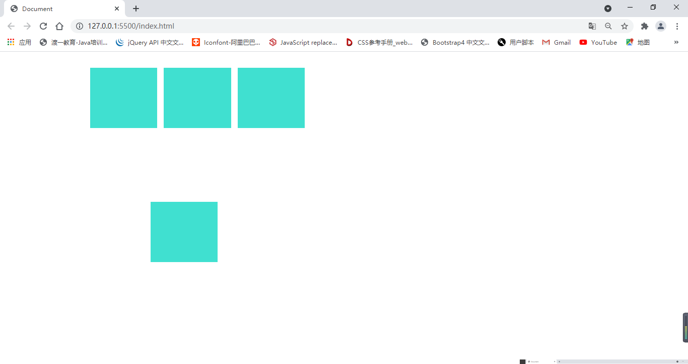


## 绝对定位 absolute

1. 宽高为auto，适应内容

2. 包含块变化：绝对定位中找祖先元素中第一个定位元素,若找不到，则包含块为整个网页（初始化包含块）

```css
        .box-1{
            width: 900px;
            height: 750px;
            border: 2px solid black;
            position: relative;
            left: 100px;
            top: 100px;
            background-color: thistle;
        }
        .box-2{
            width: 700px;
            height: 600px;
            border: 2px solid black;
            background-color: burlywood;
            margin: 20px;
        }
        .box-3{
            width: 600px;
            height: 500px;
            border: 2px solid black;
            background-color: blueviolet;
            margin: 30px;
        }
        .box-4{
            width: 500px;
            height: 400px;
            border: 2px solid black;
            background-color: chartreuse;
            position: absolute;
            left: 0;
            top:0;
        }
```
```html
    <div class="box-1">
        <div class="box-2">
            <div class="box-3">
                <div class="box-4"></div>
            </div>
        </div>
    </div>
```
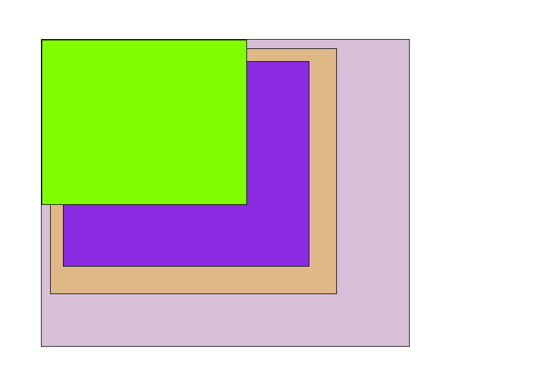

## 固定定位 fixed


其他情况和绝对定位完全一样

包含块不同：固定为视口（浏览器的可视窗口）,可用于制作网页导航栏，固定在视口
```css
        body{
            margin: 0;
        }
        .contain{
            height: 67px;
            width: 100%;
            background-color: cornflowerblue;
            position: fixed;
            left: 0;
            top: 0;
        }
        .box-a{
            width: 150px;
            height: 45px;
            border: 1px solid black;
            font-size: 40px;
            float: left;
            margin: 5px;
            padding-left:40px ;
            padding-bottom: 10px;
        }
        p{
            font-size: 30px;
        }
```
```html
    <div class="contain">
        <div class="box-a">第1章</div>
        <div class="box-a">第2章</div>
        <div class="box-a">第3章</div>
        <div class="box-a">第4章</div>
        <div class="box-a">第5章</div>
    </div>
    <p>...</p>
```

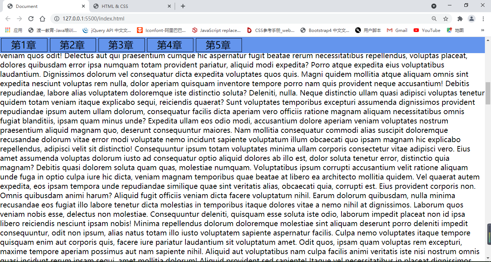

## 定位下的居中

某个方向居中：

1. 定宽（高）

2. 将左右（上下）距离设置成0

3. 将左右（上下）margin设置成auto

**绝对定位和固定定位中，margin设为auto时，会自动吸收剩余空间**

```css
        div{
            width: 300px;
            height: 250px;
            background-color: blueviolet;
            position: relative;
            left: 0;
            right: 0;
            margin: auto;
            
        }
```
```html
    <div></div>
```

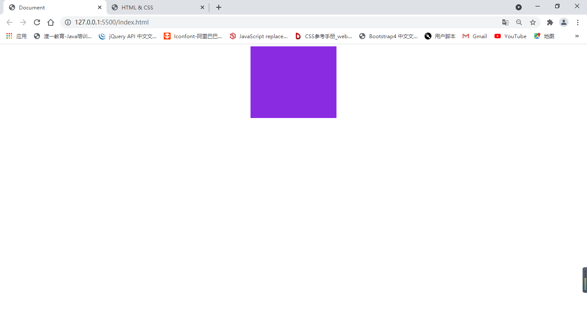

## 多个定位元素重叠

堆叠上下文

设置z-index，通常情况下，该值越大，越在显示上层

z-index:1;

只有定位元素设置z-index有效

z-index可以是负数，如果为负数，则遇到常规流、浮动元素，则会被其覆盖（默认值为0）

## 补充

- 绝对定位、固定定位元素一定是块盒

- 绝对定位、固定定位元素一定不是浮动

- 没有外边距合并

# 其他选择器

## 更多的伪类选择器

1. frist-child 选中第一个子元素

2. last-child 选中最后一个子元素

3. XX:first-of-type选中子元素中第一个该元素


4. XX:last-of-type选中子元素中最后一个该元素

5. nth-child(X)选中指定的第X个子元素

- even：关键字，偶数，等同于2n

- odd：关键字，奇数，等同于2n+1

6. XX:nth-of-type(X)选中子元素中第X个该元素

## 更多伪元素选择器

1. first-letter选中该元素中的第一个字符

2. first-line选中该元素中的第一行

3. selection选中被用户选中的文字

# 更多的样式

## 透敏度

1. opacity，设置整个元素的透明，取值0~1

2. 在颜色位置，设置alpha通道 rgba(0,0,0,0.5)

## 鼠标

- 设置cursor属性

1. auto,默认

2. help，问号

3. url(地址)图片鼠标样式，只能使用ico和cur格式图片 

## 盒子隐藏

1. display:none; 不生成盒子

2. visibility:hidden;生成盒子，只是从视觉上隐藏盒子，盒子依然存在

## 背景图

**通常，img元素属于HTML的概念，背景图属于CSS的概念**

1. 当图片属于网页内容时，必须使用img元素

2. 当图片仅用于美化页面时，必须使用背景图

### 涉及的CSS属性

1. background-image 背景图片

2. background-repeat 是否重复

    取值：

        no-repeat 不重复

        repeat 重复，默认值

        repeat-x X轴重复

        repeat-y Y轴重复

默认情况下，背景图会在横坐标和纵坐标中进行重复


3. background-size 背景图片大小

    预设值：contain、cover，类似于object-fit，数值或百分比

4. background-position 背景图位置

    预设值：left,botton,right,top,center,数值，百分比

5. background-attachment 控制背景图是否相对视口固定

6. 背景图和背景图片混用

    空白区域填充

7. background速写

background:url(图片地址) 是否重复 位置 位置/尺寸 尺寸 相对视口是否固定 颜色;

```css
background:url(./first.png) no-repeat center center/100% 100% fixed #000;
```

# iframe元素

通常用于在网页面中嵌入另一个页面

- iframe，可替换元素

    通常是行盒

    通常显示的内容取决于元素的属性

    css不能完全控制其中的样式

    具有行块盒特点

**本网页打开其他网页:**

```html
    <a href="https://www.baidu.com" target="myFram">百度</a>
    <a href="https://www.douyu.com" target="myFram">斗鱼</a>
    <a href="http://www.taobao.com" target="myFram">淘宝</a>
    <iframe name="myFram" src="https://www.baidu.com" frameborder="0"></iframe>
```

# 在页面中使用flash

object、embed都是可替换元素

MIME(Multipurpose Internet Mail Extensions)

多用途互联网邮件扩展类型

比如，资源是一个jpg文件，MIME:image/jpeg

# 表单元素

一系列元素，主要用于手机用户数据

## input元素

- 输入框

    type属性，输入框类型：

        1. text，普通文本输入框

        2. password，密码框

        3. date，日期选择框，有兼容性问题

        4. search，搜索框，有兼容性问题

        5. range，滑块，有兼容性问题

        6. color，颜色选择框

        7.number，数字输入框，只能输入数字，可设置最大值和最小值

        8. checkbox，多选框，需加name分组,默认选择属性checked

        9. radio，单选框，需加name分组,默认选择属性checked

        10. file，文件选择框

    value属性，默认输入框的值

    placeholder属性，输入框提示文本，文本框没有内容时提示

input元素可制作按钮

    当type属性为reset重置按钮、button按钮、submit提交按钮时，input表示按钮

## select元素

下拉列表选择框

通常和optgroup分组（label分组名称）、option选项元素配合使用，selected属性控制默认选中

```html
    <p>
        请选择以下城市：
        <select name="a" id="">
            <optgroup label="安徽省">
                <option value="">合肥市</option>
                <option value="">芜湖市</option>
            </optgroup>
            <optgroup label="江苏省">
                <option value="">南京市</option>
                <option value="">苏州市</option>
            </optgroup>
        </select>
        <input type="submit" name="a" id="">
    </p>
```

## textare元素

多行文本框，row行数，cols行数

## button按钮元素

button

    type属性：reset、submit、button，默认值submit


## 配合表单元素的其他元素

### label元素

    普通元素，通常配合单选和多选框使用，用表单元素的id值和lable的for属性值进行关联
    
*隐式关联*

```html
    <p>
        请选择性别：
        <input id="raMale" name="gender" type="radio">
        <label for="raMale">男</label>
        <input id="raFemale" name="gender" type="radio">
        <label for="raFemale">女</label>
    </p>
```

### datalist元素

数据列表

该元素本身不会显示到页面，通常用于和普通文本框配合

```html
    <p>
        请输入您常用的浏览器：
        <input type="text" list="userAgent">
    </p>
    <datalist id="userAgent">
        <option value="Chrome">谷歌浏览器</option>
        <option value="IE">IE浏览器</option>
        <option value="Opera">欧朋浏览器</option>
        <option value="Safari">苹果浏览器</option>
        <option value="Fire">火狐浏览器</option>
    </datalist>
```

### form元素

通常，会将整个表单元素，放置到form元素的内部，作用是当提交表单时，会将form元素内部的表单内容已核实的方式提交到服务器

form元素对开发静态页面没有太大页面

```html
    <form action="https://www.baidu.com/" method="GET">
        <p>
            账号：
            <input name="userName" type="text" name="" id="">
        </p>
        <p>
            密码：
            <input name="passWord" type="password" name="" id="">
        </p>
        <p>
            <button type="submit">提交</button>
        </p>
    </form>

```

### filedset元素

表单分组
```html
    <fieldset>
        <legend>基本信息</legend>
        <p>
            用户账号：
            <input type="text" name="" id="">
        </p>
        <p>
            用户密码：
            <input type="password">
        </p>
        <p>
            用户姓名：
            <input type="text">
        </p>
        <p>
            所在城市：
            <select name="" id="">
                <option value="">合肥</option>
                <option value="">上海</option>
                <option value="">北京</option>
                <option value="">南京</option>
                <option value="">成都</option>
            </select>
        </p>
    </fieldset>
```

## 表单状态

readonly属性:布尔属性，是否只读，不会改变表单显示样式

disabled属性：布尔属性，是否禁用，会改变表单显示样式

# 美化表单元素

## 更多伪元素

    1. focus 元素聚焦（多用于input元素）

    input:fcous;

    其他元素按Tab键聚焦顺序可设置tabindex，取值为数字，数字越大聚焦顺序越靠后
    
```css
       input:focus{
           outline: 1px solid red;
           outline-offset: -1px;
           color: blue;
       }
```

    2. checked 单选或多选框被选中得样式

```css
        input:checked+label{
            background-color: red;
            color: cornsilk;
        }
```

```html
    <p>
        <input type="radio" name="gender" id="radmale">
        <label for="radmale">男</label>

        <input type="radio" name="gender" id="radfemale">
        <label for="radfemale">女</label>
    </p>
```

    3.placeholder 文本框默认显示文本 

```css
    input:placeholder{
        color:#ccc;
    }
```

## 常见用法

1. 重置表单元素样式

2. 设置textare是否允许调整尺寸

CSS属性热size：

- both：默认值，两个方向都可以调整

- none：不能调

- horizontal：水平方向可以调整

- vertical：垂直方向可以调整

3. 文本框边缘到内容的距离

- 设置input的padding

- 设置内容的首行缩进text-indent

4. 控制单选和多选的样式

**利用label元素与input关联，其它元素设置需求样式**

# 表格元素

在css技术出现之前，网页通常使用表格布局

后天管理系统中可能还使用表格

前台：面向用户

后台：面向管理员，对界面要求不高，对功能性要求高

表格不再适用于网页布局，表格渲染速度过慢

```css
        table{
            width: 80%;
            border-collapse: collapse;
            position: relative;
            left: 0;
            right: 0;
            margin: auto;
        }
        table caption{
            font-size: 2em;
            font-weight: bold;
        }
        th,td{
            border: 1px solid #999;
            text-align: center;
        }
        thead tr{
            background-color: rgb(223, 217, 217);
        }
```

```html
    <table>
        <caption>标题</caption>
        <thead>
            <!-- 表头 -->
            <tr>
                <th>列1</th>
                <th>列2</th>
                <th>列3</th>
            </tr>
        </thead>
        <tbody>
            <!-- 表体 -->
            <tr>
                <td>数据1</td>
                <td>数据2</td>
                <td>数据3</td>
            </tr>
            <tr>
                <td>数据1</td>
                <td>数据2</td>
                <td>数据3</td>
            </tr>
            <tr>
                <td>数据1</td>
                <td>数据2</td>
                <td>数据3</td>
            </tr>        
        </tbody>
        <tfoot>
            <!-- 表尾 -->
            <tr>
                <td colspan="3">合计：XXX</td>
            </tr>
        </tfoot>
    </table>
```
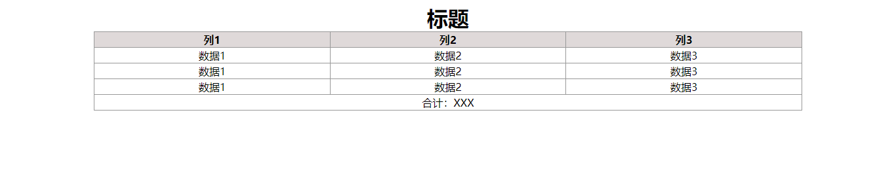

# 其他元素

1. abbr 缩写词
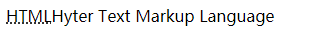

2. time

提供给浏览器或搜索引擎阅读的时间

3. b (bold)

以前是一个无语义元素，主要用于加粗字体

4. q 

一小段引用文本

5. blockquote 与q都有cite属性，表示引用地址

大段文本引用

6. br

无语义，主要用于文本中换行

7. hr

无语义，主要用于分割

8. meta

为优化搜索引擎提供信息（SEO）

```html
    <meta name="keywords" content="作家"> 
    <meta name="author" content="巴金">
    <meta name="description" content="来自中国的作家">
```

9. link

链接外部资源（CSS，图标）

rel属性：关系（CSS文件：stylesheet）

type属性：MIME类型（链接资源MIME类型，CSS文件：text/css）

# @规则

@-rule：@规则，@语句，css语句，css指令

1. import"路径";导入文件

```css
import'reset.css';
```

2. @charset"utf-8";告诉浏览器该CSS文件，使用的字符编码集是utf-8

该指令只能写在第一行

# web字体和图标

## web字体

解决用户电脑上没有安装相应字体，强制用户下载该字体

使用font-face制作新字体

```css
        @font-face {
            font-family: "night";
            src: url(./晚安体.ttf);
        }
        p{
            font-family: "night";
        }
```

```html
    <p>
        你是人间四月天
    </p>
```

## 字体图标

iconfont.cn


# 块级格式化上下文BFC

全称Block Formatting Context ，简称BFC

它是一块独立的渲染区域，它规定了在该区域中常规流的布局

- 常规流块盒在水平方向上，必须撑满包含块

- 常规流块盒在包含块的垂直方向上依次排列

- 常规流块盒外边距无缝相连，则进行外边距合并

- 常规流块盒的自动高宽和摆放位置，无视浮动元素

BFC渲染区域：

这个区域由某个HTML元素创建，一下元素会在其内部创建BFC区域：

- 根元素，意味着HTML元素创建的BFC区域，覆盖了页面中所有元素

- 浮动元素内部和绝对定位元素

- overflow不等于visible的块盒

不同的BFC区域，它们进行渲染时互不干扰

创建BFC的元素，隔绝了它内部和外部的联系，内部的渲染不会影响到外部

具体规则：

1. **创建BFC的元素，它的自动高度需要计算浮动元素**

    浮动元素包含块不会被浮动元素撑满拥有高度（高度塌陷）

    解决方法：

    - 包含块overflow不等于visible的块盒

    - 给包含块添加浮动

    - 伪元素清除浮动

```css
        .box{
            background-color: burlywood;
            /* overflow的值不为visiable */
            /* overflow: auto;
            /* 给包含块添加浮动 */
            /* float: left; */ 
        }
        /* 伪元素清除浮动 */
        .box::after{
            content: '';
            display: block;
            clear: both;
        }
        .box-{
            background-color: yellow;
            border: 1px solid black;
            width: 150px;
            height: 150px;
            margin: 50px;
        }
        .box div{
            float: left;        }
```
```html
    <div class="box">
        <div class="box-"></div>
        <div class="box-"></div>
        <div class="box-"></div>
```
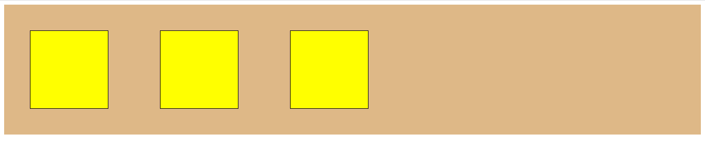

2. **创建BFC的元素，它的边框盒不会与其他浮动元素重叠**

```css
        .content{
            height: 200px;
            width: 200px;
            background-color: yellow;     
            float: left;
        }
        .box{
            float: left;
            width: 200px;
            height: 200px;
            background-color: blue;
        }
```
```html
    <div class="content">
    </div>
    <div class="box"></div>
```

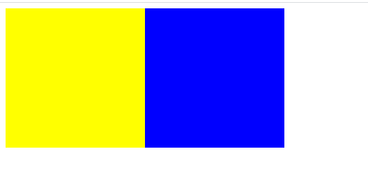

3. **创建BFC元素，不会和它的子元素进行外边距合并**

```css
        .content{
            height: 500px;
            background-color: yellow;
            margin-top: 50px;
            /* overflow值不为visable */
            overflow: hidden;
        }
        .child{
            height: 300px;
            margin: 50px;
            background-color: yellowgreen;
        }
```
```html
    <div class="content">
        <div class="child"></div>
    </div>
```
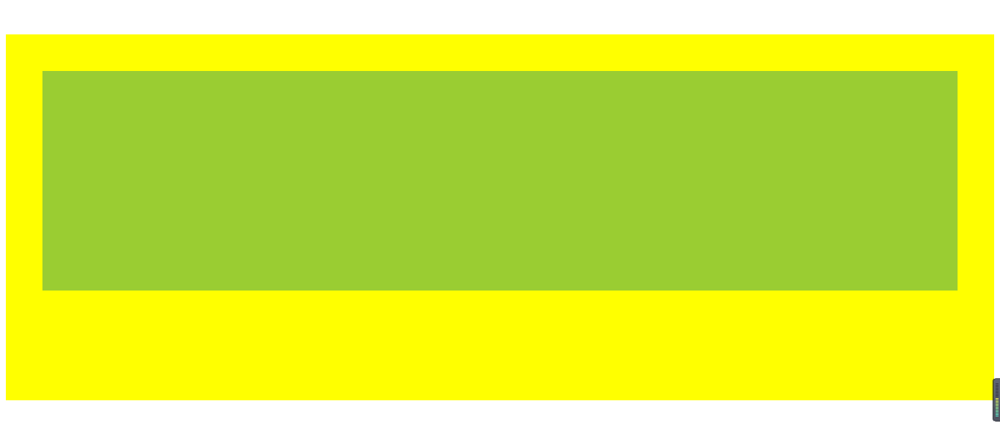


# 布局

## 多栏布局

1. 两栏布局

```css
        .content{
            width: 80%;
            background-color: cornflowerblue;
            left: 0;
            right: 0;
            margin: auto;
        }
        .box-1{
            /* 不定宽 */
            float: left;
            background-color: dimgray;
            width: 30%;
            margin-right: 20px;
            height: 900px;
            overflow: hidden;
        }
        .box-2{
            background-color: cyan;
            /* 利用BFC规则2：创建BFC的元素，它的边框盒不会与其他浮动元素重叠 */
            overflow: hidden;
            height: 900px;
        }
```
```html
    <div class="content">
        <div class="box-1">Lorem ipsum dolor sit amet consectetur adipisicing elit?</div>
        <div class="box-2">Lorem ipsum dolor sit amet consectetur adipisicing elit. </div>
    </div>
```
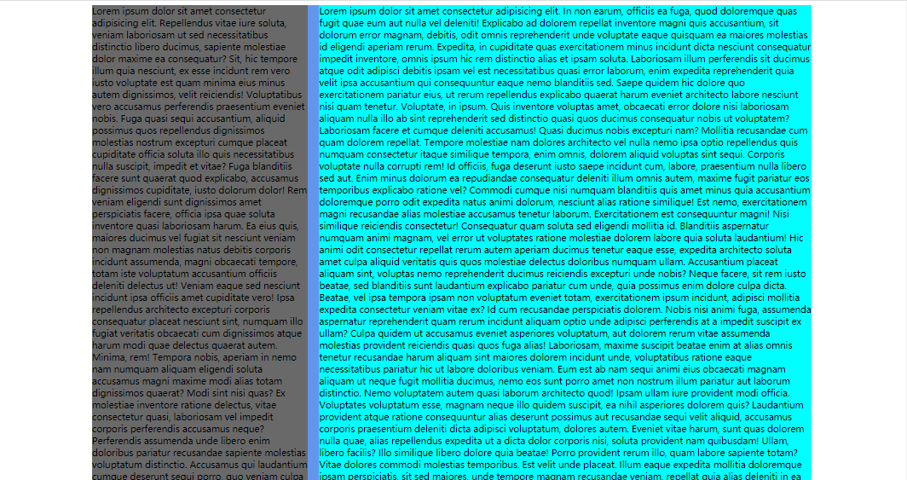

2. 三栏布局

```css
        .content{
            width: 80%;
            background-color: gray;
            left: 0;
            right: 0;
            margin: auto;
        }
        .content::after{
            content: '';
            display: block;
            clear: both;
        }
        .box-1{
            width: 15%;
            background-color: greenyellow;
            float: left;
            margin-right: 20px;
        }
        .box-2{
            width: 20%;
            background-color: hotpink;
            float: right;
            margin-left: 20px;
        }
        .box-3{
            background-color: khaki;
            overflow: auto;
        }
```

```html
    <div class="content">
        <div class="box-1">Lorem ipsum dolor, sit amet consectetur adipisicing elit. </div>
        <div class="box-2">Lorem ipsum, dolor sit amet consectetur adipisicing elit. </div>
        <div class="box-3">Lorem ipsum dolor sit amet consectetur, adipisicing elit. </div>
    </div>
```
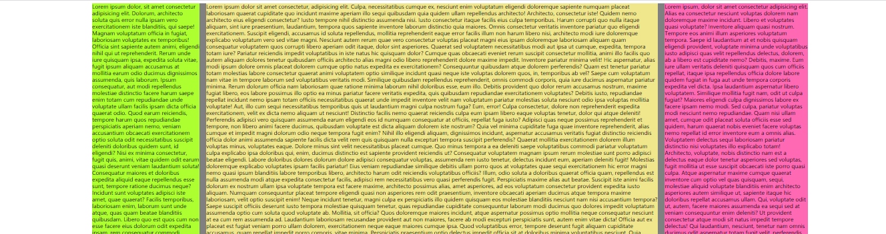

## 等高布局

1. css3的弹性盒子

2. JS控制

3. 伪等高

```css
        .content{
            width: 80%;
            background-color: lightblue;
            left: 0;
            right: 0;
            margin: auto;
            overflow: hidden;
        }
        .box-1{
            width: 30%;
            background-color: lightcoral;
            float: left;
            margin-right: 30px;
            height: 10000px;
            margin-bottom: -9999px;
        }
        .box-2{
            background-color: lightseagreen;
            overflow: hidden;
        }
```
```html
    <div class="content">
        <div class="box-1">Lorem ipsum dolor sit</div>
        <div class="box-2">Lorem ipsum dolor sit amet, consectetur adipisicing elit.</div>
    </div>
```
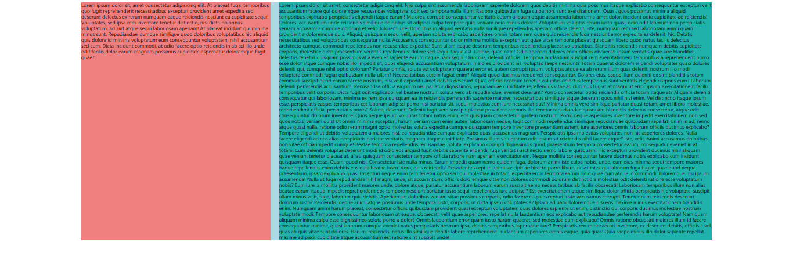

## 元素书写顺序

方便搜索引擎对页面的搜索，主要区域需要靠前书写，但书写多栏布局时，浮动元素需要先写

```css
        .content{
            width: 80%;
            background-color: cornflowerblue;
            left: 0;
            right: 0;
            margin: auto;
            position: relative;
        }
        .box-1{
            margin: 0 20% 0 15%;
            background-color: cyan;
        }
        .box-left{
            position: absolute;
            left: 0;
            top: 0;
            width: 14.5%;
            background-color: darkorchid;
        }
        .box-right{
            position: absolute;
            right: 0;
            top: 0;
            width: 19.5%;
            background-color: deeppink;
        }
```
```html
    <div class="content">
        <div class="box-1">Lorem ipsum, dolor sit amet consectetur adipisicing elit. Excepturi sunt corporis aspernatur quia ea soluta dolorem nam a quidem. Error, debitis atque illum eaque similique itaque temporibus expedita quas quos ipsam, saepe odit quod dolorem recusandae veritatis, doloribus fugit! Velit nulla facere nemo ab esse vitae sunt in asperiores quas harum, porro odio dolor aut distinctio qui ut quidem iusto praesentium quia, temporibus debitis, mollitia voluptatibus laboriosam.</div>
        <div class="box-left">Lorem ipsum dolor sit amet, consectetur adipisicing elit. </div>
        <div class="box-right">Lorem ipsum dolor sit amet consectetur, adipisicing elit.</div>
    </div>
```
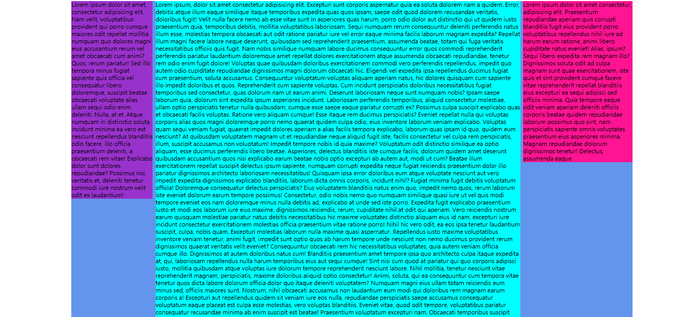

## 后台页面布局

# 行高的取值

1. px，像素值

2. 无单位的数字，先继承，再计算（推荐）

3. em数值，先计算，再继承

# body的背景

**画布 canvas**

一块背景

特点：

1. 最小宽度为视口宽度

2. 最小高度为视口高度

**HTML元素的背景**

覆盖画布

**body元素的背景**

如果HTML元素有背景，body元素正常（背景覆盖边框盒）

如果HTML元素没有背景，body元素的背景覆盖画布

**关于背景图**

画布的背景图

1. 背景图的宽度百分比，相对于视口的宽度

2. 背景图的高度百分比，相对于HTML元素的高度

3. 背景图的横向位置，预设值、百分比都相对于视口

4. 背景图的纵向位置，预设值、百分比都相对于网页高度

# 行盒的垂直对齐

## 多个行盒垂直方向上的对齐

给没有对齐的元素设置**vertical-align**

预设值，middle，top，button，text-top，text-button

数值，px，百分比

## 图片的百变底部

图片的父元素是一个块盒，块盒的高度自动，图片底部和父元素底部之间往往会出现空白

1. 设置父元素的字体大小为0

2. 将图片设置为块盒


# 堆叠上下文

堆叠上下文（stack context），它是一个区域，这块区域有某个元素创建，他规定了该区域的内容在Z轴上的先后顺序

## 创建堆叠上下文的元素

1. html元素（根元素）

2. 设置了z-index（非auto）数值的定位元素

## 同一个堆叠上下文中元素在Z轴上的排列

从后到前的顺序

1. 创建堆叠上下文的元素的背景和边框（父级在最后面）

2. 堆叠级别（z-index,stack llevel）为负值的堆叠上下文（值相同时，最后面的元素靠前）

3. 常规流非定位的块盒（定位块盒在常规流盒子上面）

4. 非定位的浮动盒子

5. 常规流非定位盒子

6. 任何z-index是auto的定位子元素，以及z-index是0的堆叠上下文

7. 堆叠级别为正值的元素


每个堆叠上下文，独立于其他堆叠上下文，他们之间不能互相穿插  

# svg

svg:scalable vector graphic,可缩放的矢量图

1. 该图片由代码书写而成

2. 缩放不会失真

## 怎么使用

svg可以嵌入浏览器，也可以单独成为一个文件

xml语言，svg使用该语言定义

##  书写svg代码

## rect矩形

## circle圆

## ellipse椭圆

## line线

## polyline折线

## polygon多边形

```xml
    <svg width="1000" height="1000" xmlns="http://www.w3.org/2000/svg">
        <!-- fill:填充颜色 x、y：矩形左上角的坐标 stroke：添加边框（颜色）transparent为透明  stroke-width 边框的宽度 -->
        <rect width="100" height="100" x='100' y='100' fill='red' stroke='#000' stroke-width='5' />
        <!-- cx、cy：圆的原点坐标 r:圆的半径 -->
        <circle cx='200' cy='400' r='100' fill='yellow' stroke='#999' stroke-width='5' />
        <!-- rx、ry：椭圆的长半径和短半径 -->
        <ellipse rx="80" ry="50" cx='300' cy='200' fill='#008c8c' />
        <!-- x1、y1、x2、y2：线的起始点和结束点 -->
        <line x1="20" x2="200" y1="50" y2="50" stroke='blue' stroke-width='5' />
        <!-- points:多点坐标 -->
        <polyline points="250,50,300,50,300,100,400,100" fill="transparent" stroke='#000' stroke-width='4' />
        <polygon points="400,50,450,50,450,100,550,100"  fill='none' stroke='black'/>
    </svg>
```
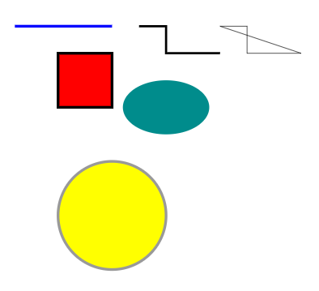

## path路径

d的值：
- M = moveto 移动到
- L = lineto 连接到
- H = horizontal lineto  
- V = vertical lineto
- C = curveto
- S = smooth curveto
- Q = quadratic Belzier curve
- T = smooth quadratic Belzier curveto
- A = elliptical Arc 弧线（椭圆）
    半径1，半径2，顺逆时针旋转角度，小弧（0）或大弧（1）
- Z = closepath 闭合路径

```xml
    <svg width="1000" height="1000" xmlns="http://www.w3.org/2000/svg">
        <!-- d:汇总的路径 -->
        <path d="M250,500 L300,600,L250,600 " stroke="black" stroke-width="5" fill="none"/>
    </svg>
```

# 数据链接

data url

## 如何书写

数据链接：将目标文件的数据直接写到路径位置

语法：data:MIME,数据

```css
    <link rel="stylesheet" href="data:text/css,h1{color:red;}">
```
```html
    <h1>起风了</h1>
```

## 意义

优点：

1. 减少了浏览器的请求，减少了请求中浪费的时间

2. 有利于动态生成数据

缺点：

1. 增加了资源的体积，导致传输内容增加，从而增加了单个资源的传输时间

2. 不利于浏览器的缓存，浏览器通常会缓存CSS文件、图片文件，JS文件

3. 使用base64会增加原资源的体积到原来的4/3

应用场景：

1. 请求单个图片体积较小，并且该图片因为各种原因，不适合制作雪碧图，可以使用数据连接

2. 图片由其他代码动态生成，并且图片较小，可以使用数据链接

## base64

一种编码方式

通常用于将一些二进制数据，用一个可书写的字符串表示

```css
    <link rel="stylesheet" href="data:text/css;base64,aDF7Y29sb3I6cmVkO30=">
```
```html
    <h1>起风了</h1>
```

# 浏览器兼容性

## 问题产生的原因

- 市场竞争

- 标准版本的变化

> Chrome 54 支持部分css3的功能

## 厂商前缀

> 比如：box-sizing,谷歌旧版本浏览器中使用-webkit-box-sizing:border-box;

- 市场竞争，标准没有发布

- 标准仍在讨论中（草案），浏览器厂商希望支持

IE:-ms-

Chrome,safari:-webkit-

opera:-o-

firefox:-moz-

> 浏览器在处理样式或元素时，使用如下的方式：当遇到无法识别的代码时，直接略过

1. 谷歌浏览器的滚动条样式

```css
        div{
            width: 400px;
            height: 500px;
            overflow: auto;
        }
        /* 滚动条 */
        div::-webkit-scrollbar {
            width: 10px;
            background-color: red;
        }
        /* 滚动条轨道 */
        div::-webkit-scrollbar-track {
            background-color: blue;
        }
        /* 滚动条滑块 */
        div::-webkit-scrollbar-thumb {
            background-color: #008c8c;
            border-radius: 50%;
        }
        /* 滚动条按钮 */
        div::-webkit-scrollbar-button{
            background-color: #f40;
        }
```
实际上，在开发中使用自定义的滚动条，往往使用的是div+csss+js实现的


2. 多个背景图中选中一个作为背景

```css
        div{
            width: 500px;
            height: 500px;
            background-image: -webkit-image-set(url('img/small.png')1x,url('img/big.png')2x);
            background-size: 100px;
        }
```

在不同的分辨率中选中不同的图片

# 居中总结

居中：盒子在其包含块中居中

## 行盒（行块盒）水平居中

直接设置行盒（行块盒）的父元素``text-align:center;``

```css
        .container{
            width: 900px;
            height: 300px;
            background-color: cyan;
            text-align: center;
        }
        .box{
            width: 100px;
            height: 70px;
            display: inline-block;
            background-color: red;
        }
```
```html
    <div class="container"> 
        <div class="box"></div>
        <a href="">起风了</a>
    </div>
```

## 常规流块盒水平居中

定宽，这只左右margin为auto

```css
        .container{
            width: 900px;
            height: 300px;
            background-color: cyan;
        }
        .box{
            width: 200px;
            height: 100px;
            background-color: red;
            left: 0;
            right: 0;
            margin: auto;
        }
```
```html
    <div class="container"> 
        <div class="box"></div>
    </div>
```

## 绝对定位元素的水平居中

定宽，设置左右的坐标为0（left：0，right：0），将margin设置为auto

```css
        div{
            height: 300px;
            background-color: cyan;
            position: relative;
        }
        p{
            width: 200px;
            height: 100px;
            background-color: red;
            position: absolute;
            left: 0;
            right:  0;
            margin: 0 auto;
        }
```
```html
    <div>
        <p></p>
    </div>
```
> 实际上，固定定位（fixed）是绝对定位（absolute）的特殊情况

## 单行文本的垂直居中

设置文本所在元素的行高，为整个区域的高度``line-height``

## 行盒多行文本的垂直居中

设置上下padding（只能达到类似结果）

## 绝对定位的垂直居中

定高，设置上下的坐标为0（top：0，button：0），将上下margin设置成auto

```css
        div{
            height: 300px;
            background-color: cyan;
            position: relative;
        }
        p{
            width: 200px;
            height: 100px;
            background-color: red;
            position: absolute;
            top: 0;
            bottom: 0;
            margin:  auto;
        }
```

```html
    <div>
        <p></p>
    </div>
```

# 样式补充

## display:list-item;
设置为该属性的盒子，本质上仍是一个块盒，但同时该盒子会附带另一个盒子

元素本身生成的盒子叫做主盒子，附带的盒子称为次盒子，次盒子和主盒子水平排列

样式同li元素

涉及的CSS属性：

1. ```list-style-type```

    设置次盒子的样式类型

2. ```list-style-position```

    设置次盒子相对于主盒子的位置

3. 速写属性```list-style```

```css
list-style:circle inside;
```

**清空次盒子**

```css
list-style:none;
```

## 图片失效时的宽高问题

如果img元素的图片链接无效时，img元素的特性和普通行盒一样，无法设置宽高

## 行盒中包括行块盒或可替换元素

会导致行盒的高度与它内部的行块盒或可代替元素的高度无关

## text-align:justify;

除最后一行外，分散对齐

## 制作一个三角形

```css
        div{
            width: 0;
            height: 0;
            border-width: 10px;
            border-style: solid;
            border-color: red blue yellow #008c8c;
        }
```

## ``direction`` 和 ``writing-mode``

开始 start > 结束 end

左 left > 右 right

开始和结束是相对的，不同的国家有不同的习惯

左右是绝对的

- ``direction:rtl;``

    ``rtl:right to left``

- ``wirting-mode`` 文字书写方向
 
 ## utf-8

```&#x5468;&#x6D9B;```
```css
        div::after{
            content: '\5468\6D9B';
        }
```


