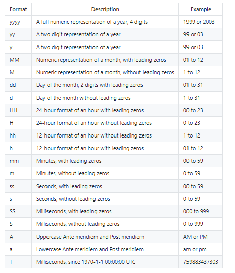

# 数据模板

1. **属性值是字符串 String**
```js
console.log(Mock.mock({
    'data1|1-5': 'abc',
    'data2|3':'123'// {data1: "abc", data2: "123123123"}
}))
```

2. **属性值是数字 Number**
```js
console.log(Mock.mock({
    'number1|+1': 10,
    'number2|1-10': 0,
    'number3|1-10.2': 0,
    'number4|1-10.1-10': 0,// 小数点后面是小数位数
    'number5|1.2-3': 0,
    'number6|1.10': 0, // {number1: 10, number2: 6, number3: 7.01, number4: 2.2673562, number5: 1.24,number6: 1.7302565635}
}));
```

3. **属性值是布尔值 Boolean**

```js
console.log(Mock.mock({
    'b1|1': false,
    'b2|1-5': true // true 的概率为 1 / ( 5 - 1 ) = 1 / 4
    // {b1: true, b2: false}
}));
```

4. **属性值为对象 Object**
```js
console.log(Mock.mock({
    'obj1|1-3':{// 随机取1-3个键值对
        a:1,
        b:2,
        c:3,
        d:4,
        e:5
    },
    'obj2|2':{// 固定取2个键值对
        a:1,
        b:2,
        c:3,
        d:4,
        e:5
    }
}));
```

5. **属性值为数组 Array**
```js
console.log(Mock.mock({
    'arr1|1': ['a', 'b', 'c', 'd', 'e', 'f'],// 随机在数组里取一个值形成一个数组
    'arr2|1-3': ['a', 'b', 'c', 'd', 'e', 'f'], // 重复数组1-3次，不是取1-3个值
}));
```

6. **属性值为函数 Function**
```js
console.log(Mock.mock({
    "result": function () {// 取该函数的返回值
        return 1 + 2
    }
}));
```

7. **属性是正则表达式 RegExp**
```js
console.log(Mock.mock({
    'reg1':/[a-z][A-Z][0-9]/,// [] ASC码匹配范围
    'reg2':/\w\W\s\S\d\D/,// \w 字符  \s 空白字符  \d 数字  大写取反
    'reg3':/\d{5,10}/,// {} 数量范围
}));
```

```js
console.log(Mock.mock({
    'data1|1-5': 'abc',
    'data2|3': '123' // {data1: "abc", data2: "123123123"}
}))

console.log(Mock.mock({
    'number1|+1': 10,
    'number2|1-10': 0,
    'number3|1-10.2': 0,
    'number4|1-10.1-10': 0, // 小数点后面是小数位数
    'number5|1.2-3': 0,
    'number6|1.10': 0, // {number1: 10, number2: 6, number3: 7.01, number4: 2.2673562, number5: 1.24,number6: 1.7302565635}
}));
console.log(Mock.mock({
    'b1|1': false,
    'b2|1-5': true // true 的概率为 1 / ( 5 - 1 ) = 1 / 4
    // {b1: true, b2: false}
}));

console.log(Mock.mock({
    'obj1|1-3': { // 随机取1-3个键值对
        a: 1,
        b: 2,
        c: 3,
        d: 4,
        e: 5
    },
    'obj2|2': { // 固定取2个键值对
        a: 1,
        b: 2,
        c: 3,
        d: 4,
        e: 5
    }
}));
console.log(Mock.mock({
    'arr1|1': ['a', 'b', 'c', 'd', 'e', 'f'], // 随机在数组里取一个值形成一个数组
    'arr2|1-3': ['a', 'b', 'c', 'd', 'e', 'f'], // 重复数组1-3次，不是取1-3个值
}));

console.log(Mock.mock({
    "result": function () {// 取该函数的返回值
        return 1 + 2
    }
}));

console.log(Mock.mock({
    'reg1':/[a-z][A-Z][0-9]/,// [] ASC码匹配范围
    'reg2':/\w\W\s\S\d\D/,// \w 字符  \s 空白字符  \d 数字  大写取反
    'reg3':/\d{5,10}/,// {} 数量范围
}));
```


# Random

## Basic

1. **boolean 随机生成布尔值**
```js
console.log(Random.boolean(1,9,true));// 同模板规则 true 的概率为 1 / ( 9 - 1 ) = 1 / 8
```
2. **natural 随机生成自然数**
```js
console.log(Random.natural(1,100));
```
3. **integer 随机一个整数**
```js
console.log(Random.integer(1,100));
```
4. **float 随机生成浮点数**
```js
console.log(Random.float(0), Random.float(-5,5),Random.float(-5,5,3,6));// min max 小数min位 小数max位
```
5. **character 返回一个随机字符**
```js
console.log(Random.character(),Random.character('abc123'),Random.character('lower'),Random.character('upper'),Random.character('number'),Random.character('symbol'));
// // abc123 在此范围类随机选择  
// //字符池：  lower 在小写字母中随机选择一个 upper 在大写字母中随机选择一个  number 在数字中随机选择一个  symbol 在特殊字符中随机选择一个
```
6. **string 随机生成字符串**
```js
console.log(Random.string(),Random.string(5),Random.string(5,10),Random.string('symbol',5),Random.string('abc123',1,3));
// // abc123 在此范围类随机选择  
// //字符池：  lower 在小写字母中随机选择一个 upper 在大写字母中随机选择一个  number 在数字中随机选择一个  symbol 在特殊字符中随机选择一个
```
7. **range 返回一个整数数组**
```js
console.log(Random.range(3), Random.range(3, 10), Random.range(1, 10, 3)); //起始数字，结束数字，数字间隔  [1,4,7] 
```
8. date 随机生产日期
```js

```


```js
let Random = Mock.Random;
// console.log(Random);
// console.log(Random.boolean(1, 9, true)); //min max value 同模板规则 true 的概率为 1 / ( 9 - 1 ) = 1 / 8
// console.log(Random.natural(1, 100));
// console.log(Random.integer(1, 100));
// console.log(Random.float(0), Random.float(-5,5),Random.float(-5,5,3,6));// min max 小数min位 小数max位
// console.log(Random.character(),Random.character('abc123'),Random.character('lower'),Random.character('upper'),Random.character('number'),Random.character('symbol'));
// // abc123 在此范围类随机选择  
// //字符池：  lower 在小写字母中随机选择一个 upper 在大写字母中随机选择一个  number 在数字中随机选择一个  symbol 在特殊字符中随机选择一个
// console.log(Random.string(),Random.string(5),Random.string(5,10),Random.string('symbol',5),Random.string('abc123',1,3));
// console.log(Random.range(3), Random.range(3, 10), Random.range(1, 10, 3)); //起始数字，结束数字，数字间隔  [1,4,7] 
```

## Date



1. date 随机生成日期
```js
console.log(Random.date(),Random.date('yyyy-MM-dd : hh-m-ss'));// 1976-10-29   1984-08-07 : 02-35-37
```

2. time 随机生成时间
```js
console.log(Random.time(),Random.time('A HH:mm:ss:SS')); // 00:43:12 AM 09:47:09:408
```

3. datetime 随机生成日期时间
```js
console.log(Random.datetime(),Random.datetime('yyyy-MM-dd A HH:mm:ss'));// 1986-01-20 19:04:20 1972-04-15 AM 09:41:52
```

4. now 当前时间
```js
console.log(Random.now(),Random.now('year'),Random.now('week'));// 2021-08-26 02:58:07   2021-01-01 00:00:00   2021-08-22 00:00:00
```

```js
let Random = Mock.Random;
// console.log(Random.date(),Random.date('yyyy-MM-dd : hh-m-ss'));// 1976-10-29   1984-08-07 : 02-35-37
// console.log(Random.time(),Random.time('A HH:mm:ss:SS')); // 00:43:12 AM 09:47:09:408
// console.log(Random.datetime(),Random.datetime('yyyy-MM-dd A HH:mm:ss'));// 1986-01-20 19:04:20 1972-04-15 AM 09:41:52
// console.log(Random.now(),Random.now('year'),Random.now('week'));// 2021-08-26 02:58:07   2021-01-01 00:00:00   2021-08-22 00:00:00
```

## Image
1. image 生成占位图片
```js
console.log(Random.image('200x100','#f40','#0f0','png','hello'));// 大小  背景色  字体颜色  图片格式  文本内容
```

2. dataImage 生成Base64图片编码
```js
console.log(Random.dataImage('200x200','Hi'));
```

## Color
1. color 随机生成颜色
```js
console.log(Random.color());// #bef279
```
2. hex 随机生成颜色
```js
console.log(Random.hex());// #bef279
```
3. rgb 随机生成rgb格式颜色
```js
console.log(Random.rgb());// rgb(121, 153, 242)
```
4. rgba 随机生成rgba格式颜色
```js
console.log(Random.rgba());// rgba(121, 157, 242, 0.99)
```
5. hsl 随机生成hsl格式颜色
```js
console.log(Random.hsl());// hsl(332, 82, 71)
```

```js
let Random = Mock.Random;
// console.log(Random.color());// #bef279
// console.log(Random.hex());// #bef279
// console.log(Random.rgb());// rgb(121, 153, 242)
// console.log(Random.rgba());// rgba(121, 157, 242, 0.99)
console.log(Random.hsl());// hsl(332, 82, 71)
```

## Text
1. paragraph  随机生成英文语句（默认为3-7句）传参 ``Random.paragraph(n)``  ``Random.paragraph(min,max)``
```js
console.log(Random.paragraph());// 随机生成语句（默认为3-7句）
console.log(Random.paragraph(2));
console.log(Random.paragraph(1,3));
```
2. cparagraph 随机生成中文语句（默认为3-7句）传参 ``Random.cparagraph(n)``  ``Random.cparagraph(min,max)``
```js
console.log(Random.cparagraph());// 随机生成语句（默认为3-7句）
console.log(Random.cparagraph(2));
console.log(Random.cparagraph(1,3));
```
3. sentence 随机生成一句话，词汇量可控（英文），默认数量为12-18
```js
console.log(Random.sentence());// 随机生成一条语句
console.log(Random.sentence(4));
console.log(Random.sentence(5,8));
```
4. csentence 随机生成一句话，词汇量可控（中文），默认数量为12-18
```js
console.log(Random.csentence());// 随机生成一条语句
console.log(Random.csentence(4));
console.log(Random.csentence(5,8));
```
5. word 随机生成一个单词（英文），默认为3-10
```js
console.log(Random.word());// 随机生成一个英文单词
console.log(Random.word(4));
console.log(Random.word(5,8));
```
6. cword 随机生成一个单词（中文）
```js
console.log(Random.cword('你是谁'));// 随机生成一个中文单词
console.log(Random.cword(4));
console.log(Random.cword(5,8));
```
7. title 随机生成一个标题（英文）
```js
console.log(Random.title());// 随机生成一个标题，英文
console.log(Random.title(4));
console.log(Random.title(5,8));
```
8. title 随机生成一个标题（中文）
```js
console.log(Random.ctitle());// 随机生成一个标题，中文
console.log(Random.ctitle(4));
console.log(Random.ctitle(5,8));
```
```js
let Random = Mock.Random;
// console.log(Random.paragraph());// 随机生成语句（默认为3-7句）
// console.log(Random.paragraph(2));
// console.log(Random.paragraph(1,3));
// console.log(Random.cparagraph());// 随机生成语句（默认为3-7句）
// console.log(Random.cparagraph(2));
// console.log(Random.cparagraph(1,3));
// console.log(Random.sentence());// 随机生成一条语句
// console.log(Random.sentence(4));
// console.log(Random.sentence(5,8));
// console.log(Random.csentence());// 随机生成一条语句
// console.log(Random.csentence(4));
// console.log(Random.csentence(5,8));
// console.log(Random.word());// 随机生成一个英文单词
// console.log(Random.word(4));
// console.log(Random.word(5,8));
// console.log(Random.cword());// 随机生成一个中文单词
// console.log(Random.cword(4));
// console.log(Random.cword(5,8));
// console.log(Random.title());// 随机生成一个标题，英文
// console.log(Random.title(4));
// console.log(Random.title(5,8));
console.log(Random.ctitle());// 随机生成一个标题，中文
console.log(Random.ctitle(4));
console.log(Random.ctitle(2,5));
```

## Name
1. first 生成名（英文）
```js
console.log(Random.first());
```
2. last 生成姓（英文）
```js
console.log(Random.last());
```
3. name 姓+名（英文）
```js
console.log(Random.name());
```
4. first 生成姓（中文）
```js
console.log(Random.cfirst());
```
5. last 生成名（中文）
```js
console.log(Random.clast());
```
6. name 姓+名（中文）
```js
console.log(Random.cname());
```

```js
let Random = Mock.Random;
// console.log(Random.first());
// console.log(Random.last());
// console.log(Random.name());
console.log(Random.cfirst());
console.log(Random.clast());
console.log(Random.cname());
```
 
## Web
1. url 随机生成一个地址
```js
console.log(Random.url());
console.log(Random.url('http'));
console.log(Random.url('https','mrzater'));
```
2. protocol 随机生成一个协议
```js
console.log(Random.protocol());
```
3. domin 随机生成一个域名
```js
console.log(Random.tld());
```
4. email 随机生成一个email
```js
console.log(Random.email());
console.log(Random.email('163'));
```
5. ip 随机生成IP地址
```js
console.log(Random.ip());
```

```js
let Random = Mock.Random;
// console.log(Random.url());
// console.log(Random.url('http'));
// console.log(Random.url('https','mrzater'));
// console.log(Random.protocol());
// console.log(Random.tld());
// console.log(Random.email());
// console.log(Random.email('163'));
console.log(Random.ip());
```

## Adress
1. region 随机生成一个中国大区
```js
console.log(Random.region());
```
2. province 随机生成省份直辖市
```js
console.log(Random.province());
```
3. city 随机生成一个城市
```js
console.log(Random.city());
console.log(Random.city(true));// 返回 省 市
```
4. county  随机生成一个县
```js
console.log(Random.county());
console.log(Random.county(true));
```
5. zip 随机生成邮政编码
```js
console.log(Random.zip());
```
```js
let Random = Mock.Random;
// console.log(Random.region());
// console.log(Random.province());
// console.log(Random.city());
// console.log(Random.city(true));// 返回 省 市
// console.log(Random.county());
// console.log(Random.county(true));
console.log(Random.zip());
```

## Helper
1. capitalize 首字母大写
```js
console.log(Random.capitalize('mrzater'));
```
2. upper 字母大写
```js
console.log(Random.upper('mrzater'));
```
3. lower 字母小写
```js
console.log(Random.lower('mrzater'));
```
4. pick 随即在数组中选取一个元素并返回
```js
console.log(Random.pick(['a','b','c','d']));
```
5. shuffle  对数组进行重新排序
```js
console.log(Random.shuffle(['a','b','c','d']));
```
```js
let Random = Mock.Random;
// console.log(Random.capitalize('mrzater'));
// console.log(Random.upper('mrzater'));
// console.log(Random.lower('mrzater'));
// console.log(Random.pick(['a','b','c','d']));
console.log(Random.shuffle(['a','b','c','d']));
```

## 其他
1. guid 随机生成产品标识码guid
```js
console.log(Random.guid());
```
2. id 随地生成身份证号
```js
console.log(Random.id());
```
3. increment 生成全局一个自增的整数
```js
console.log(Random.increment());
```

```js
let Random = Mock.Random;
console.log(Random.guid());
console.log(Random.id());
console.log(Random.increment());
```

#  数据占位符 

使用@调用Random中的方法,使用大写增加辨识度（不强制）
```js
console.log(Mock.mock('@EMAIL'));
console.log(Mock.mock('@CITY(true)'));
console.log(Mock.mock('@CWORD("渡一教育",1,3)'));
```

- 扩展Random·方法

``Random.extend``添加Random方法 

```js
let Random = Mock.Random
Random.extend({
    constellation: function (date) {
        var constellations = ['白羊座', '金牛座', '双子座', '巨蟹座', '狮子座', '处女座', '天秤座', '天蝎座', '射手座', '摩羯座', '水瓶座', '双鱼座']
        return this.pick(constellations)
    }
})
console.log(Random.constellation());
```


