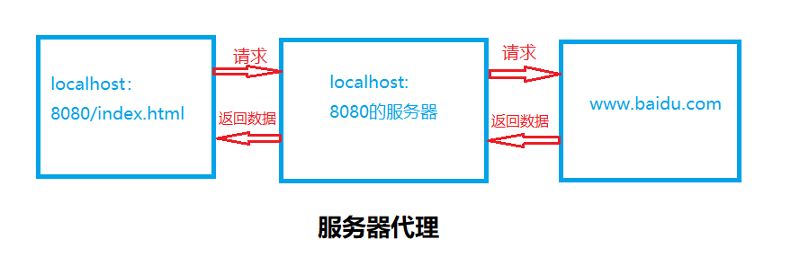
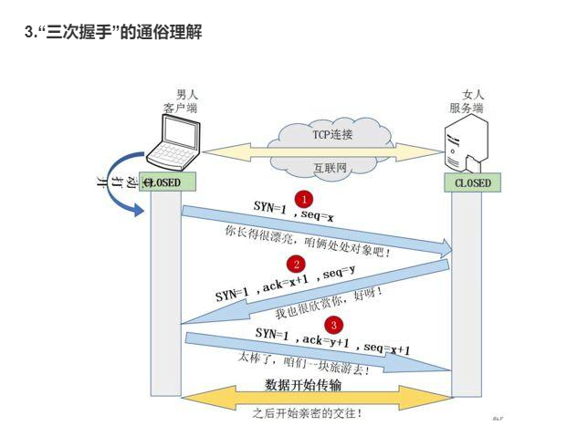
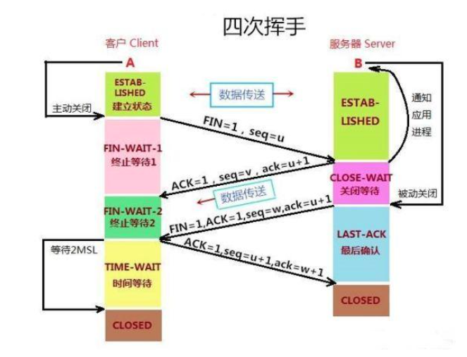
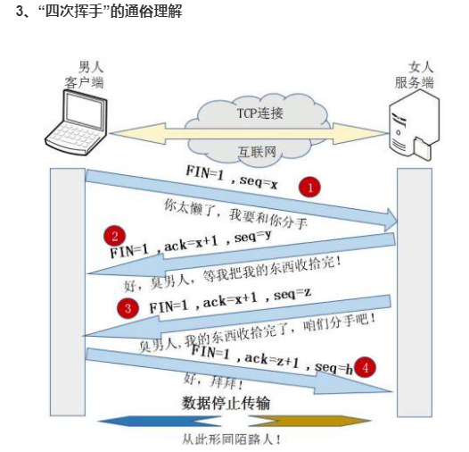

# 前端网络 {ignore} 
[toc]

# Internet 网络

- 互联网————Internet（音译：因特网、英特网）

- 协议（格式）

- www（World Wide Web）

# 局域网 & 计算机

## 计算机

- 冯诺依曼式计算机 ————冯诺依曼（计算机之父）

- 运算器：

    - CUP（中央处理器）、GPU（显卡）

- 存储器：

    - 内存（断电数据清空，读写速度快）

    - 硬盘（辅存）：（数据可以持久化，读写速度相对较慢）

- 控制器：
  
    - 主板上的一些器件

- 输入设备

    - 键盘、鼠标、麦克风、网口

- 输出设备

    - 显示器、耳机、网口

## 局域网

- 局域网（Local Area Network，LAN）是指在某一区域内由多台计算机互联组成的计算机组


# IP地址与公网

- IP地址
  
    - IP地址的格式：

        - IP地址分为四个段：``xxx.xxx.xxx.xxx``，每个段0~255，每个段，都是由8个0、1组成的

    - IP地址的分类：

    一个IP地址分为两个部分：网络ID、主机ID

        - A类：000.000.000.000 ~ 127.255.255.255（一个网络能有1600万台计算机）

        - B类：128.000.000.000 ~ 191.255.255.255（私有网络，172.16.0.0 ~ 172.31.255.255）

        - C类：192.000.000.000 ~ 223.255.255.255（私有网络，路由器一般是192.168.xxx.xxx）

        - D类：（多播地址）

        - E类：

# 域名与DNS解析

域名：``www.baidu.com``

  - **问**：能通过域名直接访问一台机器吗

    **答**：不可以的，用域名和IP形成对应关系

    首先，计算机是不知道域名对应的IP的。问路由器，如果路由器认识这个域名，就返回一个IP，然后计算机访问这个IP；如果路由器不认识，他就问上一层路由器，如果问到了城市这个级别的路由器（DNS服务器），也不认识这个域名，继续向上级DNS服务器查找。

    互联网刚建立的时候，共建设13台总的DNS服务器。

  - **问**：向浏览器的地址栏中输入一个url按回车之后，网络中会发生什么？
  
    **答**：比如输入的域名是123.xyz，看浏览器的缓存——>家里路由器——>上级路由器/城市的DNS服务器——>继续向上找，直到找到gDNS服务器（全局DNS服务器）

# 五层网络模型

``MAC协议 IP/TCP协议 (对方的IP，自己的IP，对方的端口) HTTP协议(请求头) hello``

**应用层**：HTTP协议、DNS协议

    - HTTP协议分为两个部分：

        - 请求：Request

            请求方式    路径            协议版本

            GET        /path?a=1&b=2   HTTP/1.1

            Host: www.baidu.com  域名

            Connection: keep-alive  连接方式（长链接）

            User-Agent:客户端

                请求方式：GET POST

        - 响应：Response

**运输层**：TCP协议、UDP协议

**网络层**：IP地址——IP协议

**数据链路层**：MAC地址

**物理层**：

# 简述HTTP协议

- 请求：``Request``
  
    请求头

            请求方式    url               协议版本

            GET        /path?a=1&b=2      HTTP/1.1

            Host: www.baidu.com  域名

            Connection: keep-alive  连接方式（长链接）

            User-Agent:...  客户端


            两种请求方式：GET/POST

- 响应：``Response``
  
-     请求头

            协议版本    状态码        信息

            HTTP/1.1    404          Not Found

            Content-Length: 202

# GET与POST的区别

**问**：GET与POST请求方式的区别

**答**：

1. 是基于什么前提的？如果什么前提都没有，不使用任何规范，只考虑语法和理论上的HTTP协议
   
   - GET和POST几乎没有区别，只有名字不一样

2. 如果是基于RFC规范的。

    - 理论上的（Specification）：GET和POST是具有相同的语法的，但有不同的语义，GET是获取数据的，POST是发送数据的，其他方面没有区别

    - 实现上的（Implementation）：各个浏览器，就是这个规范的实现者。

        常见的不同：

            1) GET的数据在url中是可见的，POST的数据不显示在url中

            2) GET请求对长度有限制，POST请求的长度是无限制的

            3) GET请求的数据可以收藏为书签，POST请求的数据不可收藏为书签

            4) GET请求后，按前进和后退按钮是无影响的，POST请求的数据会被重新提交

            5) GET的编码类型：application/x-www-form-url，POST的编码类型：有很多种。
   
            encodeapplication/x-www-form-urlencoded     
            multipart/form-data

            6) GET的历史参数会被保存在浏览器中，POST的历史数据不会保存在浏览器中

            7) GET只允许ASCII码，POST没有编码限制，甚至允许发二进制

            8) GET和POST相比，GET安全性较差，因为所发的数据是URL的一部分

# Cookie与Session

## Cookie

1. 如果我们用JS的变量来保存数据，那么页面关闭的时候，数据就丢失了

2. 保存登录状态是怎么做到的？

    按照正常的HTTP协议来说，是做不到的，因为HTTP协议是上下文无关协议，所以说前端页面上，需要有一个可持久化存储数据的东西，一旦登陆成功，我就记载在这个里面，这个就是Cookie，可跨页面

    **Cookie是有限制的**
    **Cookie是存在浏览器中的，不是存在某个页面上的，Cookie是可以长期存储的。Cookie即使是保存在浏览器里的，也是存放在不同的域名下的**

        1) 初始状态：没有登录
        
        2) 访问百度的登录，输入用户名、密码
        
        3) 如果用户名和密码是正确的，百度的后端会向这个域名下，设置一个Cookie，写入用户的基本信息（加密的）
        
        4) 以后每一下次向百度发送请求，浏览器会自动带上这些Cookie
        
        5) 服务端（后端）看到了带有ID的Cookie，就可以解析这个加密的ID，来获取用户本身的ID、 
        
        6) 如果能获取到本身的ID，那么证明这个用户已经登陆过了，所以后端可以继续保留用户的信息

缺点：若Cookie被别人复制即可在别人的电脑上登录

## Session

与Cookie不同，Session是存在服务器端的

数据在Session上的缺点：

    - 如果用户量非常大，服务器端很耗资源。

    - 后端可能不止一台服务器，用户的登录信息，一般只存在一台服务器上，用户的登录操作在哪台服务器上执行，一般就存在那台服务器上，需要通过反向代理（轮询、IP哈希）

XSS注入攻击：获取Cookie进行攻击

# 页面的正确打开方式

B/S结构：Client/Server——Client只负责内容的展示，Server负责提供内容

C/S结构：Browser/Server——Browser只负责内容的展示，Server负责提供内容

**问**：页面的本质是什么？

  - **答**：页面的本质就是一个字符串，带有HTML格式的字符串

**问**：浏览器向服务器请求一个页面的本质是什么？

  - **答**：

     1) ``www.baidu.com``
     
     2) 服务器接收到这个请求后，服务器想要把这个页面的内容（HTML格式的字符串）返回给浏览器
     
     3) 页面的字符串存在哪里？存在HTML文件里。列如：index.html
     
     4) 服务器端读取文件
     
     5) 将读取查出来的内容返回给浏览器。最后浏览器得到的是一个字符串，这个字符串的来源可能是文件，可能是缓存，也可能来自于数据库  

**服务器**：严格的来说，服务器是一台计算机，这台计算机，只提供服务（不是用户用的），但是我们常说的服务器，指的是服务容器，不是服务器

**服务容器**：是一个程序，程序可以监听一个端口。读取文件，并且返回。

如果我们想通过访问**服务器**的方式，来访问我们写的页面，我们就得装一个服务容器的程序

# 发送网络请求

1. 在浏览器中直接输入网址（无法用代码控制）

2. ``location.href='http://www.taobao.com'``，可以发出网络请求（网页会跳转）

3. 带有src属性的标签，请求是可以发出的，服务端是可以处理的，也是可以返回的，但是返回之后，能否被应用，还是要看浏览器（页面无法处理返回结果）

4. 带有href属性的标签，请求是可以发出的，服务端是可以处理的，也是可以返回的，但是返回之后，能否被应用，还是要看浏览器（页面无法处理返回结果）

5. 带有action属性的标签（网页会跳转）

6. 需要有一种可以用代码控制，页面不会跳转，服务器返回的结果可以用JS处理

    ajax请求

```js
    //要素
    // 1. 请求方式
    // 2. url
    var xhr = null;
    if(window.XMLHttpRequest){
        xhr = new XMLHttpRequest();
    }else{
        //IE6自带
        xhr = new ActiveXObject('Microsoft.XMLhttp');
    }
    xhr.open('get','http://developer.duyiedu.com/edu/testAjaxCrossOrigin')
    xhr.send();
```

# 跨域

- **问**： 哪些东西属于资源？JS文件算资源吗？

    - **答**：JS文件算资源，但是SJ文件时允许被跨域请求的。CSS文件、jpg、png文件等，所有的src属性的资源都是可以给跨域请求的。href属性的资源大部分是可以被跨域请求的


- **问**：哪些资源算跨域请求的资源？

    - **答**：
     
      1. 后端接口的数据

      2. 其他域的cookie
      
      3. 其他域的缓存

- **问**：什么是其他的域？怎么样算跨域？

    - **答**：页面本身：协议（http/https），域名，端口

        请求的数据：``http://www.baidu.com:80``

        **协议**  **域名**  **端口号** 有任意一个不同就算跨域

- **问**：跨域这个行为发生在哪里？

    - **答**：

        1. 即时跨域了（协议  域名  端口号 有任意一个不同），请求也可以发出。
        
        2. 服务器端也是可以接收的
        
        3. 服务器端也是可以正常处理的
        
        4. 服务器端也是可以正常返回数据的
        
        5. 浏览器也能接收到这些数据
        
        6. 接收到之后，浏览器发现当前页面的域和请求的域不同，所以判定为跨域
        
        7. 代码正在等待结果，但是浏览器判定为跨域，不会把结果传递给代码

- **问**：如何解决跨域？

    - **答**：

        1. 后端配合跨域

            ``pan.baidu.com`` --> ``zhidao.baidu.com``

            - JSONP（正常的情况下，返回的数据都是JSON格式，JSONP是一种特殊的格式）
            
            - 后端设置``Access-Control-Origin``属性以支持跨域 
            
        2. 后端不配合跨域

            - iframe 只能显示不能控制
            
            - 通过后端代理

# 源生JS发送Ajax

```js
        //要素
        // 1. 请求方式
        // 2. url
        var xhr = null;
        if (window.XMLHttpRequest) {
            xhr = new XMLHttpRequest();
        } else {
            //IE6自带
            xhr = new ActiveXObject('Microsoft.XMLhttp');
        }
        console.log(xhr.readyState);//未初始化状态为0
        //如果open第三个参数传true或不传，为异步模式，如果传false，为同步模式
        xhr.open('get', 'http://developer.duyiedu.com/edu/testAjaxCrossOrigin',true)
        console.log(xhr.readyState);//连接已建立状态为1
        //xhr.readyState 网络请求状态
        // 0: 请求未初始化
        // 1: 服务器连接已建立
        // 2: 请求已接收
        // 3: 请求处理中
        // 4: 请求已完成，且响应已就绪
        xhr.onreadystatechange = function () {//存储函数（或函数名），每当 readyState 属性改变时，就会调用该函数。
            //每当 readyState 改变时，就会触发 onreadystatechange 事件。
            console.log(xhr.readyState, xhr.status);
            //xhr.status 网络请求状态码
            // 200: "OK"
            // 404: 未找到页面
            if (xhr.readyState === 4 && xhr.status === 200) {
                console.log(xhr.responseText)
                //JSON.parse()将json格式的数据转化为对象
                var data = JSON.parse(xhr.responseText);
                console.log(data);
            }
        }
        //发送请求
        xhr.send();
        console.log('asd')
```

# JSONP的使用与特性

```html
    <script src="https://ajax.aspnetcdn.com/ajax/jquery/jquery-3.5.1.min.js"></script>
    <script>
        //jsonp格式哪里特殊？
        //发送的时候，会戴上一个参数caalback
        //返回的结果不是json
        //callback的名 + (+ json +);
        //jQuery351019190310350602968_1622716055955({status: "ok", msg: "Hello! There is DuYi education!"})
        $.ajax({
            url:'http://developer.duyiedu.com/edu/testJsonp',
            type:'get',
            dataType:'jsonp',
            success:function(data){
                console.log(data)
            }
        })
        //jsonp跨域只能使用get方法，如果我们设置的是POST方法，jQuery回去自动转化为get方法
        //在jsonp里面是不是只能使用get方法？
        //不是，看是否同源，如果是同源，则使用书写方法，如贵不是同源，即跨域请求，无论写get还是POST，最终都会转化为get方法
    </script>
```

# JSON原理

## JSON实现目的与方向

1. 若要从一个接口获取一个数据，但是该接口和当前页面是不同源的

2. 但是这个接口是支持JSONP的
   
3. script标签，有src属性，所以可以发送网络请求
   
4. script标签虽然可以引入其他域的资源，浏览器不限制
   
5. 但是，浏览器会将返回的内容，作为JS代码执行
   
    ``ads({"status":"ok","msg":"Hello! There is DuYi education!"}) ``

    相当于掉用了一个asd方法，传入了一个JSON对象作为参数

## JSONP原理

 - 前端部分：

   1. 判断请求与当前页面的域是否同源，如果同源则发送正常的ajax，就不用跨域了

   2. 如果不同源，会生成一个script标签，再生成一个随机的callback名字，在创建一个名为该callback名的函数

   3. 然后设置script标签src，设置为要请求的借口

   4. 将callback作为参数拼接在后面

 - 后端部分：
 
   1. 后端收到请求，开始准备返回数据

   2. 后端拼接数据，将要返回的数据用callback的值和括号包裹起来

          列如：callback =asd123，要返回的数据为``{name:'abc'}``

          拼接位：``asd123({name:'abc'});``
          
   3. 将内容返回
   
 - 前端部分
  
   1. 浏览器收到数据，当做JS代码执行

   2. 从而执行名为asd123的方法，参数为{name:'abc'}

   3. 接收到后端返回的对象


简单实现jsonp

```js
    var $ = {
        ajax: function (options) {
            var url = options.url;
            var type = options.type;
            var dataType = options.dataType;
            //判断是否同源（协议，域名，端口号）
            // 获取目标url的域
            var targetProtocol = '';//目标接口的协议
            var targetHost = '';//目标接口的host，host是包含域名和端口的
            //如果URL不带http，那么访问的一定是相对路径，相对路径一定是同源的
            if (url.indexOf('http://') === 0 || url.indexOf('https://') === 0) {
                var targetUrl = new URL(url);
                targetProtocol = targetUrl.protocol;
                targetHost = targetUrl.host;
            } else {
                targetProtocol = location.protocol;
                targetHost = location.host;
            }
            //首先要判断是否是JSONP，因为不是JSONP不用做其他判断，直接发送ajsx
            if (dataType === 'jsonp') {
                //要看是否是同源
                if (location.protocol === targetProtocol && location.host === targetHost) {
                    //此处省略，因为是同源，jsonp会当做普通ajax发送
                } else {
                    //随机生成一个callback
                    var callback = 'cb' + Math.floor(Math.random() * 10000000);
                    //给window上添加一个方法
                    window[callback] = options.success;
                    //生成script标签
                    var script = document.createElement('script');
                    if (url.indexOf('?') > 0) {//表示已经有参数了
                        script.src = url + '&callback=' + callback;
                    } else {//表示没有参数
                        script.src = url + '?callback=' + callback;
                    }
                    script.id = callback;
                    document.head.appendChild(script);
                }
            }
        }
    }
    $.ajax({
        url: 'http://developer.duyiedu.com/edu/testJsonp',
        type: 'get',
        dataType: 'jsonp',
        success: function (data) {
            console.log(data)
        }
    })
```

# 其他   

- ajax:受到同源策略的限制

    同源： 协议 域名 端口号 全部相同
    
- 如果不同源就需要跨域处理

    1. jsonp:需要服务端的支持，在数据外边包裹一层

    2. CORS跨域

```js
        function dealData(res) {
            console.log(res)
        }
        $.ajax({
            url: 'http://localhost:3333/data',
            type: 'GET',
            data: {
                page: 1,
                size: 10,
                cb: 'dealData'
            },
            //请求头信息
            headers:{

            },
            //请求发出时会触发的函数
            beforeSend: function (xhr, data) {
                console.log(xhr, data)
            },
            // 希望获取到的数据类型
            dataType: 'jsonp',
            // 成功的回调函数
            success: function (res) {
                console.log('success', res)
            },
            error: function (err) {
                console.log('error', err)
            }
        })
```


**封装ajax函数**

```js
/**
 * ajax:async javascript and json
 * 
 * 主要用来实现前后端数据交互的
 * 
 * A 发送信息给 B 
 * 
 * 请求当中需要有的基本信息
 * 
 *  1. B的地址
 * 
 *  2. 请求方式 GET POST
 * 
 *  3. 请求数据
 * 
 *  4. 状态码（B是否正确接受数据）
 * 
 *  5. 响应数据
 * 
 * XMLHTTPRequest
 * 
 */
function ajax(url, type, data, success, flag) {
    var xhr = null;
    if (window.XMLHttpRequest) {
        xhr = new XMLHttpRequest();
    } else {
        //IE6自带
        xhr = new ActiveXObject('Microsoft.XMLHTTP');
    }

    //xhr.readyState 网络请求状态
    // 0: 请求未初始化
    // 1: 服务器连接已建立
    // 2: 请求已接收
    // 3: 请求处理中
    // 4: 请求已完成，且响应已就绪
    xhr.onreadystatechange = function () { //存储函数（或函数名），每当 readyState 属性改变时，就会调用该函数。
        //每当 readyState 改变时，就会触发 onreadystatechange 事件。
        // console.log(xhr.readyState);
        if (xhr.readyState === 4) {
            //xhr.status 网络请求状态码
            // 200: "OK"
            // 404: 未找到页面
            if (xhr.status === 200) {
                //xhr.responseText 获取到的原始数据
                //JSON.parse()将json格式的数据转化为对象
                success(JSON.parse(xhr.responseText));
            } else {
                console.log('Error');
            }
        }
    }
    if (type == 'GET') {
        //get请求会将请求数据拼接到URL上
        xhr.open(type, url + '?' + data, flag);//建立
        xhr.send();//发送
    } else if(type =='POST'){
        xhr.open(type, url, flag)
        //setRequestHeader() 是设置HTTP请求头部的方法。此方法必须在  open() 方法和 send()   之间调用。
        //POST请求需要另外设置请求头
        xhr.setRequestHeader('content-type', 'application/x-www-form-urlencoded')
        // key = value & key1 = value1
        xhr.send(data);
    }
}
```

跨域问题：

  - ## 客户端与服务器端：

      1. **``JSONP``**   JSON and  padding  

            原理：script标签中的src属性是不受同源策略限制的
      
      2. **服务器代理**

            
      
      3. **``CORS``**

            cross origin resource sharing 跨域资源共享

            简单请求和非简单请求，只要满足下面两个条件，就属于简单请求：
                
             - 请求的方式只能是 HEAD GET POST
             
             - HTTP的头信息不超过以下几种字段

                1. Accept
                
                2. Accept-Langeuage
                
                3. Content-Language
                
                4. Last-Event-ID
                
                5. Content-Type（发送的数据种类）：只限于三个值：application/x-www-form-urlencoded（urlencoded编码类型）、multipart/form-data（文件类型）、text/plain（字符串类型），除此以外还有application/json（JSON格式类型），这是非简单请求
            只要不满足以上两个条件，就属于非简单请求，浏览器对于非简单请求会进行一次预检  


后端支持：
```js
//nodejs引入两个网络模块
var http = require('http');
var url = require('url');
// 127.0.0.1/localhost
// http的createServer方法，创建服务
http.createServer(function (request, response) {
    // 读取请求的地址
    var pathName = url.parse(request.url).pathname;
    // 拿到请求的参数
    var query = url.parse(request.url, true).query;
    // 判断路径
    if (pathName == '/data') {
        // 拿到要返回的响应数据
        var data = require('./data.json');
        var size = 10;
        var page = query.page;
        var padding = query.cb || 'window.sug';
        // page = 2的时候  数据索引值 10 - 19 
        //        3                  20 - 29
        // 对返回的数据进行处理
        var resultData = data.filter(function (item, index) {
            return index >= (page - 1) * size && index < page * size;
        });
        // 添加响应头
        response.writeHead(200, {
            // 响应头数据
            // 允许跨域的域  * 代表所有域
            "Access-Control-Allow-Origin": '*',//请求为简单请求
            "Access-Control-Allow-Methods": 'PUT',//请求为非简单请求，请求方式为PUT等
            "Access-Control-Allow-Headers": 'Content-Type',//请求为非简单请求，Content-Type为application/json等
            // "Content-Type": "application/json"
        });
        // 添加响应体
        response.write(padding+'('+JSON.stringify(resultData)+')');
        // 断开连接
        response.end();
    }
    // createServer的监听端口号3333
}).listen(3333)
```

```md
1、浏览器发送跨域请求，如何判断？

    浏览器在发送跨域请求的时候，会先判断下是简单请求还是非简单请求，如果是简单请求，就先执行服务端程序，然后浏览器才会判断是否跨域

2、简单请求

（1）工作中比较常见 【简单请求】：

       方法为： GET HEAD POST

（2）请求header里面：

              无自定义头

              Content-Type为以下几种：

                    text/plain

                    multipart/form-data

                    application/x-www-form-urlencoded

3、非简单请求
    工作中常见的【非简单请求】有：

        put，delete方法的ajax请求

        发送json格式的ajax请求（Content-Type：application/json）

        带自定义头的ajax请求
```

  - ## 客户端与客户端：
  
      1. **父页面给子窗口传递数据：** ``iframe`` + ``location.hash``

      2. **子窗口给父页面传递数据**: ``iframe`` + ``window.name``

        父窗口中获取子窗口的window对象：``dom.contentWindow``

        父窗口：

        ```js
        var flag = false;
        $('iframe')[0].onload = function () {
            if (!flag) {
                //将父窗口的src设置成它同源下另一个HTML页面
                $('iframe')[0].src = './demo.html'
                flag = true;
            } else {
                //用dom.contentWindow.name可获取子窗口的window.name，即子窗口传递来的数据
                console.log('子窗口传递来的数据',$('iframe')[0].contentWindow.name)
            }
        }
        //保存要向子窗口传送的数据
        var a = '德玛西亚';
        //将数据拼接到dom.src上
        $('iframe')[0].src += '#' + a;
        ```

        子窗口：

        ```js
        //修改子窗口中的 window.name
        window.name= '我是瀑布流';
        //window.location.hash可获取到父窗口传递来的数据，可能会转码
        console.log('父窗口传递来的数据',window.location.hash)
        ```

      3. **双向通信：** `iframe` + ``window.postMessage``（参数1为数据，参数2为下一个窗口的域） ``window.onmessage``事件接收数据

            子窗口：

                ```js
                        // window上的onmessage事件，监听从子窗口发送过来的数据
                        window.onmessage= function(e){
                            console.log('子窗口接收',e.data)
                        }
                        // 调用window.parent.postMessage方法，向父窗口传递数据，参数1为数据，参数2为父窗口的域
                        window.parent.postMessage({
                            name:'我是你儿子',
                            money:[50,100]
                        },'http://127.0.0.1:5501/')
                ```

            父窗口：

                ```js
                        var obj ={
                            name:'我是你爹',
                            money:[100,200,300]
                        }
                        //等待页面全部加载完后执行
                        $('iframe')[0].onload =function(){
                            // dom.contentWindow.postMessage方法，向子窗口传递数据，参数1为数据，参数2为子窗口的域
                            $('iframe')[0].contentWindow.postMessage(obj,'http://127.0.0.1:5500')
                        }
                        // window上的onmessage事件，监听从子窗口发送过来的数据
                        window.onmessage =function(e){
                            console.log('你爹收到了',e.data);
                        }
                ```

      4. ``document.domain``  

        通过更改``document.domain``后实现基础域名相同即，可以进行数据交互

## 其他知识点

  - **详解 TCP 连接的“ 三次握手 ”与“ 四次挥手 ”  发生在传输层**

**三次握手**

    ``https://baijiahao.baidu.com/s?id=1654225744653405133&wfr=spider&for=pc``

)



**四次挥手**

所谓的四次挥手即TCP连接的释放(解除)。连接的释放必须是一方主动释放，另一方被动释放。以下为客户端主动发起释放连接的图解：





**为什么“握手”是三次，“挥手”却要四次？**

    TCP建立连接时之所以只需要"三次握手"，是因为在第二次"握手"过程中，服务器端发送给客户端的TCP报文是以SYN与ACK作为标志位的。SYN是请求连接标志，表示服务器端同意建立连接；ACK是确认报文，表示告诉客户端，服务器端收到了它的请求报文。

    即SYN建立连接报文与ACK确认接收报文是在同一次"握手"当中传输的，所以"三次握手"不多也不少，正好让双方明确彼此信息互通。

    TCP释放连接时之所以需要“四次挥手”,是因为FIN释放连接报文与ACK确认接收报文是分别由第二次和第三次"握手"传输的。为何建立连接时一起传输，释放连接时却要分开传输

  - **TCP/IP协议**   

    TCP/IP 是基于 TCP 和 IP 这两个最初的协议之上的不同的通信协议的大的集合。

    **TCP - 传输控制协议**

    TCP 用于从应用程序到网络的数据传输控制。

    TCP 负责在数据传送之前将它们分割为 IP 包，然后在它们到达的时候将它们重组。

    **IP - 网际协议**

    IP 负责计算机之间的通信。

    IP 负责在因特网上发送和接收数据包。
        
  - **``TCP`` 和 ``UDP``的区别**

    一、是否基于连接

    TCP是面向连接的协议，而UDP是无连接的协议。即TCP面向连接;UDP是无连接的，即发送数据之前不需要建立连接。

    二、可靠性 和 有序性 区别

        TCP 提供交付保证（Tcp通过校验和，重传控制，序号标识，滑动窗口、确认应答实现可靠传输），无差错，不丢失，不重复，且按序到达，也保证了消息的有序性。该消息将以从服务器端发出的同样的顺序发送到客户端，尽管这些消息到网络的另一端时可能是无序的。TCP协议将会为你排好序。

        UDP不提供任何有序性或序列性的保证。UDP尽最大努力交付，数据包将以任何可能的顺序到达。

        TCP的逻辑通信信道是全双工的可靠信道，UDP则是不可靠信道

    三、实时性

        UDP具有较好的实时性，工作效率比TCP高，适用于对高速传输和实时性有较高的通信或广播通信。

    四、协议首部大小

        TCP首部开销20字节; UDP的首部开销小，只有8个字节 。

    五、运行速度

        TCP速度比较慢，而UDP速度比较快，因为TCP必须创建连接，以保证消息的可靠交付和有序性，毕竟TCP协议比UDP复杂。

    六、拥塞机制

        UDP没有拥塞控制，因此网络出现拥塞不会使源主机的发送速率降低（对实时应用很有用，如IP电话，实时视频会议等）

    七、流模式（TCP）与数据报模式(UDP);

        TCP面向字节流，实际上是TCP把数据看成一连串无结构的字节流;UDP是面向报文的 。

    八、资源占用

        TCP对系统资源要求较多，UDP对系统资源要求较少。

        TCP被认为是重量级的协议，而与之相比，UDP协议则是一个轻量级的协议。因为UDP传输的信息中不承担任何间接创造连接，保证交货或秩序的的信息。这也反映在用于承载元数据的头的大小。

    九、应用

        每一条TCP连接只能是点到点的;UDP支持一对一，一对多，多对一和多对多的交互通信 。基于UDP不需要建立连接，所以且适合多播的环境，UDP是大量使用在游戏和娱乐场所。

    **优缺点**

    基于上面的区别；TCP和UDP的优缺点也很明显了。

    - UDP：
    
     优点：简单、传输快。

    （1）网速的提升给UDP的稳定性提供可靠网络保障，丢包率很低，如果使用应用层重传，能够确保传输的可靠性。

    （2）TCP为了实现网络通信的可靠性，使用了复杂的拥塞控制算法，建立了繁琐的握手过程，由于TCP内置的系统协议栈中，极难对其进行改进。采用TCP，一旦发生丢包，TCP会将后续的包缓存起来，等前面的包重传并接收到后再继续发送，延时会越来越大，基于UDP对实时性要求较为严格的情况下，采用自定义重传机制，能够把丢包产生的延迟降到最低，尽量减少网络问题对游戏性造成影响。

    缺点：不可靠，不稳定；

    UDP应用场景：

    1. 面向数据报方式

    2. 网络数据大多为短消息

    3. 拥有大量Client

    4. 对数据安全性无特殊要求

    5. 网络负担非常重，但对响应速度要求高

    - TCP：
 
    优点：可靠 稳定

    TCP的可靠体现在TCP在传输数据之前，会有三次握手来建立连接，而且在数据传递时，有确认. 窗口. 重传. 拥塞控制机制，在数据传完之后，还会断开来连接用来节约系统资源。

    缺点：慢，效率低，占用系统资源高，易被攻击

    TCP应用场景：

    当对网络质量有要求时，比如HTTP，HTTPS，FTP等传输文件的协议；POP，SMTP等邮件传输的协议。

  - **除了GET和POST请求方式外其他的请求方式**

      1. GET请求指定的页面信息，并返回实体主体。

      2. HEAD	类似于 GET 请求，只不过返回的响应中没有具体的内容，用于获取报头

      3. POST 向指定资源提交数据进行处理请求（例如提交表单或者上传文件）。数据被包含在请求体中。POST 请求可能会导致新的资源的建立和/或已有资源的修改。

      4. PUT 从客户端向服务器传送的数据取代指定的文档的内容。

      5. DELETE 请求服务器删除指定的页面。

      6. CONNECT HTTP/1.1 协议中预留给能够将连接改为管道方式的代理服务器。

      7. OPTIONS 允许客户端查看服务器的性能。

      8. TRACE	回显服务器收到的请求，主要用于测试或诊断。

      9. PATCH	是对 PUT 方法的补充，用来对已知资源进行局部更新 。

- **状态码：**
  
    - 2xx: 请求成功返回

    - 3xx: 重定向  
  
      - 301永久性重定向   302 临时性重定向   304 资源未修改  

    - 4xx: 客户端错误    
    
      - 404没有找到（检查地址）   403没有权限   400错误的请求（参数有错误） 

    - 5xx: 服务器端错误  
    
      - 500  服务器内部错误   

- **``http`` 和 ``https`` 的区别**
    
    - https  是在http的基础上运用了ssl加密  运用的加密算法 rsa 默认端口号443 
    
    - http:  超文本传输协议 端口号80
    
    - 非对称 和 对称 


