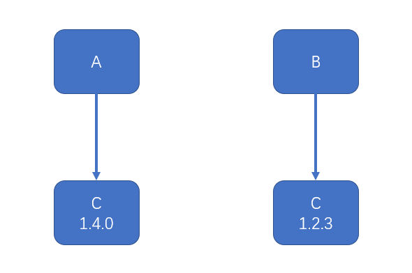

# 包管理器 {ignore}

[toc]

# 包管理工具概述

> 本门课程的前置知识：JavaScript、ES6、模块化、git
> 本门课程的所有代码均书写在 nodejs 环境中，不涉及浏览器环境

## 概念

**模块（module）**

通常以单个文件形式存在的功能片段，入口文件通常称之为**入口模块**或**主模块**

**库（library，简称lib）**

以一个或多个模块组成的完整功能块，为开发中某一方面的问题提供完整的解决方案

**包（package）**

包含元数据的库，这些元数据包括：名称、描述、git主页、许可证协议、作者、依赖等等


## 背景

CommonJS 的出现，使 node 环境下的 JS 代码可以用模块更加细粒度的划分。一个类、一个函数、一个对象、一个配置等等均可以作为模块，这种细粒度的划分，是开发大型应用的基石。

为了解决在开发过程中遇到的常见问题，比如加密、提供常见的工具方法、模拟数据等等，一时间，在前端社区涌现了大量的第三方库。这些库使用 CommonJS 标准书写而成，非常容易使用。

然而，在下载使用这些第三方库的时候，遇到难以处理的问题：

- **下载过程繁琐**

  - 进入官网或 github 主页

  - 找到并下载相应的版本

  - 拷贝到工程的目录中

  - 如果遇到有同名的库，需要更改名称

- **如果该库需要依赖其他库，还需要按照要求先下载其他库**

- **开发环境中安装的大量的库如何在生产环境中还原，又如何区分**

- **更新一个库极度麻烦**

- **自己开发的库，如何在下一次开发使用**

**以上问题，就是包管理工具要解决的问题**

## 前端包管理器

> npm：重点

> yarn：次重点

> 其他：了解

几乎可以这样认为，前端所有的包管理器都是基于 npm 的，目前，npm 即是一个包管理器，也是其他包管理的基石

npm 全称为 node package manager，即 node 包管理器，它运行在 node 环境中，**让开发者可以用简单的方式完成包的查找、安装、更新、卸载、上传等操作**

> npm 之所以要运行在 node 环境，而不是浏览器环境，根本原因是因为**浏览器环境无法提供下载、删除、读取本地文件的功能**。而 node 属于服务器环境，没有浏览器的种种限制，理论上可以完全掌控运行 node 的计算机。

npm 的出现，弥补了 node 没有包管理器的缺陷，于是很快，node 在安装文件中内置了 npm，当开发者安装好 node 之后，就自动安装了 npm，不仅如此，node 环境还专门为 npm 提供了良好的支持，使用 npm 下载的包更加方便了。

npm 由三部分组成：

- registry：入口

  - 可以把它想象成一个庞大的数据库

  - 第三方库的开发者，将自己的库按照 npm 的规范，打包上传到数据库中

  - 使用者通过统一的地址下载第三方包

- 官网：https://www.npmjs.com/

  - 查询包

  - 注册、登录、管理个人信息

- CLI：command-line interface 命令行接口

  - 这一部分是本门课讲解的重点

  - 安装好 npm 后，通过 CLI 来使用 npm 的各种功能
  
> node 和 npm 是互相成就的，node 的出现让 npm 火了，npm 的火爆带动了大量的第三方库的发展，很多优秀的第三方库打包上传到了 npm，这些第三方库又为 node 带来了大量的用户 

# NPM
 
## 包的安装

> 安装（install）即下载包

> 由于 npm 的官方 registry 服务器位于国外，可能受网速影响导致下载缓慢或失败。因此，安装好 npm 之后，需要重新设置 registry 的地址为国内地址。目前，淘宝 https://registry.npm.taobao.org 提供了国内的 registry 地址，先设置到该地址。设置方式为```npm config set registry https://registry.npm.taobao.org```。设置好后，通过命令```npm config get registry```进行检查


npm 安装一个包，分为两种安装方式：

1. 本地安装

2. 全局安装


### 本地安装

使用命令```npm install 包名 包名```或```npm i 包名 包名```即可完成本地安装一个或多个包

本地安装的包出现在当前目录下的```node_modules```目录中

> 随着开发的进展，```node_modules```目录会变得异常庞大，目录下的内容不适合直接传输到生产环境，因此通常使用```.gitignore```文件忽略该目录中的内容

> 本地安装适用于绝大部分的包，它会在当前目录及其子目录中发挥作用

> 通常在项目的根目录中使用本地安装

> 安装一个包的时候，npm 会自动管理依赖，它会下载该包的依赖包到```node_modules```目录中

> 如果本地安装的包带有 CLI，npm 会将它的 CLI 脚本文件放置到```node_modules/.bin```下，使用命令```npx 命令名```即可调用

### 全局安装

全局安装的包放置在一个特殊的全局目录，该目录可以通过命令```npm config get prefix```查看

使用命令```npm install --global 包名``` 或 ```npm i -g 包名```

重要：**全局安装的包并非所有工程可用，它仅提供全局的 CLI 工具**

大部分情况下，都不需要全局安装包，除非：

1. 包的版本非常稳定，很少有大的更新

2. 提供的 CLI 工具在各个工程中使用的非常频繁

3. CLI 工具仅为开发环境提供支持，而非部署环境

## 包配置

目前遇到的问题：

1. 拷贝工程后如何还原？

2. 如何区分开发依赖和生产依赖？

3. 如果自身的项目也是一个包，如何描述包的信息？

以上这些问题都需要通过包的**配置文件**解决

### 配置文件

npm 将每个使用 npm 的工程本身都看作是一个包，包的信息需要通过一个名称固定的配置文件来描述

**配置文件的名称固定为：package.json**

可以手动创建该文件，而更多的时候，是通过命令```npm init```创建的

配置文件中可以描述大量的信息，包括：

- name：包的名称，该名称必须是**英文单词字符**，支持连接符

- version：版本

  - 版本规范：主版本号.次版本号.补丁版本号

  - 主版本号：仅当程序发生了重大变化时才会增长，如新增了重要功能、新增了大量的API、技术架构发生了重大变化

  - 次版本号：仅当程序发生了一些小变化时才会增长，如新增了一些小功能、新增了一些辅助型的API

  - 补丁版本号：仅当解决了一些 bug 或 进行了一些局部优化时更新，如修复了某个函数的 bug、提升了某个函数的运行效率

- description：包的描述

- homepage：官网地址

- author：包的作者，必须是有效的 npm 账户名，书写规范是 ```account <mail>```，例如：```zhangsan <zhangsan@gmail.com>```，不正确的账号和邮箱可能导致发布包时失败

- repository：包的仓储地址，通常指 git 或 svn 的地址，它是一个对象

  - type：仓储类型，git 或 svn

  - url：地址

- main：包的入口文件，使用包的人默认从该入口文件导入包的内容

- keywords: 搜索关键字，发布包后，可以通过该数组中的关键字搜索到包

使用```npm init --yes```或```npm init -y```可以在生成配置文件时自动填充默认配置

### 保存依赖关系

大部分时候，我们仅仅是开发项目，并不会把它打包发布出去，尽管如此，我们仍然需要package.json文件

**package.json文件最重要的作用，是记录当前工程的依赖**

- dependencies：生产环境的依赖包

- devDependencies：仅开发环境的依赖包

配置好依赖后，使用下面的命令即可安装依赖

```shell
## 本地安装所有依赖 dependencies + devDependencies
## 不添加包名,即安装所有依赖
npm install
npm i

## 仅安装生产环境的依赖 dependencies
npm install --production
```

这样一来，代码移植就不是问题了，只需要移植源代码和package.json文件，不用移植node_modules目录，然后在移植之后通过命令即可重新恢复安装

为了更加方便的添加依赖，npm支持在使用install命令时，加入一些额外的参数，用于将安装的依赖包保存到package.json文件中

涉及的命令如下

```shell
## 安装依赖到生产环境
npm i 包名
npm i --save 包名
npm i -S 包名

## 安装依赖到开发环境
npm i --save-dev 包名
npm i -D 包名
```

> 自动保存的依赖版本，例如```^15.1.3```，这种书写方式叫做语义版本号（semver version），具体规则后续讲解

## 包的使用

nodejs 对 npm 支持非常良好

当使用 nodejs 导入模块时，**如果模块路径不是以 ./ 或 ../ 开头，则 node 会认为导入的模块来自于 node_modules 目录**，例如：

```js
var _ = require("lodash");//导入lodash包，用变量_接收
```

它首先会从当前目录的以下位置寻找文件

```shell
node_modules/lodash.js
node_modules/lodash/入口文件
```

若当前目录没有这样的文件，则会回溯到上级目录按照同样的方式查找

如果到顶级目录都无法找到文件，则抛出错误

上面提到的入口文件按照以下规则确定

**顺序**

1. 查看导入包的package.json文件，读取main字段作为入口文件

2. 若不包含main字段，则使用index.js作为入口文件

> 入口文件的规则同样适用于自己工程中的模块

> 在 node 中，还可以手动指定路径来导入相应的文件，这种情况比较少见

## 简易数据爬虫

将豆瓣电影的电影数据抓取下来，保存到本地文件 movie.json 中

需要用到的包：

1. axios：专门用于在各种环境中发送网络请求，并获取到服务器响应结果
2. cheerio：jquery的核心逻辑包，支持所有环境，可用于讲一个html字符串转换成为jquery对象，并通过jquery对象完成后续操作
3. fs：node核心模块，专门用于文件处理
   - fs.writeFile(文件名, 数据)

## 语义版本

思考：如果你编写了一个包A，依赖另外一个包B，你在编写代码时，包B的版本是2.4.1，你是希望使用你包的人一定要安装包B，并且是2.4.1版本，还是希望他可以安装更高的版本，如果你希望它安装更高的版本，高的什么程度呢？

回顾：版本号规则

版本规范：主版本号.次版本号.补丁版本号
- 主版本号：仅当程序发生了重大变化时才会增长，如新增了重要功能、新增了大量的API、技术架构发生了重大变化

- 次版本号：仅当程序发生了一些小变化时才会增长，如新增了一些小功能、新增了一些辅助型的API

- 补丁版本号：仅当解决了一些 bug 或 进行了一些局部优化时更新，如修复了某个函数的 bug、提升了某个函数的运行效率

有的时候，我们希望：安装我的依赖包的时候，次版本号和补丁版本号是可以有提升的，但是主版本号不能变化

有的时候，我们又希望：安装我的依赖包的时候，只有补丁版本号可以提升，其他都不能提升

甚至我们希望依赖包保持固定的版本，尽管这比较少见

这样一来，就需要在配置文件中描述清楚具体的依赖规则，而不是直接写上版本号那么简单。

这种规则的描述，即**语义版本**

语义版本的书写规则非常丰富，下面列出了一些常见的书写方式

| 符号  |         描述         |     示例      |                            示例描述                             |
| :---: | :------------------: | :-----------: | :-------------------------------------------------------------: |
|   >   |     大于某个版本     |    >1.2.1     |                          大于1.2.1版本                          |
|  >=   |   大于等于某个版本   |    >=1.2.1    |                        大于等于1.2.1版本                        |
|   <   |     小于某个版本     |    <1.2.1     |                          小于1.2.1版本                          |
|  <=   |   小于等于某个版本   |    <=1.2.1    |                        小于等于1.2.1版本                        |
|   -   |   介于两个版本之间   | 1.2.1 - 1.4.5 |                      介于1.2.1和1.4.5之间                       |
|   x   |    不固定的版本号    |     1.3.x     |              只要保证主版本号是1，次版本号是3即可               |
|   ~   |    补丁版本号可增    |    ~1.3.4     |        保证主版本号是1，次版本号是3，补丁版本号大于等于4        |
|   ^   | 此版本和补丁版本可增 |    ^1.3.4     | 保证主版本号是1，次版本号可以大于等于3，补丁版本号可以大于等于4 |
|   *   |       最新版本       |       *       |                        始终安装最新版本                         |

### 避免还原的差异

版本依赖控制始终是一个两难的问题

如果允许版本增加，可以让依赖包的bug得以修复（补丁版本号），可以带来一些意外的惊喜（次版本号），但同样可能带来不确定的风险（新的bug）

如果不允许版本增加，可以获得最好的稳定性，但失去了依赖包自我优化的能力

而有的时候情况更加复杂，如果依赖包升级后，依赖也发生了变化，会有更多不确定的情况出现

基于此，npm 在安装包的时候，会自动生成一个 package-lock.json 文件，该文件记录了安装包时的确切依赖关系

当移植工程时，如果移植了 package-lock.json 文件，恢复安装时，会按照 package-lock.json 文件中的确切依赖进行安装，最大限度的避免了差异

### [扩展]npm的差异版本处理

如果两个包依赖同一个包的不同版本，如下图



面对这种情况，在 node_modules 目录中，不会使用扁平的目录结构，而会形成嵌套的目录，如下图：

```
├── node_modules
│   ├── a 
│   │   ├── node_modules
│   │   │   ├── c
│   │   │   |   |—— c包的文件
│   │   │── a包的文件     
│   ├── b 
│   │   ├── node_modules
│   │   │   ├── c
│   │   │   |   |—— c包的文件
│   │   │── b包的文件           
```

## npm 脚本 （npm scripts）

在开发的过程中，我们可能会反复使用很多的 CLI 命令，例如：

- 启动工程命令（node 或 一些第三方包提供的CLI命令）

- 部署工程命令（一些第三方包提供的CLI命令）

- 测试工程命令（一些第三方包提供的CLI命令）

这些命令纷繁复杂，根据第三方包的不同命令也会不一样，非常难以记忆

于是，npm 非常贴心的支持了脚本，只需要在 package.json 中配置 scripts 字段，即可配置各种脚本名称

之后，我们就可以运行简单的指令来完成各种操作了

运行方式是 ```npm run 脚本名称```

不仅如此，npm 还对某些常用的脚本名称进行了简化，下面的脚本名称是不需要使用run的：

- start

- stop

- test

一些细节：

- 脚本中可以省略npx

- start脚本有默认值：node server.js

## 运行环境配置

我们书写的代码一般有三种运行环境：

1. 开发环境

2. 生产环境

3. 测试环境

有的时候，我们可能需要在 node 代码中根据不同的环境做出不同的处理

如何优雅的让 node 知道处于什么环境，是极其重要的

通常我们使用如下的处理方式：

node中有一个全局变量 global (可以类比浏览器环境的window)，该变量是一个对象，对象中的所有属性均可以直接使用

global有一个属性是process，该属性是一个对象，包含了当前运行node程序的计算机的很多信息，其中有一个信息是env，是一个对象，包含了计算机中所有的系统变量

通常，我们通过 系统变量 NODE_ENV 的值，来判定node程序处于何种环境


```js
let a;
if (process.env.NODE_ENV === 'development') {
    a = '开发环境';
} else if (process.env.NODE_ENV === 'production') {
    a = '生产环境';
} else if (process.env.NODE_ENV === 'test') {
    a = '测试环境';
}
console.log(a);
```

有两种方式设置 NODE_ENV 的值

1. 永久设置

  修改计算机的 环境变量

2. 临时设置

```json
"scripts": {
    "start": "set NODE_ENV=development&&node index.js",
    "build": "set NODE_ENV=production&&node index.js",
    "test": "set NODE_ENV=test&&node index.js"
  }
```

我们一般使用临时设置

因此，我们可以在package.json中配置 scripts 脚本，在设置好了 NODE_ENV 后启动程序

> 为了避免不同系统的设置方式的差异，可以使用第三方库 cross-env 对环境变量进行设置

## 在node中读取package.json

有的时候，我们可能在 package.json 中配置一些自定义的字段，这些字段需要在node中读取

在node 中，可以直接导入一个json格式的文件，它会自动将其转换为js对象

```js
// 读取package.json文件中的版本号
let config = require('./package.json')
console.log(config.version);
```

## 其他npm命令

### 安装

1. 精确安装最新版本

```shell
npm install --save-exact 包名 
npm install -E 包名

npm install jquery -E
```

2. 安装指定版本

```shell
npm install 包名@版本号

npm install lodash@2.1.0
```

### 查询

1. 查询包安装路径

```shell
npm root [-g]

npm root

npm root -g
```

2. 查看包信息

```shell
npm view 包名 [子信息]

npm view react

npm view react name

npm view react version 

npm view react versions
## view = v = info = show
```

3. 查询安装包

```shell
npm list [-g] [--depth=依赖深度]

npm list

npm list -depth=0
## list = ls = la = ll
```

### 更新

1. 检查有哪些包需要更新

```shell
npm outdated
```

2. 更新包

```shell
npm update [-g] [包名]

npm update
## update = up = upgrade
```

### 卸载包

```shell
npm uninstall [-g] 包名

npm r lodash
## uninstall = remove = rm = r = un = unlink
```

### npm 配置

npm的配置会对其他命令产生或多或少的影响

安装好npm之后，最终会产生两个配置文件，一个是用户配置，一个是系统配置，当两个文件的配置项有冲突的时候，用户配置会覆盖系统配置

通常，我们不关心具体的配置文件，而只关心最终生效的配置

通过下面的命令可以查询目前生效的各种配置

```shell
npm config ls [-l] [--json]

npm config ls
```

另外，可以通过下面的命令操作配置

1. 获取某个配置项

```shell
npm config get 配置项

npm config get registry
```

2. 设置某个配置项

```shell
npm config set 配置项=值
```

3. 移除某个配置项

```shell
npm config delete 配置项
```


## 发布包

### 准备工作

1. 移除淘宝镜像源

  移除某个配置项

```shell
npm config delete 配置项
```

2. 到npm官网注册一个账号，并完成邮箱认证

3. 本地使用 npm cli 进行登录

   1. 使用命令```npm login```登录

   2. 使用命令```npm whoami```查看当前登录的账号

   3. 使用命令```npm logout```注销

4. 创建工程根目录

5. 使用npm init进行初始化

### 发布

1. 开发

2. 确定版本

3. 使用命令```npm publish```完成发布
