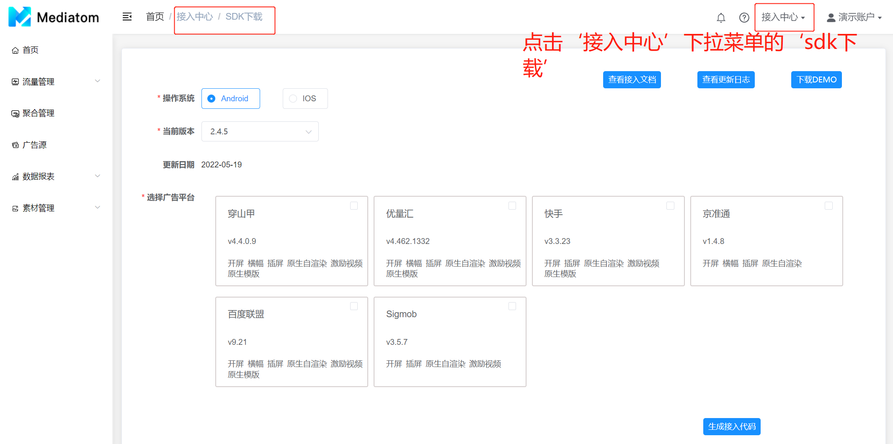
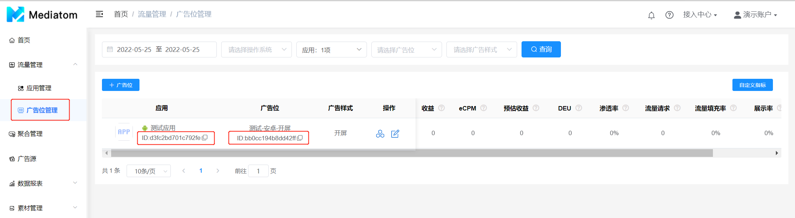

&emsp;&emsp;**欢迎使用{{msg.a}}聚合平台,如果您准备接入变现,请根据如下步骤完成操作**：

| {{msg.a}}聚合平台变现流程一览表                                      |
| ------------------------------------------------------------------- |
| 1.创建{{msg.a}}账号                                                  |
| 2.确认广告类型及对应使用的三方广告平台，查看接入文档并下载SDK       |
| 3.注册对应三方广告平台账号并在其创建应用和广告位，以及做数据API授权 |
| 4.在{{msg.a}}平台创建应用及广告位                                    |
| 5.广告源与聚合管理设置                                              |
| 6.完整阅读集成文档，集成{{msg.a}} SDK                                |
| 7.测试是否正常展示广告                                              |
| 8.分析及优化数据                                                    |

  *注：您在接入过程中遇到任何问题，请联系您的商务经理*

### 1. 创建{{msg.a}}账号

 1. 联系{{msg.a}}商务经理进行对接前的沟通确认；
 2. 在开发者后台注册账号；
 3. 登录开发者后台进行相关配置。

### 2. 确认广告类型及对应使用的三方广告平台，查看接入文档并下载SDK
  广告类型与第三方广告平台确认以及查看接入文档并下载SDK

### 3. 注册对应三方广告平台账号并在其创建应用和广告位，以及做数据API授权
  在确认接入的第三方广告平台注册账号并创建应用和广告位，开通各个账户的数据API接口。
### 4. 在{{msg.a}}创建应用及广告位
 1. 左侧菜单栏“流量管理”下的“应用管理”，点击“新建应用”创建您需要接入{{msg.a}} SDK变现的应用；
 2. 在需要变现的应用下“添加广告位”，创建您需要的广告位类型；
 3. 获取SDK集成时需要用到的参数：App ID（应用ID）、Placement ID（广告位ID）。

### 5. 广告源与聚合管理设置
  *注：配置广告源与聚合管理之前确保所需第三方广告平台已注册并已创建应用和代码位*
1. 进入左侧菜单栏“广告源”页面，点击“新建广告源”配置报表API和广告源
2. 进入左侧菜单栏“聚合管理”页面添加在第三方广告平台所创建的代码位

### 6. 完整阅读集成文档，集成{{msg.a}} SDK
 参考“**接入中心**”中的SDK集成文档和SDK demo，并选择希望合作的三方广告平台生成接入代码，将{{msg.a}} SDK集成进您的应用中。

### 7. 测试是否正常展示广告 
 验证您集成是否成功：广告是否正常曝光（包括广告样式、素材展示比例、关闭按钮等等），展示和点击是否成功追踪。
 
### 8. 分析及优化数据 
 应用发布后，可以在报表中查看数据效果

         