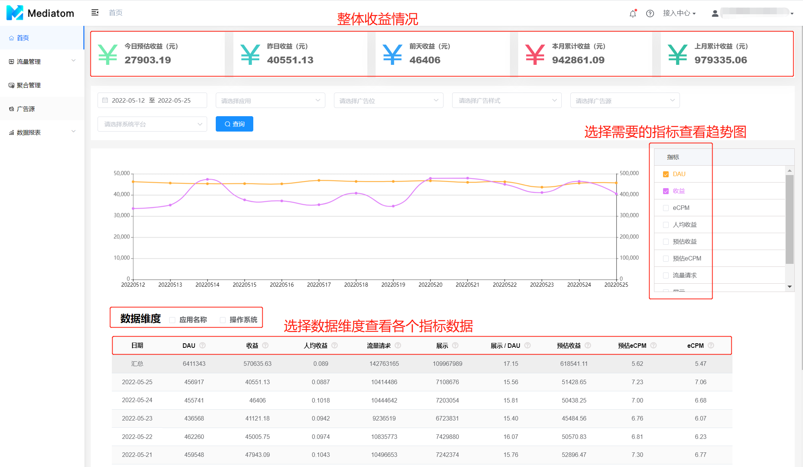
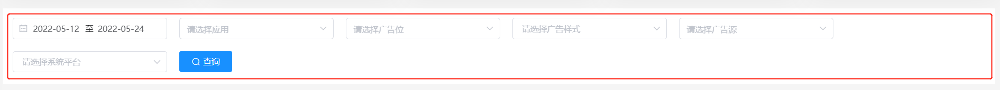
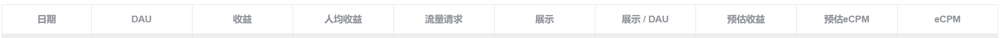

**首页是您登录Mediatom时看到的第一页，它提供了整个Mediatom账号的数据概览。**

### 1. 数据更新时间
   时区目前仅支持UTC+8中国标准时间
1. Mediatom SDK统计数据：每5分钟更新
2. 广告平台的报表API数据我们会在次日的10：00拉取第一次，之后每隔30分钟拉取一次

### 2. 数据筛选项
1. 自定义筛选项支持勾选需要的筛选项内容显示至下方报表

|  筛选项  |                                                     说明                                                     |
| :------: | :----------------------------------------------------------------------------------------------------------: |
|   日期   |                                               数据产生的时间段                                               |
|   应用   |                                             在Mediatom创建的应用                                             |
|  广告位  |                                            在Mediatom创建的广告位                                            |
| 广告样式 | 在Mediatom创建的广告位对应的广告样式：激励视频、插屏、原生自渲染、原生模板、开屏、横幅(Banner)、全屏视频广告 |
|  广告源  |                                     Mediatom支持的多家广告平台SDK的接入                                      |
| 系统平台 |                                                 Android/iOS                                                  |

### 3.数据指标

| 数据指标 | 说明                                                                                                                                                         |
| :------: | :----------------------------------------------------------------------------------------------------------------------------------------------------------- |
|   日期   | 数据产生的时间段                                                                                                                                             |
|   DAU    | 日活跃用户(Daily Active User)，即初始化Mediatom SDK的设备用户数                                                                                              |
|   收益   | Mediatom通过报表API向广告平台拉取到的实际收益                                                                                                                |
| 人均收益 | 每用户平均收入（Average Revenue Per User，简称ARPU）                                                                                                         |
| 流量请求 | 应用向Mediatom发送请求的次数，一次流量请求可能触发多次广告请求                                                                                               |
|   展示   | Mediatom统计的广告曝光次数。由于统计口径不一样，Mediatom统计的展示与广告平台统计的展示（展示API）可能存在一定差异                                            |
| 展示/DAU | 日活跃用户人均展示次数                                                                                                                                       |
| 预估收益 | 根据Mediatom SDK统计的展示数和eCPM价格进行预估的收益。计算公式：①常规广告源：人工填写的eCPM价格*Mediatom统计的展示/1000；②头部竞价广告源：实时的广告展示价格 |
| 预估eCPM | 根据预估收益和Mediatom统计的展示预估的eCPM。计算公式：预估收益*1000/展示                                                                                     |
|   eCPM   | 根据收益和Mediatom通过报表API向广告平台拉取到的实际展示(展示API)计算的。计算公式：（收益/展示）*1000                                                         |

