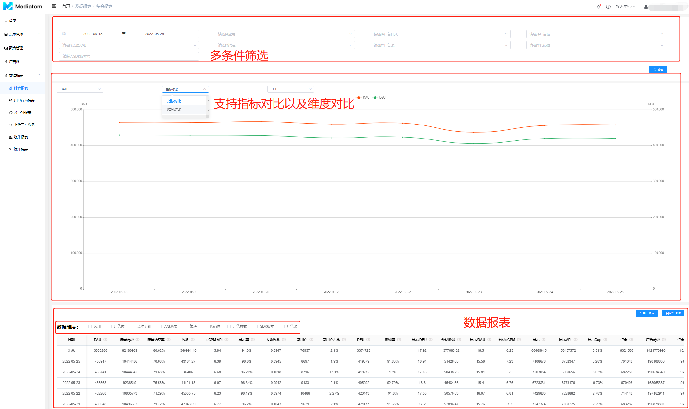
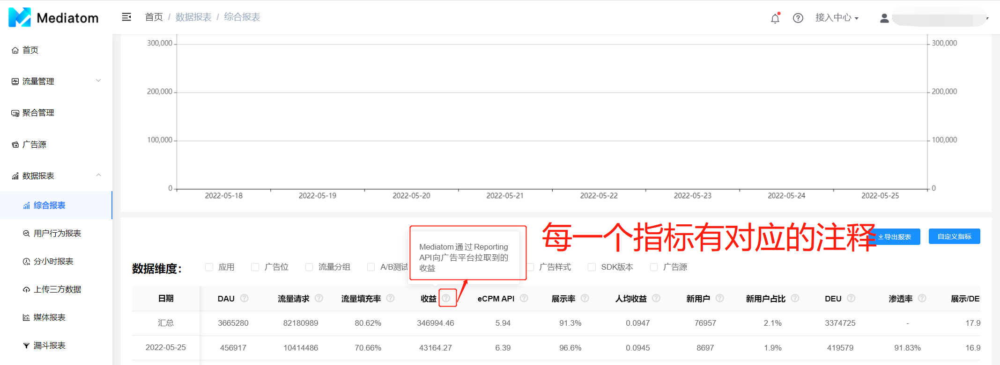
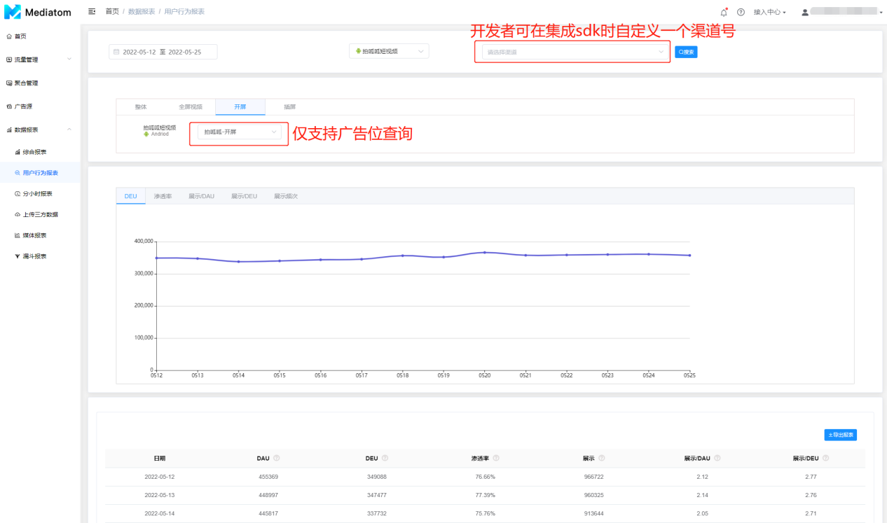
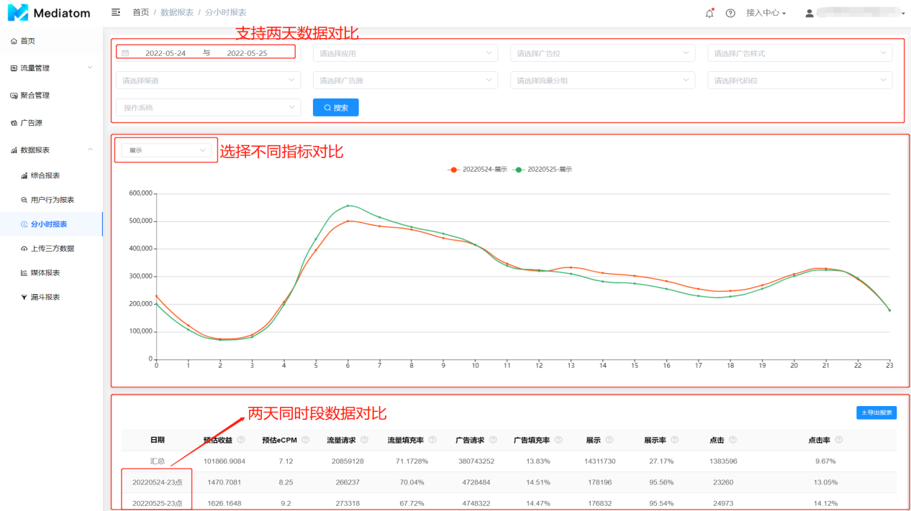
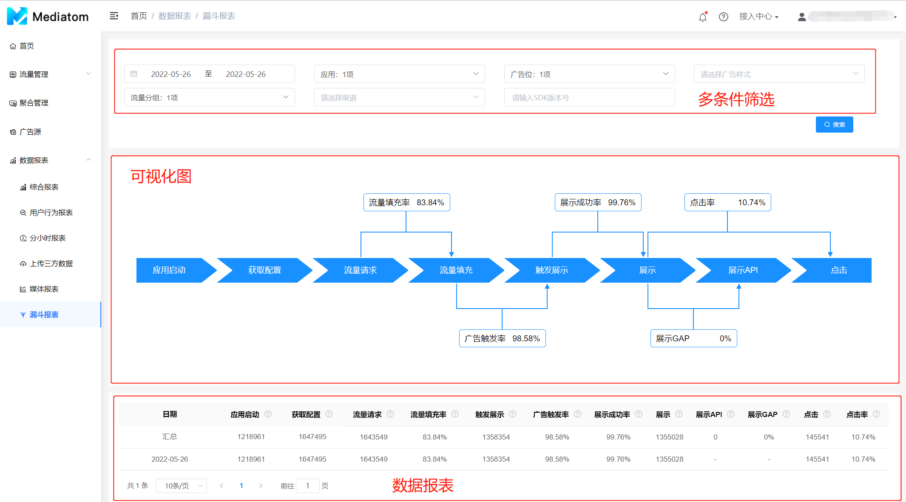
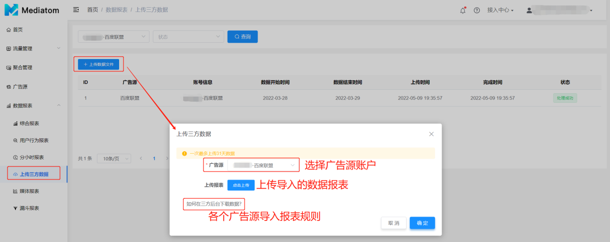
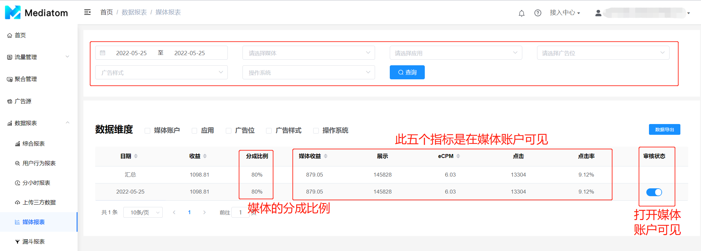

  数据报表提供了丰富的广告变现侧的数据维度，以全面了解您的广告业务变现效果。数据报表包含综合报表、用户行为报表、分小时报表、漏斗报表等多维度的可视化内容以及上传第三方数据和媒体报表

#### 综合报表

  - 数据维度：日期、应用、广告样式、广告位、流量分组、渠道、广告源、代码位、sdk版本号
  - 数据指标：DAU、人均收益、新用户、新用户占比、DEU、渗透率、展示/DAU、展示/DEU、预估收益、预估eCPM、流量请求、流量填充率 、展示、展示率、点击、点击率、广告请求、广告填充率 、展示Gap、点击Gap、收益、展示API、eCPM API、点击API、点击率API、请求API、填充率API 

每一个数据指标都有对应的注释

| **数据指标** | **说明**                                                                                                           |
| :----------: | :----------------------------------------------------------------------------------------------------------------- |
|     DAU      | 每天打开应用的独立用户数                                                                                           |
|   人均收益   | 人均收益，ARPU=收益/DAU                                                                                            |
|    新用户    | 首次使用应用的用户数                                                                                               |
|  新用户占比  | 首次使用应用的用户占比，计算公式：新增用户/DAU                                                                     |
|     DEU      | 每天观看过广告的独立用户数                                                                                         |
|    渗透率    | 每天观看过广告的用户占比，渗透率=DEU/DAU                                                                           |
|   展示/DAU   | 人均展示次数                                                                                                       |
|   展示/DEU   | 观看过广告的用户人均展示次数                                                                                       |
|   预估收益   | 预估收益=SUM(代码位人工填写的eCPM价格*Mediatom统计的展示/1000)                                                     |
|   预估eCPM   | （预估收益/Mediatom统计的展示）*1000                                                                               |
|   流量请求   | 应用向Mediatom发送请求的次数，一次流量请求可能触发多次广告请求                                                     |
|  流量填充率  | 应用向广告平台发送请求后，响应成功的占比                                                                           |
|     展示     | Mediatom统计的广告曝光次数，由于统计口径差异、网络丢包等因素，Mediatom统计的展示数据与广告平台展示数据可能存在差异 |
|    展示率    | Mediatom收到来自广告平台的广告返回后，展示成功的占比。公式为 展示率 = (展示/填充)                                  |
|     点击     | Mediatom统计的广告点击数，由于部分广告平台不提供点击回调，Mediatom统计的点击数据与广告平台点击数据可能存在差异     |
|    点击率    | Mediatom统计的点击率，点击率=点击数/展示数                                                                         |
|   广告请求   | Mediatom向广告平台发送请求的次数。一次流量请求可能触发多次广告请求                                                 |
|  广告填充率  | Mediatom向广告平台发送请求后，返回成功的占比                                                                       |
|   展示Gap    | Mediatom统计展示与广告平台统计展示的差异，公式为 展示Gap=(展示-展示API)/展示API                                    |
|   点击Gap    | Mediatom统计点击与广告平台统计点击的差异，公式为 点击Gap=(点击-点击API)/点击API                                    |
|     收益     | Mediatom通过Reporting API向广告平台拉取到的收益                                                                    |
|   展示API    | Mediatom通过Reporting API向广告平台拉取到的展示                                                                    |
|   eCPM API   | Mediatom通过Reporting API向广告平台拉取到的收益和展示API计算出eCPM API，公式：（收益/展示API）*1000                |
|   点击API    | Mediatom通过Reporting API向广告平台拉取到的点击                                                                    |
|  点击率API   | 点击API/展示API                                                                                                    |
|   请求API    | Mediatom通过Reporting API向广告平台拉取到的广告请求数，部分平台不提供此数据                                        |
|  填充率API   | Mediatom通过Reporting API向广告平台拉取到的填充率，部分平台不提供此数据                                            |

#### 用户行为报表

| **报表内容** |                                                      **说明**                                                      |
| :----------: | :----------------------------------------------------------------------------------------------------------------: |
|     DAU      |                                              每天打开应用的独立用户数                                              |
|     DEU      |                                             每天观看过广告的独立用户数                                             |
|    渗透率    |                                      每天观看过广告的用户占比，渗透率=DEU/DAU                                      |
|     展示     | Mediatom统计的广告曝光次数，由于统计口径差异、网络丢包等因素，Mediatom统计的展示数据与广告平台展示数据可能存在差异 |
|   展示/DAU   |                                                    人均展示次数                                                    |
|   展示/DEU   |                                            观看过广告的用户人均展示次数                                            |

#### 分小时报表

| 报表内容   | 说明                                                                                                                                                                                                                                                                                                                                                              |
| ---------- | ----------------------------------------------------------------------------------------------------------------------------------------------------------------------------------------------------------------------------------------------------------------------------------------------------------------------------------------------------------------- |
| 日期       | 数据产生的时间段，以及当天所属的小时时间段                                                                                                                                                                                                                                                                                                                        |
| 预估收益   | 根据Mediatom SDK统计的展示数和eCPM价格进行预估的收益。计算公式：①常规广告源：人工填写的eCPM价格*Mediatom统计的展示/1000；②竞价广告源：实时的广告展示价格                                                                                                                                                                                                          |
| 预估eCPM   | 根据预估收益和Mediatom统计的展示计算出预估eCPM，计算公式：（预估收益/Mediatom统计的展示）*1000。注：1、预估 eCPM当天提供；2、常规广告源基于手动填写的eCPM价格计算，竞价广告源基于实时竞价价格计算                                                                                                                                                                 |
| 流量请求   | 应用（客户端）向广告平台发起的请求（Load)次数                                                                                                                                                                                                                                                                                                                     |
| 流量填充率 | 应用（客户端）向MediatomSDK发起请求（Load）后，广告返回成功的占比。计算公式：流量请求返回成功数（流量填充数）/流量请求*100%                                                                                                                                                                                                                                       |
| 广告请求   | Mediatom按照聚合管理的瀑布流广告源排序向各广告平台（广告源）发起的请求次数。 注意：一次流量请求可能会对应多次广告请求。当应用（客户端）向Mediatom发起请求时，Mediatom按照瀑布流广告源排序依次向各广告源发起请求，当高优先级的广告源没有填充、或者短超时（单次并行请求超时时长）内还没有广告返回，则会往下请求低优先级的广告源，此时一次流量请求会对应多次广告请求 |
| 广告填充率 | Mediatom向各广告平台（广告源）发起请求后，广告返回成功的占比。计算公式：广告请求返回成功数（广告填充数）/广告请求*100%                                                                                                                                                                                                                                            |
| 展示       | Mediatom统计的广告曝光次数。由于统计口径不一样，Mediatom统计的展示与广告平台统计的展示（展示API）可能存在一定差异                                                                                                                                                                                                                                                 |
| 展示率     | Mediatom统计的广告曝光次数占流量请求返回成功数（流量填充数）的比例。计算公式：展示/流量填充数*100%                                                                                                                                                                                                                                                                |
| 点击       | Mediatom统计的广告点击数。部分平台不提供点击回调（如Admob的激励视频），导致Mediatom无法统计到用户的点击行为                                                                                                                                                                                                                                                       |
| 点击率     | Mediatom统计的广告点击数占Mediatom统计的广告曝光次数的比例。计算公式：点击/展示*100%                                                                                                                                                                                                                                                                              |

#### 漏斗报表

| **报表内容** | **说明**                                                                                                           |
| :----------: | :----------------------------------------------------------------------------------------------------------------- |
|   应用启动   | 应用启动并成功初始化Mediatom SDK                                                                                   |
|   获取配置   | 应用向Mediatom服务器请求广告位配置策略                                                                             |
|   流量请求   | Mediatom向广告平台发起请求的次数                                                                                   |
|  流量填充率  | Mediatom向广告平台发送请求后返回成功的占比                                                                         |
|   触发展示   | 应用调用Mediatom 的Show接口(原生、横幅广告为触发三方广告的展示逻辑)                                                |
|  广告触发率  | 触发展示 / 流量填充*100%                                                                                           |
|  展示成功率  | 展示 / 触发展示 * 100%                                                                                             |
|     展示     | Mediatom统计的广告曝光次数，由于统计口径差异、网络丢包等因素，Mediatom统计的展示数据与广告平台展示数据可能存在差异 |
|   展示API    | Mediatom通过Reporting API向广告平台拉取到的展示                                                                    |
|   展示GAP    | Mediatom统计展示与广告平台统计展示的差异，公式为 展示Gap=(展示-展示API)/展示API                                    |
|     点击     | Mediatom统计的广告点击数，由于部分广告平台不提供点击回调，Mediatom统计的点击数据与广告平台点击数据可能存在差异     |
|    点击率    | Mediatom统计的点击率，点击率=点击数/展示数                                                                         |

#### 上传三方数据
  若第三方广告平台无法开通数据报表api接口时，则可手动到第三方广告平台下载数据并在此处根据对应数据上传规则上传第三方数据

  如果您是媒体代理方，需向媒体出成本时；您只需开通一个媒体子账户，在**广告位管理-广告位-编辑**填写分成比例，以此向媒体方出成本。
  数据维度：媒体账户、应用、广告位、广告样式、操作系统
  媒体子账户数据报表字段为：已分成后的收益、展示、eCPM、点击、点击率

  注：此功能并不是向所有管理员开放，须向商务经理申请开通
