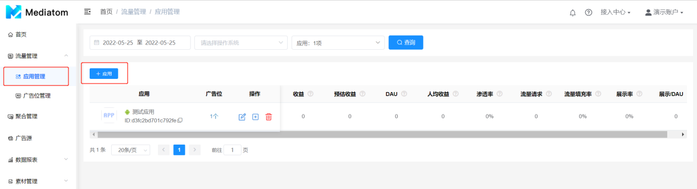

**创建应用和广告位**
### 1.应用管理
  在**流量管理-应用管理**页面可创建、编辑应用、删除以及修改广告源里的App ID。在应用管理页面，您可以做：添加新应用和查看应用数据
1. 添加新应用
  点击左上角**【+应用】**进入添加应用页面，对应输入信息

2. 查看应用数据
  应用上线后可在此页面直观地查看每款应用的数据，数据指标固定为：收益、预估收益、DAU、人均收益、渗透率、流量请求、流量填充率、展示率、展示/ADU

### 2.广告位管理
  在流量管理-广告位管理页面可创建和编辑广告位。在广告位页面，您可以做：添加广告位和查看广告位数据
1. 添加广告位
  广告位即应用内展示广告的位置。例如，游戏页面底部展示的广告，或者游戏关卡结束时展示的广告。每个广告位都对应着一种广告样式。 应用与广告位之间存在一对多的关系。每款应用必须至少有一个广告位，通常大多数应用都会创建多个广告位来满足不同位置和广告类型需求。

点击左上角**【+广告位】**进入添加广告位页面。一个新广告位的添加步骤如下：

  注：同一个应用，同一个广告样式下有不同的位置，建议利用广告位名称区分。比如“tset”这个Android应用，广告样式“banner”的位置有的在首页底部，有的在首页中部，有的在首页顶部；**三个位置的数据想要分开统计**，就必须创建三个“banner”的广告位，且最好在广告位名称上区分开（比如：test-Android-banner-首页底部、test-Android-banner-首页中部、test-Android-banner-首页顶部）；**三个位置的数据统计在一起**，创建一个“banner”广告位即可，这时广告位名称可随意。

2. 查看广告位数据
  应用上线后可**广告位管理**页面直观地查看每个广告位数据，数据指标与综合报表同步，默认显示：收益、eCPM、预估收益、DEU、渗透率、流量请求、流量填充率、展示率、展示/DEU；支持自定义勾选所需要的指标。

