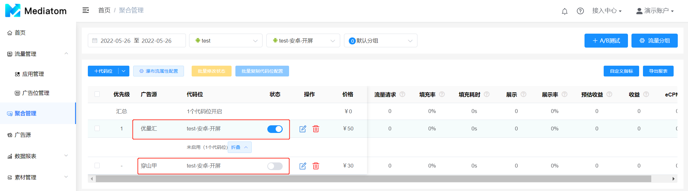
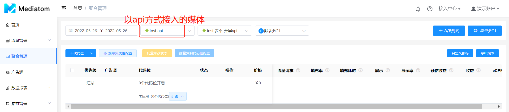
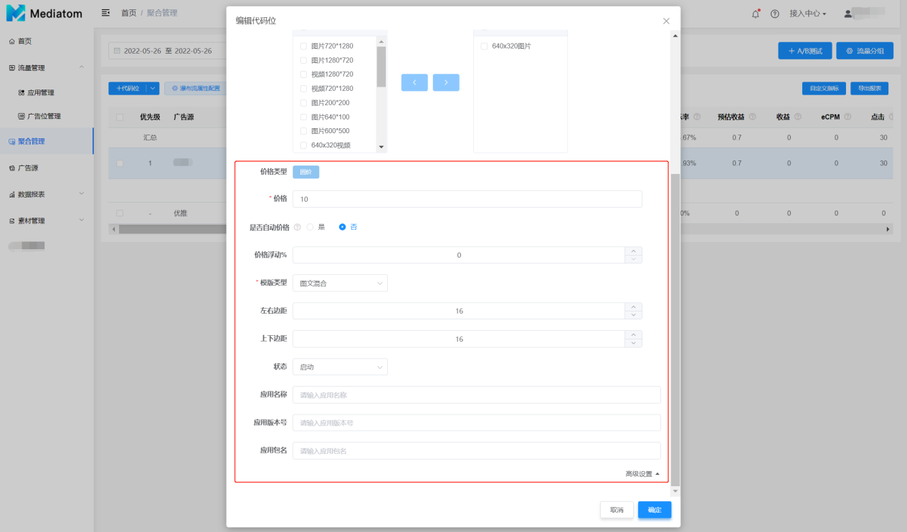

  在聚合管理页面可以进行所有的广告优化策略调整，在此之前，请确保您已经正确地将Mediatom SDK、三方广告平台SDK全部接入您的应用中。
  然后录入您在第三方广告平台创建的代码位
 1. 点击**“+代码位”**，选择您要录入的广告源
**SDK方式接入的媒体：**

注：新建账户这一步可在左侧菜单栏“广告源”单独配置，与这里配置效果一致

  重复以上步骤在对应广告样式下录入您所有的代码位,按需求开启或关闭代码位

**API方式接入的媒体：**

  重复以上步骤在对应广告样式下录入您所有的代码位,按需求开启或关闭代码位

**在聚合管理页面您可以做策略优化调整：**

1. Waterfall（瀑布流）优先级调整
  通过调整排序价格手动调整,waterfall按照价格从高到低排序；通过调整状态关闭按钮来开启/关闭代码位

2. Waterfall（瀑布流）属性配置
- 并行请求数：瀑布流中代码位将根据并行请求数来分组，同一组内代码位将同时发起广告请求
- 单次并行请求超时时长：一次并行请求没有返回广告填充结果(成功或失败)时最多等待的时长
- 瀑布流请求总超时时长：一次瀑布流总请求还没有返回任何成功广告填充时最多等待的时长
- API请求超时时长：一次瀑布流总请求还没有返回任何成功广告填充时最多等待的时长

3. 添加流量分组（可选）
  Mediatom支持多个维度对用户进行分组，不同的流量分组可以配置不同Waterfall，以实现精细化流量变现的目的。目前Mediatom支持的流量分组维度具体如下：

  Mediatom的1个广告位可以配置多个流量分组。当配置多个流量分组时，各个流量分组会有优先级，流量分组前缀数字为优先级，**数字越大优先级越高**。当某次请求同时命中多个流量分组时，Mediatom会返回最高优先级的流量分组广告源配置

4. 添加A/B测试（可选）

   - A/B测试是一种对比测试，将用户按比例分为对照组和测试组并对不同的组使用不同的配置。您可以
   - 通过对两组分别使用不同的广告策略并对比结果，来帮助您验证哪种广告策略效果更好。

   - 创建A/B测试时可以设置多个A/B分组，可以在同一个应用的同一个广告位下的多个流量分组下分别进行A/B测试

5. 展示频次控制（可选）

  聚合管理页面支持流量分组维度的展示频次控制功能；通过该功能，可以限制单个用户在流量分组维度下的展示频次。默认不限。
   - 路径：聚合管理→流量分组→展示上限/展示间隔
   - 展示上限（小时）：单个用户在1小时内可以观看该流量分组广告的最大次数；
   - 展示上限（天）：单个用户在1天内可以观看该流量分组广告的最大次数；
   - 展示间隔（秒）：单个用户本次该流量分组展示到下次该流量分组请求之间的时间间隔。

  **辅助功能**

